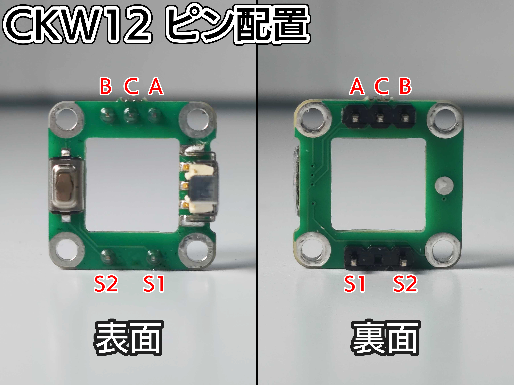
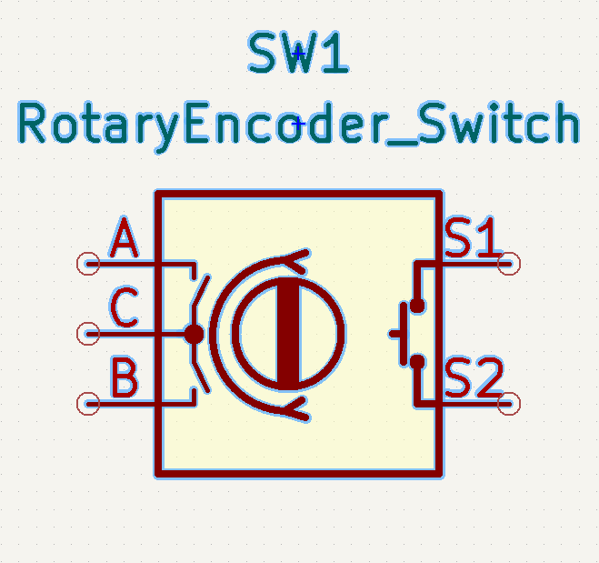
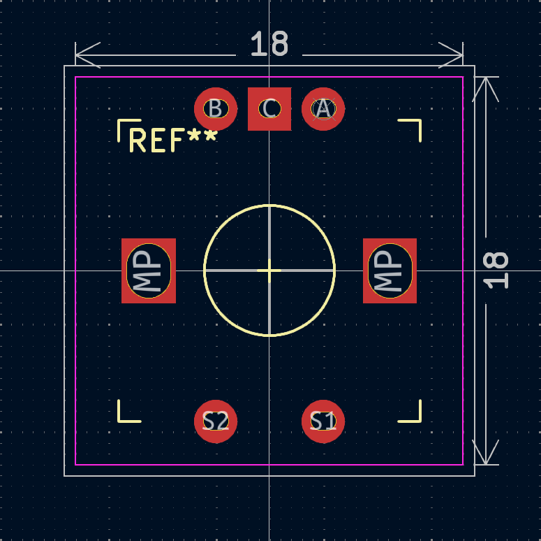
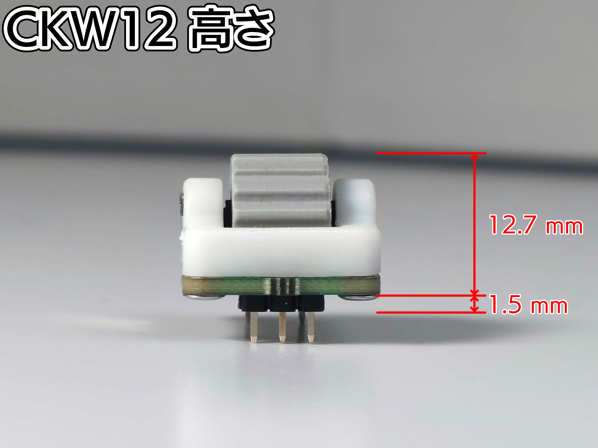

# CKW12 開発者用ドキュメント

[!CAUTION]
本ドキュメントは、ロータリーエンコーダモジュール「CKW12」をご自身で開発されているキーボードに搭載する際の技術的な注意事項を記載しております。
組み立てについては[こちらのドキュメント](./readme.md)をご確認ください。

## 概要

CKW12は、自作キーボード向けに設計されたプッシュスイッチ機能付きロータリーエンコーダモジュールです。主な特徴は以下の通りです。

* EC12互換のピン配置（一部制約あり）
* コンスルー（スプリングピンヘッダ）によるソケット化が可能
* プッシュスイッチ機能付き

---

## 基板設計

KiCadでの設計を想定しています。
他CADでの対応の検証はしていませんが、フットプリントを変換することで使用することが可能なはずです。

### 1. ピン配置

CKW12のピン配置は以下の通りです。EC12エンコーダの標準的なピン（A, B, C）およびスイッチ用のピン（S1, S2）に対応しています。

| ピン名 | 機能 | 説明 |
| :--- | :--- | :--- |
| A | エンコーダ A相 | 回転信号 |
| B | エンコーダ B相 | 回転信号 |
| C | GND (Common) | A相・B相の共通GND |
| S1 | スイッチ | プッシュスイッチの片側 |
| S2 | スイッチ | プッシュスイッチのもう片側 |




### 2. 回路図 (シンボルと接続例)

#### シンボル

KiCadの標準ライブラリに含まれる `RotaryEncoder_Switch` がそのまま使用できます。
シンボルライブラリより上記を使用してください。

#### 接続例

一般的なMCU（Pro Micro, RP2040など）への接続例です。

- **エンコーダ部分 (A, B, C)**:
    - `A` ピンと `B` ピンはMCUの任意のデジタルピンに接続します。  
    - `C` ピンは **GND** に接続します。  

- **スイッチ部分 (S1, S2)**:
    - MCUのデジタルピンとGNDに接続します（通常のキースイッチと同様にマトリックスのCol, RowまたはDirect接続）。
    - `S1` と `S2` に極性はありません。



### 3. フットプリント



CKW12用のKiCadフットプリントは[こちらからダウンロード](./footprint/xxx)できます。
本フットプリントはMIT Licenseにて提供しています。

CKW12はEC12のフットプリントでも使用できるように作られています。
付属のピンヘッダーを使用することでEC12互換の基板であればほとんど使用できます。

もし**コンスルーにて接続する際**は、専用フットプリントへの更新を強く推奨します。
変更が必要な理由は主に以下の3点です。

1.  **物理サイズ**: CKW12が **18x18mm** のパーツであり、EC12用のスイッチプレート穴（約14mm角）と干渉する可能性があるため。
2.  **ピンピッチ**: コンスルーのピッチ（**2.54mm**）とEC12の標準ピッチ（**2.5mm**）が僅かに異なるため。
3.  **スルーホール径**: コンスルーのピン（オス側）に適した穴径（推奨 **Φ0.8mm 〜 Φ0.85mm**）に対応していないスルーホールの可能性があるため。

提供フットプリントでは、18x18mmのF.Courtyard（部品占有領域）を記載すると共に、スルーホールの仕様（位置、穴径）をコンスルーに最適化しています。
このフットプリントをそのまま利用していただくことも可能ですし、参考元にして改変することも可能です。

---

## 物理的制約と寸法

- **基板占有面積**: 18mm x 18mm (フットプリントの Courtyard 参照)
- **スイッチプレートカットアウト**:
    - CKW12本体（基板部分）を通すための最小穴サイズは、**18.5mm x 18.5mm** 程度を推奨します。
    - **注意**: エンコーダーの基板にはマウスバイトが付いていることがあり、これにより0.5mmほど大きくなることがあります。必要であればヤスリで削ってください。
- **高さ**:
    - 基板裏面 (PCB) からのCKW12モジュール底面までの高さ: 1.5 mm（ピンヘッダーやコンスルーなどの厚みによる）
    - 基板裏面 (PCB) からのホイール上面までの高さ（実測値）: 約 12.7 mm

---

## ファームウェア (QMK/VIA/Remap)

QMK Firmware (およびVIA/Remap) で設定する場合、以下の2種類の方法があります。  
詳しい実装方法は[Encoders | QMK Firmware](https://docs.qmk.fm/features/encoders)をご確認ください。  
また、[Practice BoardのQMK Firmware](https://github.com/yushakobo/qmk_firmware/tree/practice_board/keyboards/yushakobo/practice_board)を確認し、参考にしていただいても構いません。
※実装方法がわからないなどのお問い合わせはお答えいたしかねます。

1. `keyboard.json`に以下を記載してください。  

```
    "encoder": {
        "enabled": true,
        "rotary": [
            {"pin_a": "B4", "pin_b": "E6"}
        ]
    },
    "features": {
        "bootmagic": true,
        "command": false,
        "console": false,
        "encoder": true,
        "encoder_map": true,
        "extrakey": true,
        "mousekey": true,
        "nkro": true,
        "rgblight": true
    },
```
※B4やE6などは、実際の設計時は対応するGPIOに合わせて変更してください。

2. `keymap.c`に以下を記載してください。

```
#if defined(ENCODER_MAP_ENABLE)
const uint16_t PROGMEM encoder_map[][NUM_ENCODERS][NUM_DIRECTIONS] = {
    [0] =   { ENCODER_CCW_CW(KC_RBRC, KC_BSLS)}
};
#endif
```

3. VIA/Remap用のJSONファイルを作成してください。

こちらの[Encoder](https://caniusevia.com/docs/layouts/#rotary-encoders)の記載を確認し、JSONファイルを作成してください。
上記のPractice Boardでは、下記のようなJSONファイルを作成しています。

```
{
    "name": "practice_board",
    "vendorId": "0x3265",
    "productId": "0x0014",
    "lighting": "qmk_rgblight",
    "matrix": { "rows": 3, "cols": 3 },
    "layouts": {
        "keymap": [
            ["0,0","0,1","0,2"],
            ["1,0","1,1","1,2",{"x":0.25},"2,0\n\n\n\n\n\n\n\n\ne0"]
        ]
    }
}
```
