# Ergo68 ビルドガイド

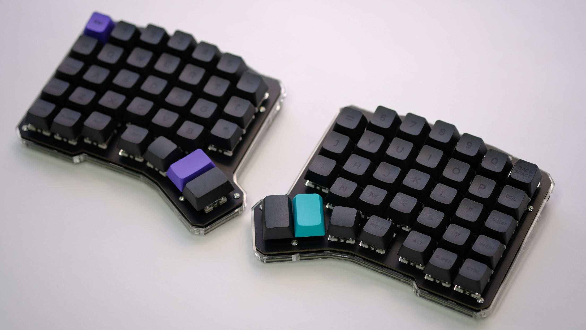
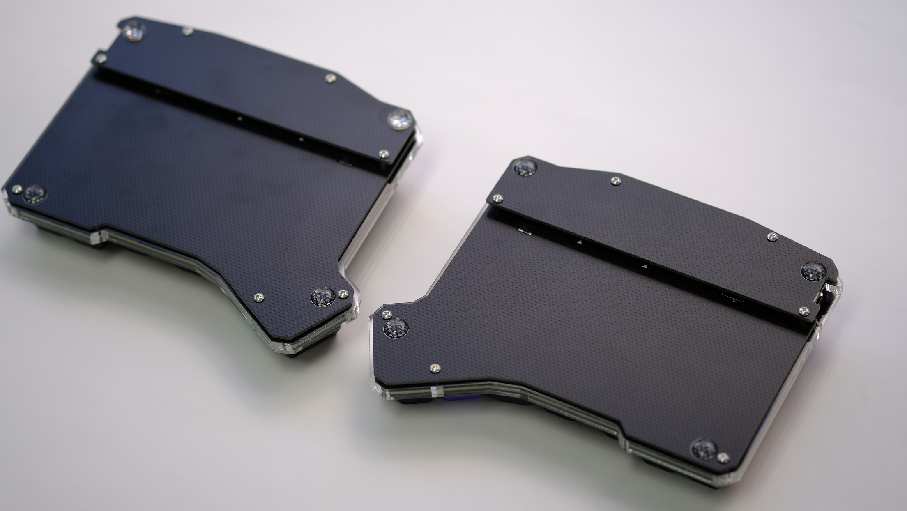

Ergo68のお買い上げありがとうございます。

**実際の組み立てを始める前に、このビルドガイドを最後までお読みください。**

組み立ては本手順に沿って行ってください。 
本手順に疑問等がある場合は遊舎工房の[サポートページ](https://yushakobo.zendesk.com/hc/ja)を参照の上、お気軽にお問い合わせください。

## 注意事項

本キットの組み立てにはニッパーなどの刃物やハンダごてなどの火傷の危険性がある道具を使用しますので、十分に注意して作業を行ってください。 
キットの部品には細かい部品も含まれますので、保管する際はお子様などの手に届かない場所に保管してください。 
作業中に出るゴミ、切ったダイオードの足やピンヘッダの足などが刺さったりしますので、適宜清掃をしながら作業されることをお勧めします。
**PCとUSBケーブルで接続中に左右間をつなぐTRSケーブルを抜いてしまうと故障の原因になります。** 
**絶対にPCと接続中に左右間をつなぐケーブルを抜かないでください。** 

## １．キットに同梱されている部品をチェックする

まずはキットに同梱されている部品が足りているかチェックしてください。 
万が一部品に不足がある場合は、大変お手数ですが遊舎工房の[お問い合わせフォーム](https://yushakobo.zendesk.com/hc/ja/requests/new)のカテゴリ **「購入した商品の不足・初期不良等」** を選択してお問い合わせください。

|名称|数量|画像|
|---|---|---|
|基板|2|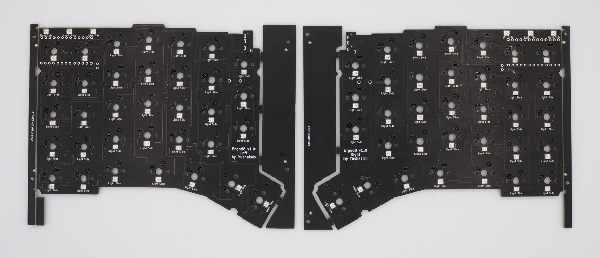|
|スイッチプレート|2|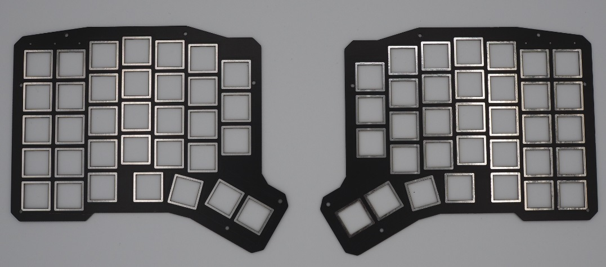|
|ボトムプレート|2|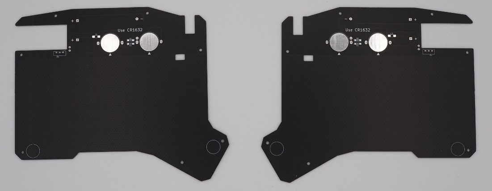|
|カバープレート|2|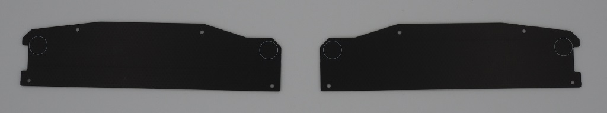|
|ProMicro|2|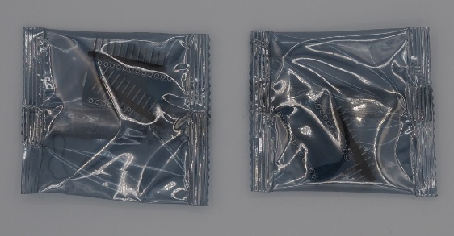|
|コンスルー（12ピン）|4|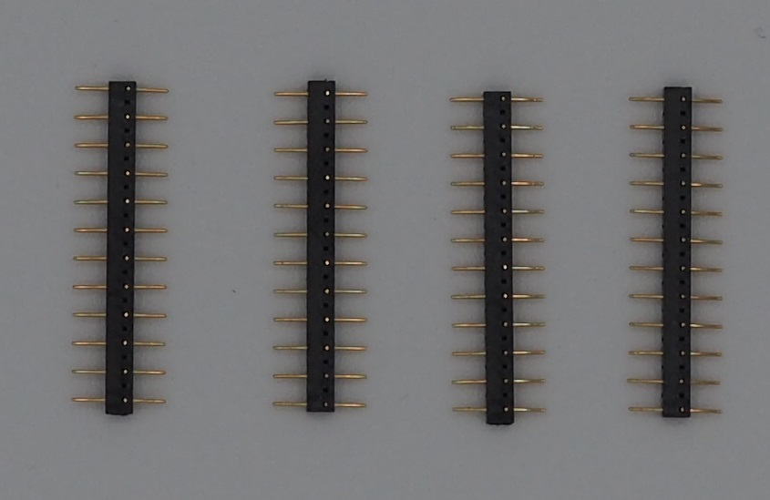|
|リセットスイッチ|2|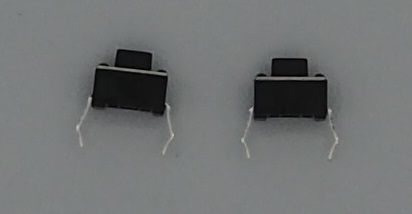|
|TRRSジャック|2|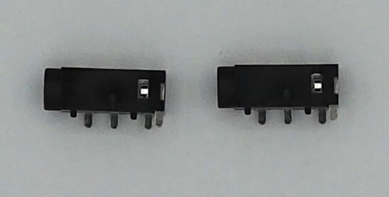|
|ネジ（4mm）|28|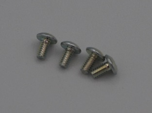|
|スペーサー（7mm）|14|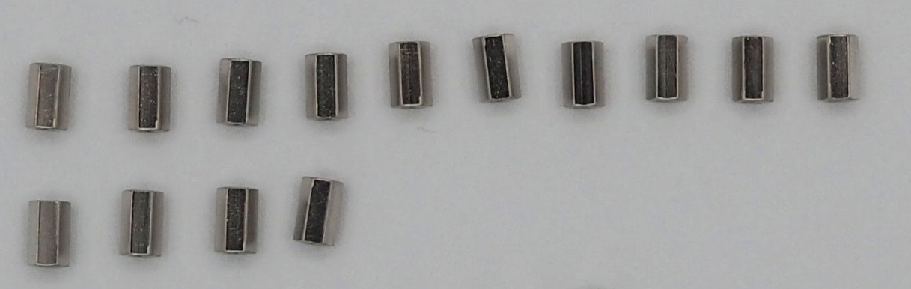|
|スペーサー・オスメス（4mm）|8|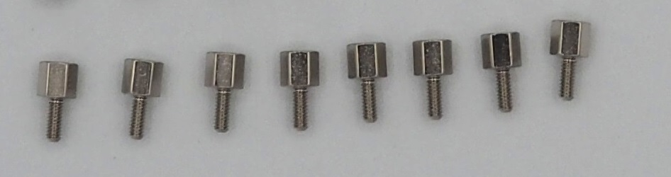|
|ゴム足(小)|4|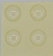|
|ゴム足(大)|4||

### １－１．オプション部品（電池部品キット）

|名称|数量|画像|
|---|---|---|
|コイン電池ホルダー|4|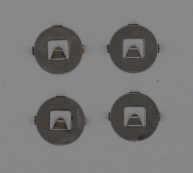|
|コンスルー|1|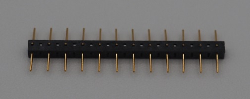|
|ショットキーバリアダイオード|4|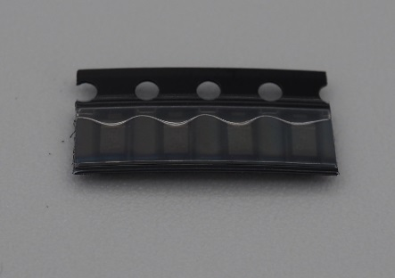|
|チップコンデンサ|2|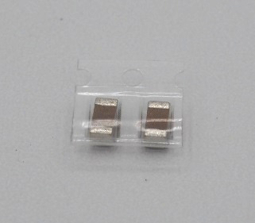|
|スライドスイッチ|2|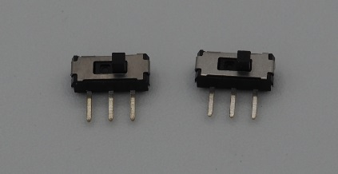|

### １－２．オプション部品（単4電池部品キット）

|名称|数量|画像|
|---|---|---|
|単4電池ホルダー|4|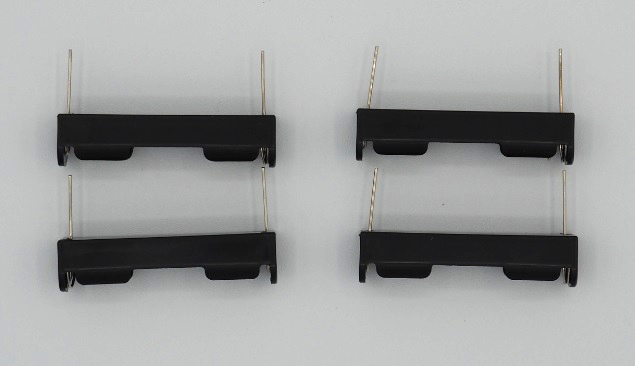|
|コンスルー|1||
|ショットキーバリアダイオード|4||
|チップコンデンサ|2||
|スライドスイッチ|2||
|カバープレート（単4電池用）|2|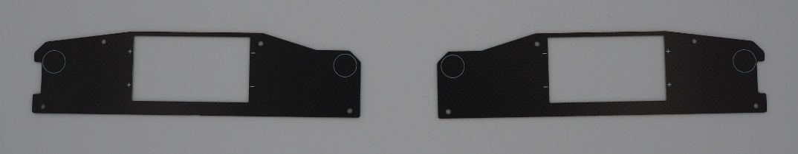|
|スペーサー・オスメス（8mm）|8||
|ゴム足(大)|4||

### １－３．オプション部品（ミドルプレート）

|名称|数量|画像|
|---|---|---|
|ミドルプレート(2mm)|2|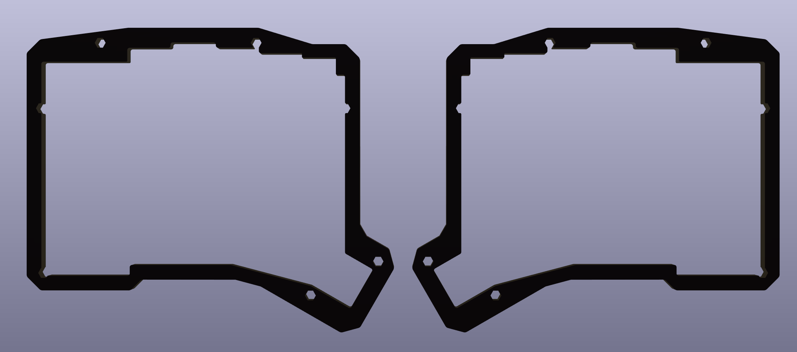|
|ミドルプレート(5mm)|4|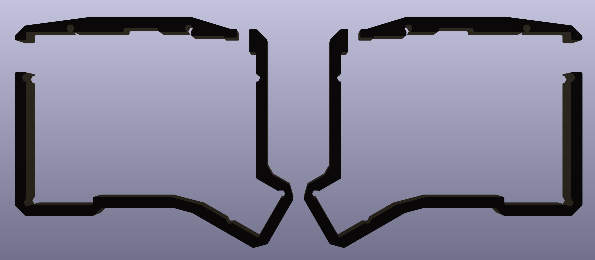|

## ２．別途準備するパーツをチェックする

キットには含まれていないパーツは別途用意する必要があります。 
予め購入し、組立前に不足がないかチェックしてください。

|名称|数量|備考|
|---|---|---|
|キースイッチ|68|ご購入は[こちら](https://shop.yushakobo.jp/collections/all-switches/cherry-mx-%E4%BA%92%E6%8F%9B-%E3%82%B9%E3%82%A4%E3%83%83%E3%83%81) CherryMX互換スイッチのみ対応|
|キーキャップ|68|ご購入は[こちら](https://shop.yushakobo.jp/collections/keycaps/cherry-mx-%E4%BA%92%E6%8F%9B-%E3%82%AD%E3%83%BC%E3%82%AD%E3%83%A3%E3%83%83%E3%83%97) キーレイアウトとキーキャップセットをよくチェックして購入してください|
|TRSケーブルorTRRSケーブル|1|ご購入は[こちら](https://shop.yushakobo.jp/products/trrs_cable) LPME-IOの場合はTRRSケーブルのみ TRSは3極、TRRSは4極の端子を持ちます|
|USBケーブル|1|ご購入は[こちら](https://shop.yushakobo.jp/products/usb-cable-micro-b-0-8m) マイコンが対応するコネクタの種類に合わせてご用意ください 標準で付属するProMicroはMicroBケーブルが必要です|

## 必要な道具

|名称|備考|
|---|---|
|ハンダごて|できるだけ温度調節機能付きのもの|
|ハンダ線|0.6mm~0.8mm径程度のもの|
|ドライバー|M2サイズのネジを締める用のもの（#0）|
|ニッパー|なるべく先端が細いもの|

**こちらに[工具セット](https://shop.yushakobo.jp/products/a9900to)の用意もありますので、よろしければ部品と一緒にどうぞ。**

## 組み立ての手順

1. ProMicroとコンスルーのハンダ付け
1. リセットスイッチとTRRSジャックのハンダ付け
1. ファームウェアの書き込みと動作確認
1. 基板の左右の捨板を折り取る
1. キースイッチのスイッチプレートへの取り付け
1. スペーサーのネジ止め
1. ボトムプレートのネジ止め
1. カバープレートのネジ止め
1. キーキャップの取り付け
1. ゴム足の貼り付け
1. キーマップを変更する
1. (オプション)電池部品キットのハンダ付け

