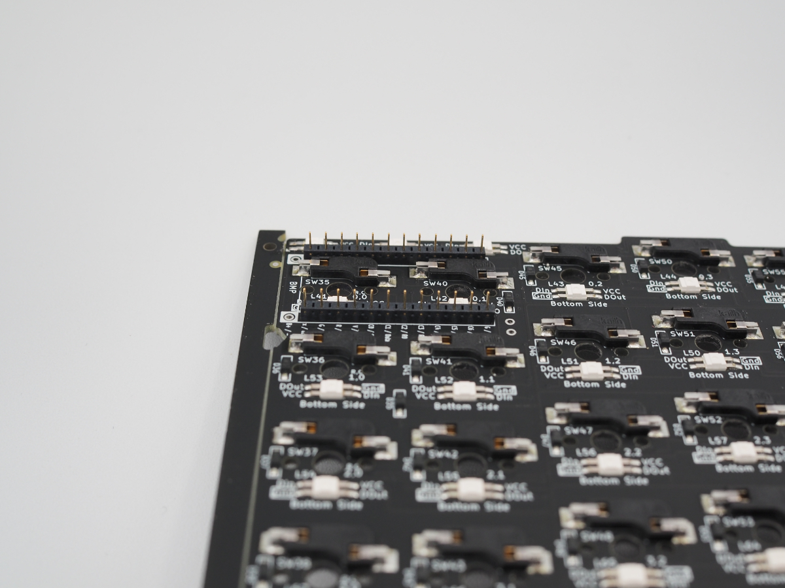
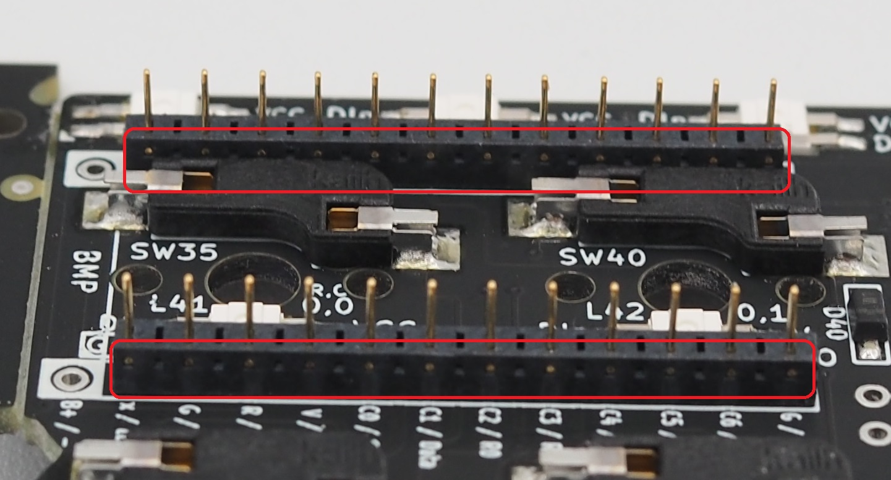
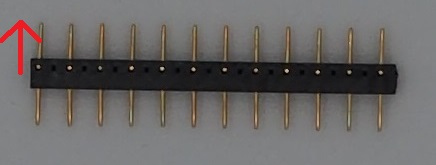
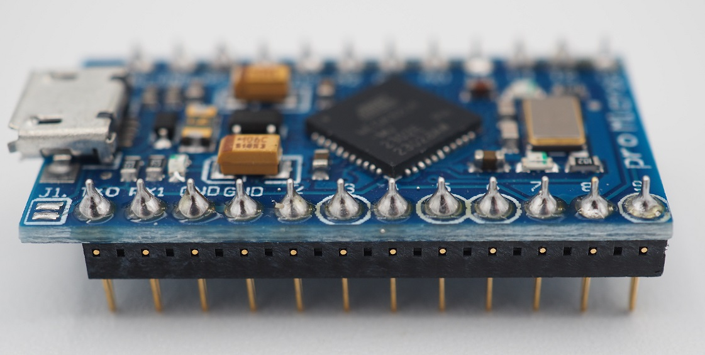

## 1. ProMicroとコンスルーのハンダ付け

**Check:ProMicroの裏表に十分に注意してください。** 
**逆に取り付けてしまった場合、コンスルーを取り外すのはとても大変です。** 

**Check:無線対応をしたい場合、ProMicroの代わりにBLE Micro Proを使用しますが、ハンダ付けは不要です。** 
**後述の「EX1．無線対応」を代わりに参照してください。** 

### 1-1．コンスルーの差し込み

ピンソケットを基板の **裏側** から差し込みます。 

 

この際に、下の写真のようにコンスルーの側面から金属が見える側を揃えてください。 
**Check:ProMicroを使う場合は基板の一番上のピンは差し込まず開けておきます。** 

 

また、コンスルーには上下があります。 
金属が見える窓は上下のどちらかに寄っていますので、上側に寄っている側が来るように差し込んでください。

 

### 1-2．ProMicroのハンダ付け

ProMicroの部品が見える側を上面にし、コンスルーに差し込みます。 

 

このとき、ProMicroの向きに十分に注意します。 
基板の**表側**からProMicroの**チップ部品が見えるように**なっているはずです。 
後でProMicroのハンダを外すのは大変な労力を伴いますので、ここで**必ず上の写真と相違が無いかチェック**しておきます。 

ハンダ付けの際は2～3mm程度のハンダを送るだけで十分です。 
ハンダごてを当て、1～2秒待ってからハンダを送ります。 
また1～2秒待ってからハンダを離し、その後ハンダごてを離します。 
以下の画像のようになればOKです。

