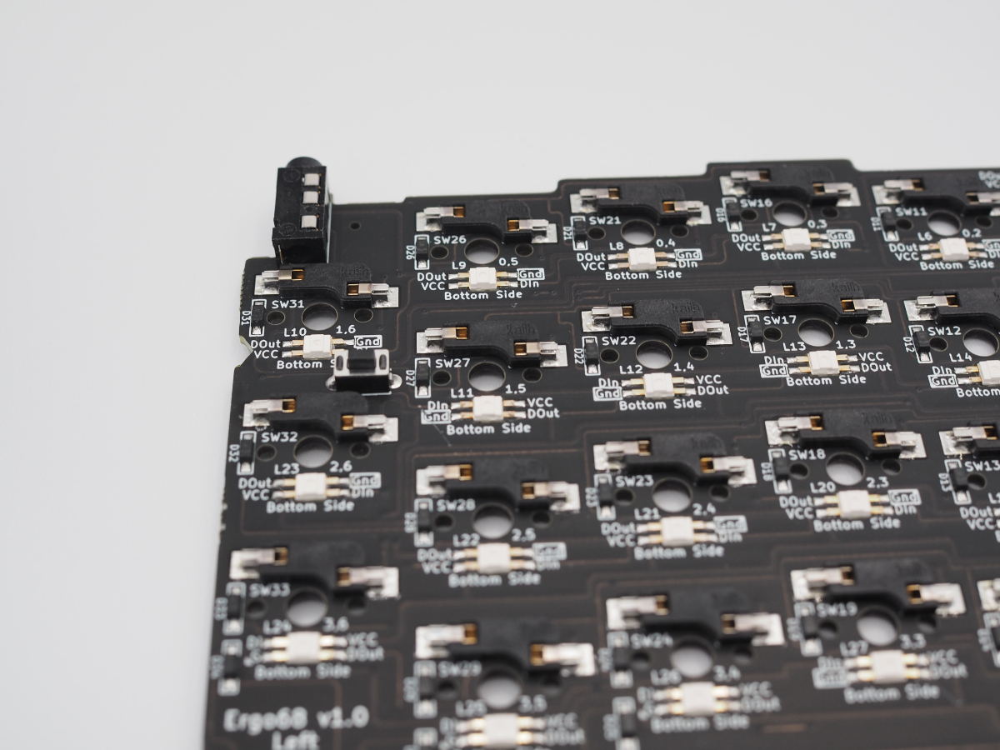
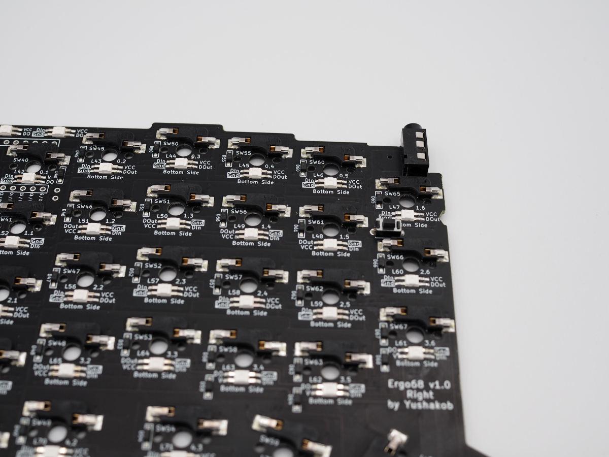
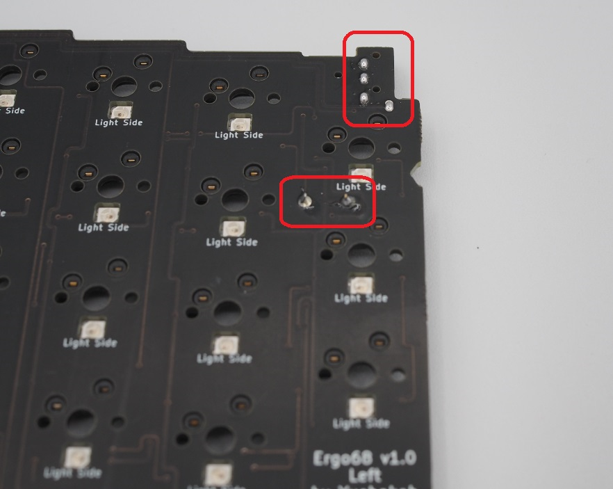

## 2. リセットスイッチとTRRSジャックのハンダ付け

**Point:リセットスイッチはハンダ付けせずに使うことも出来ます。** 
**使う機会も少ないので、頻繁にファームウェアを書き換える予定がなければハンダ付けを省略しても大丈夫です。** 
**なお、一度ファームウェアを書き込んでしまえば、キーマップの書き換えにはリセットスイッチは不要です。** 

基板裏側のProMicroの反対側の`Reset`と`TRRS`と書かれている部分にリセットスイッチとTRRSジャックを**裏面**に取り付け、**表側**からハンダ付けします。 

左側 
右側 

ハンダ付けした後、ニッパーで切り取ってもう一度ハンダごてで温めることで机に傷をつけずに使うことが出来ます。

 

