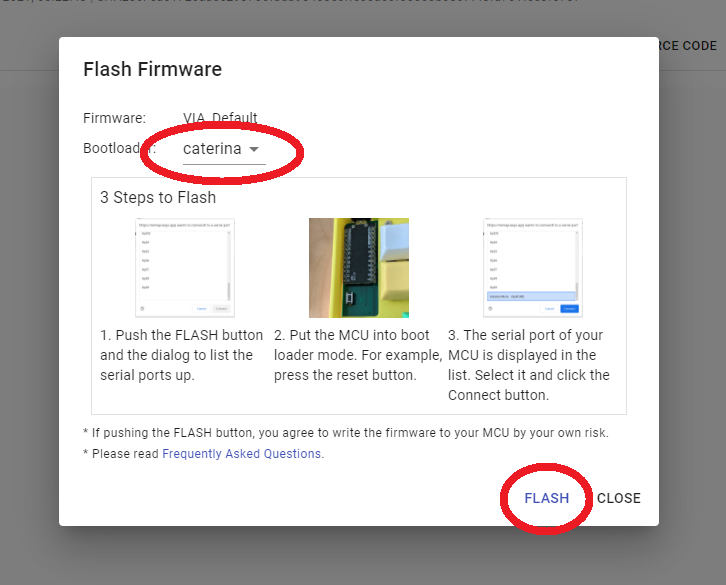
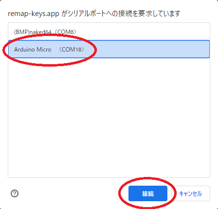
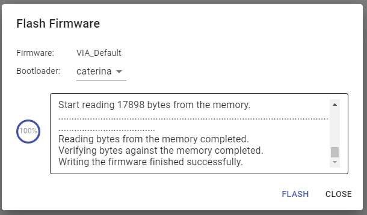
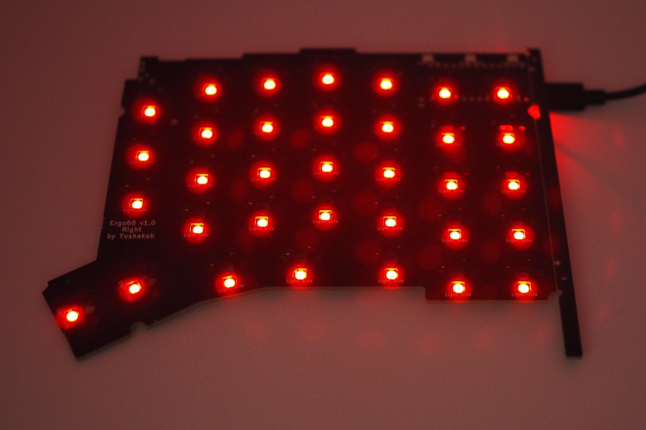
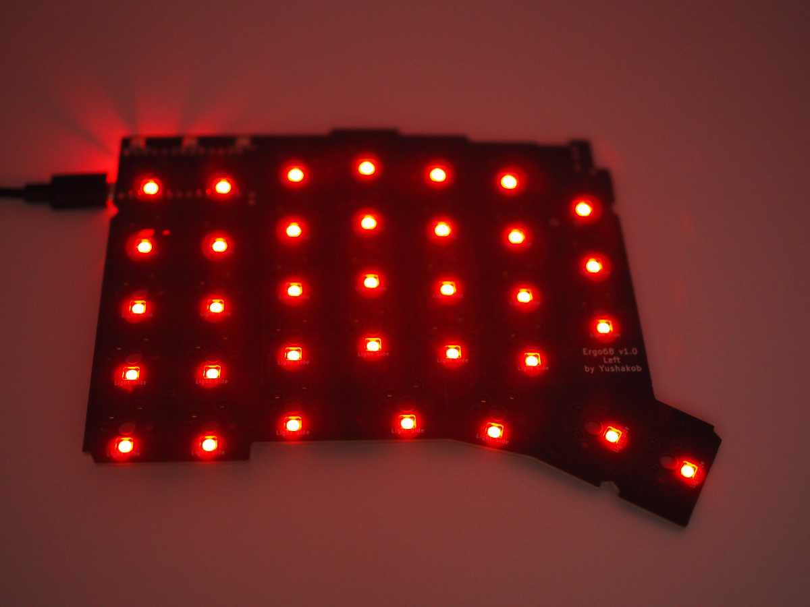
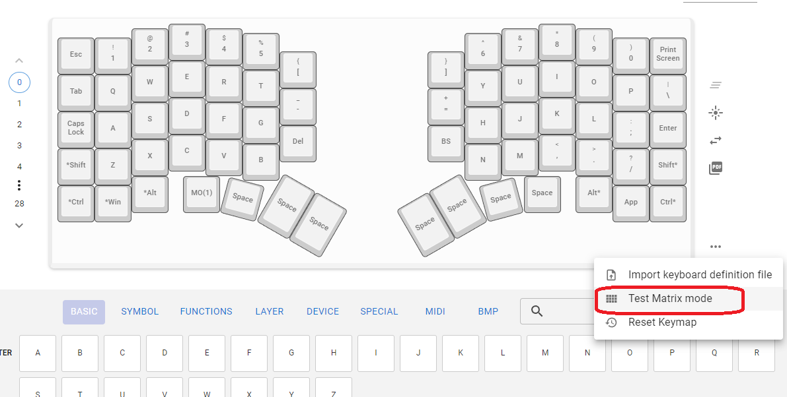
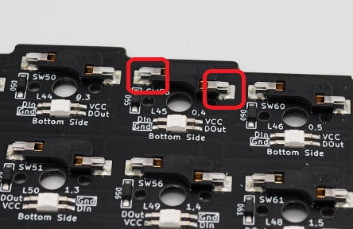
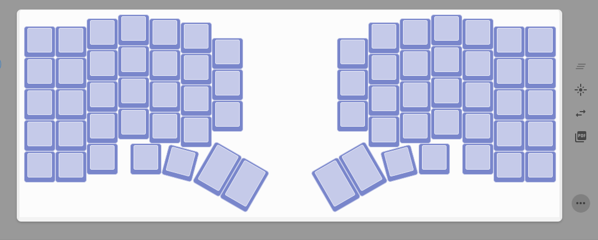

## 3. ファームウェアの書き込みと動作確認

Ergo68はファームウェアとしてqmk_firmwareを使用しています。 

Remapのカタログ機能を用いてファームウェアの書き込みを行います。 
**Check:※BLE Micro Proの書き込みは本ビルドガイドの末尾の`EX1-5．ファームウェアの書き込み`を参照してください。** 

https://remap-keys.app/catalog/qIgO7rOq7GMRsGf6QhlY/firmware

ファームウェアの書き込みが完了したらRemapのコンフィギュレータ画面を開きます。 

https://remap-keys.app/configure

FLASHをクリックします。

 

通常のProMicroは「caterina」を、Elite-Cは「dfu」を選択してからFLASHをクリックします。 
※「dfu」を使用しての書き込みは別途Zadigというツールを用いた作業が必要になる場合があります。

 

下図のように小ウインドウに「Arduino Micro」等が表示されることを確認します。 
表示されない場合、ケーブルや接続するポートを変更して試してみます。

 

リセットスイッチを押すと一瞬USB機器が抜けたような音がするので先程の小ウインドウのArduino Microのポート番号が変化したことを確認し、素早く「接続」をクリック。 
（本ビルドガイドの図例の場合、COM17がCOM18に変化） 
ポート番号が変化しない場合、リセットを素早く2回実施する等も試してみてください。 

 

ファームウェアの書き込みが完了したら下図のようにメッセージの最後に「successfully」が表示されます。
**Check:Elite-C等の通常のProMicroを使用しない場合は失敗する場合があります。** 
**Elite-Cなどを使用する場合はBootloaderをdfuに変更し、Remapの説明に従ってdfuのUSBモードを変更してください。** 

 

まずはLEDが全て点灯するか確認してください。 

 
 
**Point:左右上部のLEDはインジケータです。** 
**左側がCapsLock、NumLock、ScreenLockです。** 
**右側がレイヤー状態です。** 
**ただPCを繋いだ状態でこれらのインジケータが消灯していても正常です。** 

Remapで正常に認識できたらテストモードを開き、ピンセットでスイッチソケットの金属部分に触れて導通をチェックします。 

 
 

全て正常だと下図のように全てのキーが青くなります。 
 

