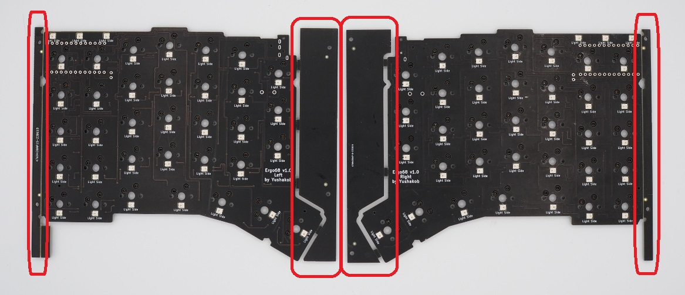
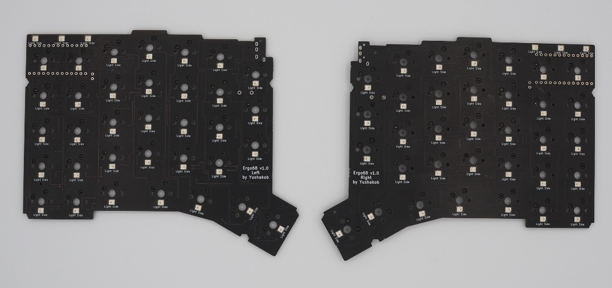
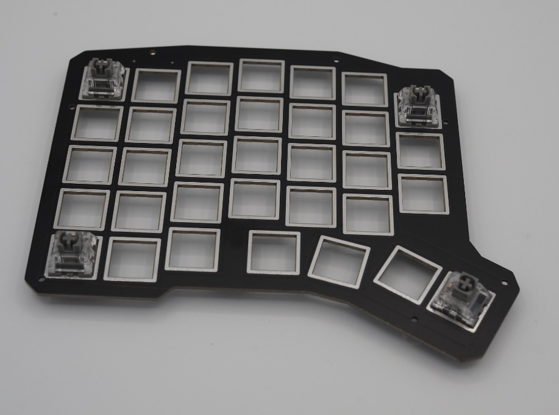
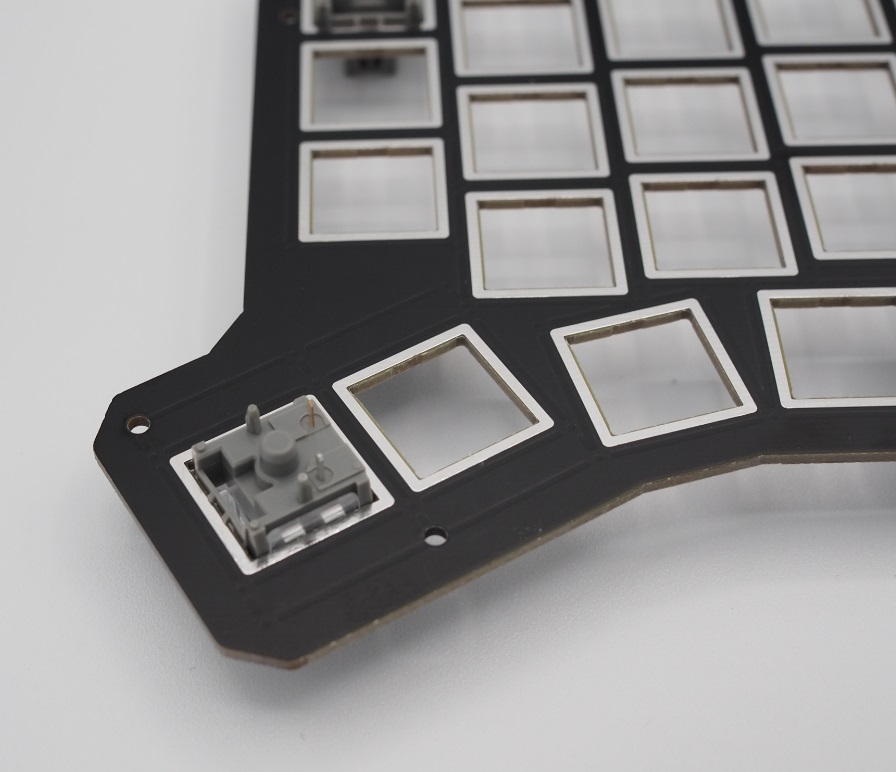
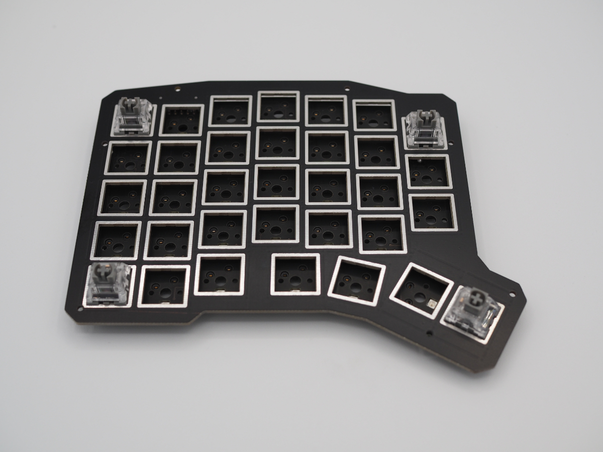
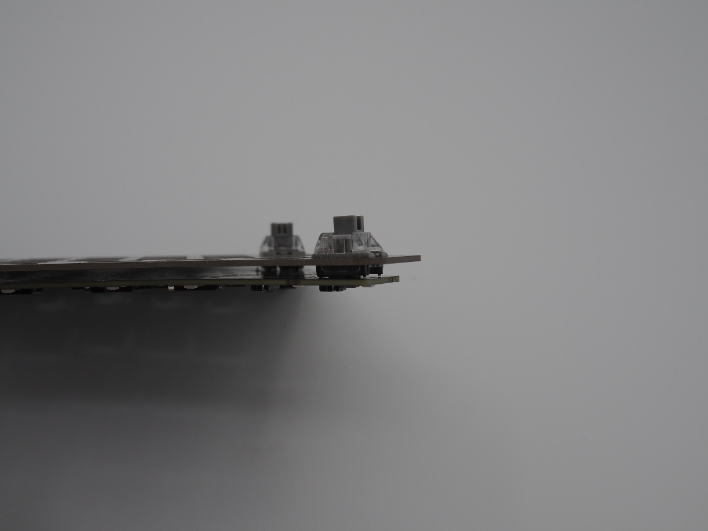
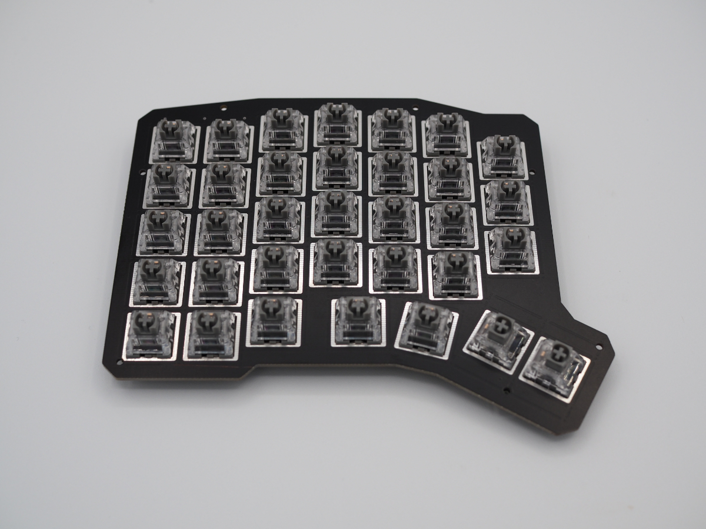

## 4. 基板の左右の捨板を折り取る

基板の左右についている捨板を折り取ります。 

 

**Check:折る際に基板全体に無理に力をかけるとスイッチソケットが剥がれる恐れがあります。** 
**折りづらい場合はカッターでなぞったりニッパーで切ってください。** 

 

## 5．キースイッチのスイッチプレートへの取り付け

スイッチプレートにキースイッチを取り付けます。 
まずはスイッチプレートの四隅にスイッチを嵌めます。

 

**Check:親結キーの部分のスイッチの向きだけ異なります。** 
**基板のスイッチソケットの向きと見比べ、正しい向きでスイッチプレートにはめ込みます。** 

 

**Check:スイッチプレートにスイッチをちゃんとはめ込んでいることを確認します。** 

 

**Check:ミドルプレートを取り付ける場合、基板とスイッチプレートの間にミドルプレート（2mm）をはさみます。** 
スイッチプレートを基板に合わせ、基板のスイッチソケットにスイッチの端子を嵌めます。 
**Check:スイッチソケットに差し込む前に、スイッチの向きが合っているか、ピンが折れ曲がっていないか再度確認します。** 

 

**Check:スイッチは最後まで差し込んでください。** 

 

全てのスイッチを取り付けます。
**Check:スイッチの向きに注意してください。** 
**Point:この時点でもう一度Remapでテストしておくと確実です。** 

 

