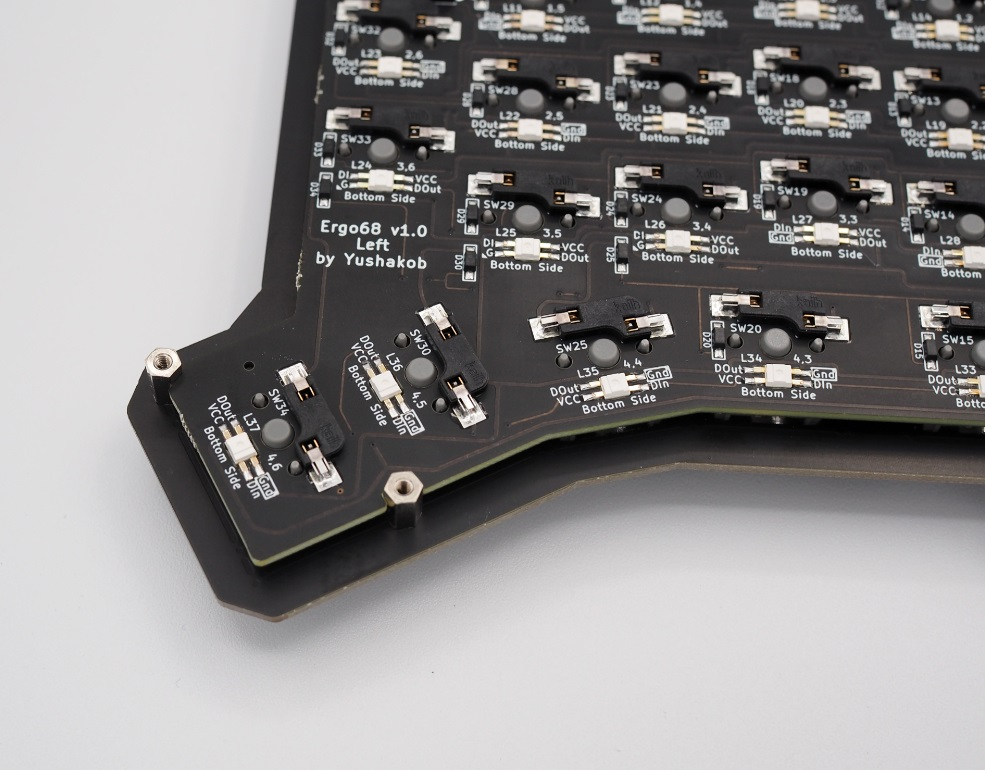
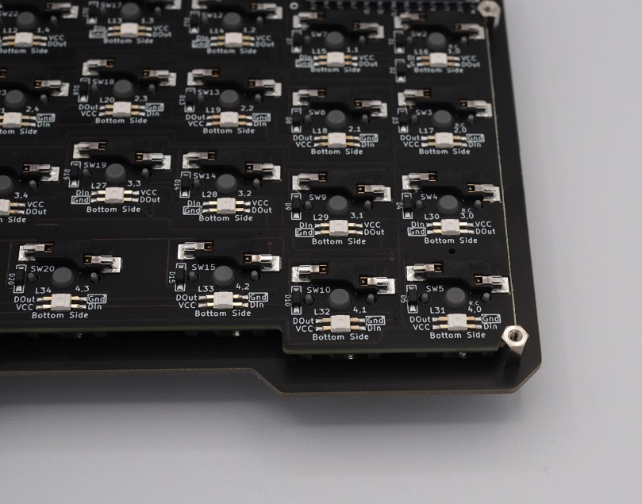
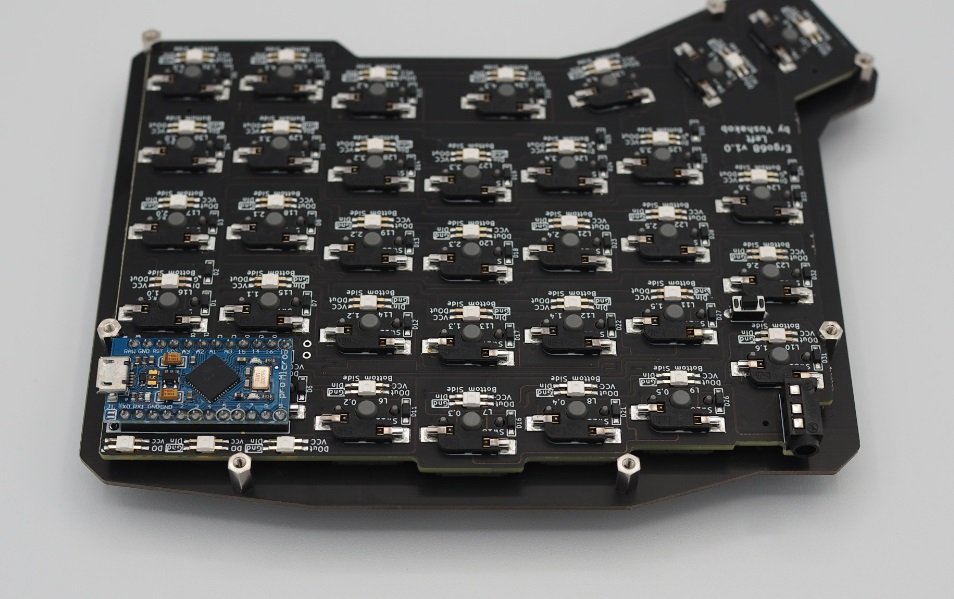
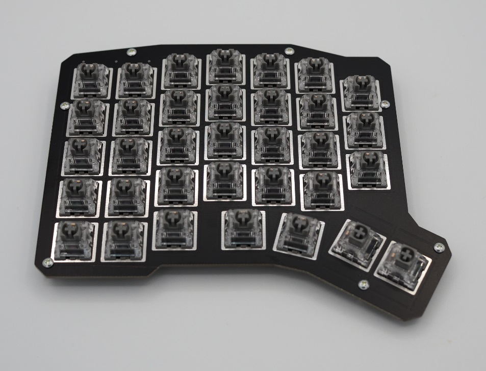

## 6. スペーサーのネジ止め

スイッチプレートにスペーサー(7mm)を取り付けます。 
スペーサーをスイッチプレート裏のネジ穴に配置し、指で抑えながらスイッチプレートの表側からネジ止めします。 
**Point:ミドルプレートを取り付ける場合、5mmのプレートを重ねておくとスペーサーが空回りしなくて締めやすくなります。** 
**Point:スペーサーを指で固定するのが難しければマスキングテープで軽く貼っておくとイライラせずにすみます。** 

 
 
 
 

