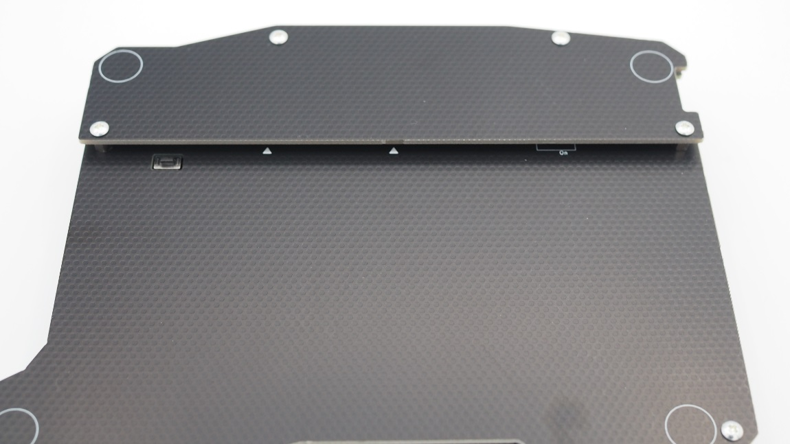

## 8. カバープレートのネジ止め

ボトムプレートの上半分のスペーサー・オスメス（4mm）の上部にカバープレートを乗せ、ネジ止めします。 
**Point:ProMicroにコンスルーを用いている場合、USBケーブルの抜き差しでコンスルーが抜けてしまってキーが効かなくなってしまう場合が結構あります。** 
**この問題を予防するために、ProMicroとカバープレートにクッションゴムを貼ることで抜けるのを抑止する手法があります。** 
**もし頻繁にUSBケーブルを抜き差しするなら、一度考えてみてください。** 

 

