# ErgoDash親指ありアルミニウムケース組み立て説明
**こちらはキットとケースセットを購入した場合の組み立て説明です。ケースのみ購入し、組み立て済みのErgodashと組み合わせる場合にはボトムプレートを取り外し、「[5 アルミケースとの結合](#CaseAsm)」から始めてください。**

## パーツリスト
※キットにはTRRSケーブル（両手間をつなぐケーブル）、USB microBケーブル（PCとの接続に使うケーブル）、キーキャップ、スイッチは付属しません。別途お買い求めください。
### 大きなもの
- a.アルミケース左
- b.アルミケース右

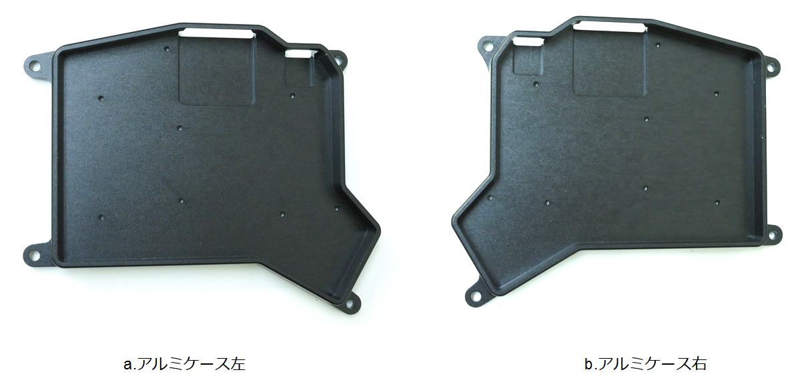

### 平たいもの
- a.Ergodash PCB（基板）　2枚（左右共通）

- b.アクリル製トッププレート右
- c.アクリル製トッププレート左
※アクリルプレートには裏表（左右）があるので注意してください。キースイッチの穴の上下に溝があるのが裏側です。

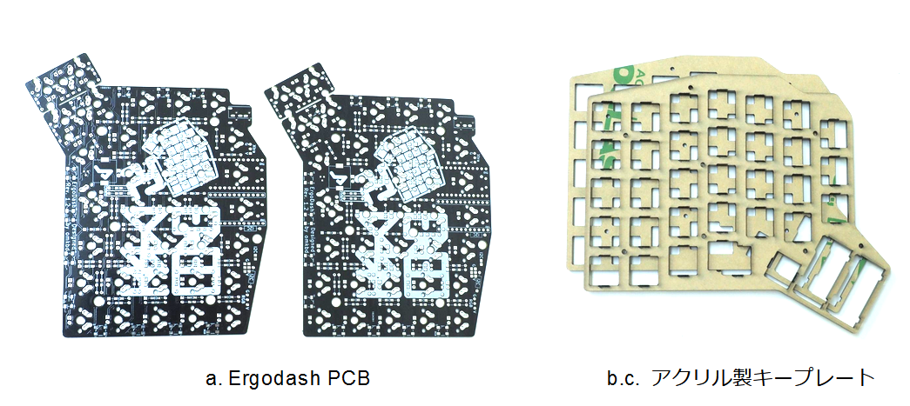

### 電子部品
- a.ProMicro +コンスルー　2セット(コンスルーはProMicroの袋と同じチャックポリに入っています
コンスルーは2つが合体していることがあります。使用する時に分離してください）
- b.ダイオード　赤白の連続テープで70個

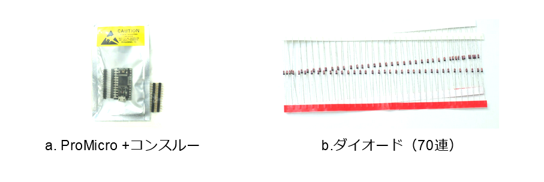

### 小袋の中のもの
- a.2U用スタビライザー　2個
- b.トラスネジ　M2 5mm 16個
- c.低頭ネジ　　M2 5mm 16個
- d.スペーサー　M2 6mm 16個
- e.リセットスイッチ　2個
- f.TRRSジャック　2個

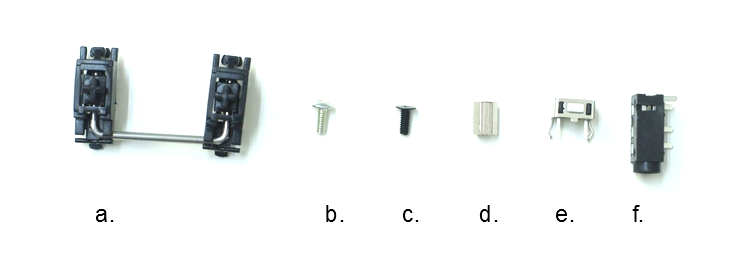

### ケース用袋の中のもの
- ワッシャー　M5 　16枚 ※外周10mmのため注意（標準的なものは外周12mm）
- ナット　M5 16個
- 皿ネジ　M5 50mm　8本
- スパナ（M5用）
- 六角レンチ

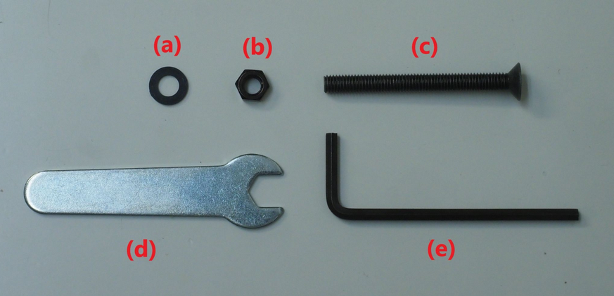

### 必要な道具
このキットの組立には、以下の道具が必要になります。
- はんだごてとコテ台とハンダ
- ドライバー　
 - 以下の２種類が必要になります。
 - +1規格のもの
 - +0規格のもの
※    アルミケース側の穴が狭いため、一般的なドライバーでは太すぎる場合があります
※２    精密ドライバーでも組み立ては可能ですが、ネジに適切なトルクで締結するためにグリップ付きのドライバーが推奨です

はんだごては[HAKKO FX600](https://www.hakko.com/japan/products/hakko_fx600.html)を推奨します。一般家庭のコンセントで使う場合はFX600-02の平型プラグのものを推奨します。類似した製品にFX-601がありますが、細いコテ先の選択肢が少ないので非推奨です。また、FX600の熱容量でも自作キーボードの組み立てには十分に余裕があります。

ドライバーはVesseel製 メガドラ 細軸シリーズを推奨します。
- [メガドラ 細軸ドライバー No.910(+1×100)](https://www.vessel.co.jp/product/screwdriver/detail/125745)
- [メガドラ 細軸ドライバー No.910(+0×100)](https://www.vessel.co.jp/product/screwdriver/detail/125743)

はんだごてとドライバーは遊舎工房の[工具セット](https://shop.yushakobo.jp/collections/accessory-1/products/a9900to)に入っています。他の道具も一緒に揃えられるので、自作キーボードのための工具を揃える場合にはおすすめです。※工具セットの中にはP0規格のドライバーは含まれていないため、別途お求めください。

## 組み立て

### 1.PCB(基板)の組み立て
PCBに部品を挿入し、はんだ付けしていきます。PCBは左右共通の設計で、同じものが2枚入っています。2枚のPCBの片方を右、残りを左と決めて作業してください。

#### 1-1 ダイオードのはんだ付け
ダイオードをPCBの対応するフットプリントに挿入してはんだ付けします。

##### 1-1-1 ダイオードの整形
　ダイオードをコの字型に曲げます。ダイオードを含む辺の長さは10mmぐらいになるようにしてください。ダイオードのリード線は柔らかいので、だいたいで問題ありません。

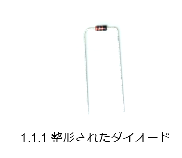

##### 1-1-2 ダイオードの挿入と固定
ダイオードをPCBに挿入して固定します。ダイオードを実装する箇所は基板上にダイオードの記号(〇－▷|－□)のあるフットプリントです。ダイオードには向きがあります。フットプリントの三角形のとがったほうにダイオードの黒い側が向くようにします（画像参照）。挿入したら、ダイオードをPCBに押さえつけながら、リード線を45度ぐらいに曲げます。

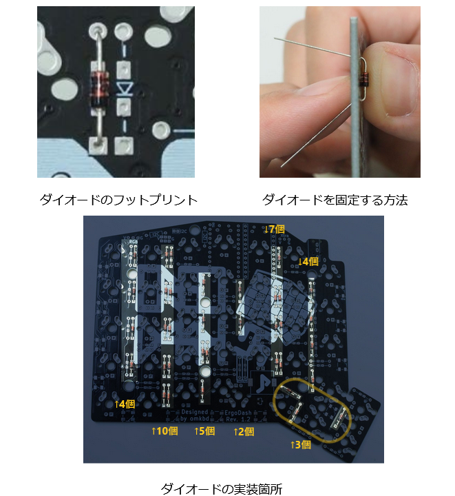

##### 1-1-3 はんだ付け
挿入して固定したダイオードと基板をはんだ付けします。基材は耐熱性です。基板のパッドとダイオードのリード線にしっかりとはんだごてを当てて予熱してください。

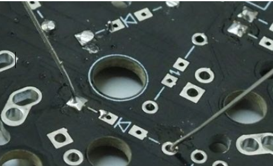

##### 1-1-4 リード線の処理
　はんだ付けが完了したら余ったリード線をニッパーで切断します。なるべく短く切断してください。

#### 1-2 反対側の基板のダイオードの組み立てとはんだ付け
反対側の基板にダイオードを実装します。裏表逆になるので、1.1でダイオードをはんだ付けした面の反対側にダイオードをはんだ付けします。左右両方の基板にはんだ付けが完了するとこのようになります。
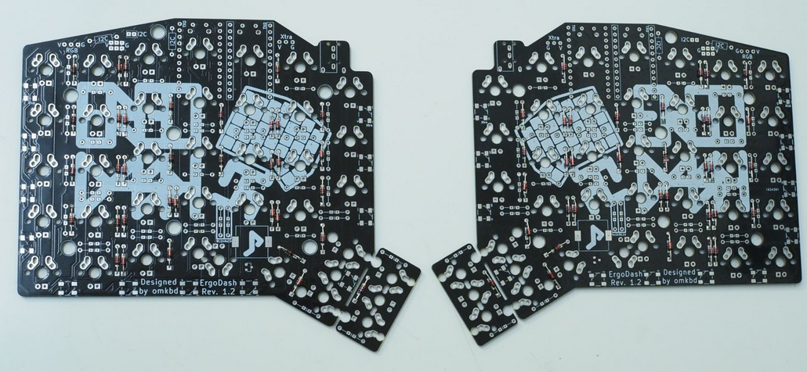

#### 1-3 リセットスイッチとTRRSジャックのはんだ付け
リセットスイッチとTRRSジャックを基板に挿入してハンダ付けします。先程**ダイオードを実装した面と同じ面**に実装します。

TRRSジャックは基板の上端の親指側に実装箇所があります。押し込むとパチっと音がして固定できるので、TRRSジャックの底面がPCBにふれるまで押し込んでください。TRRSジャックが固定できない場合は、逆作用ピンセットなどで基板に密着させた状態で仮止めしてはんだ付けしてください。

リセットスイッチは、基板の上端の中央辺りに実装箇所があります。基板の左右で挿入する位置が異なるので注意してください。（双方ともに実装する面の左側の穴に実装します）

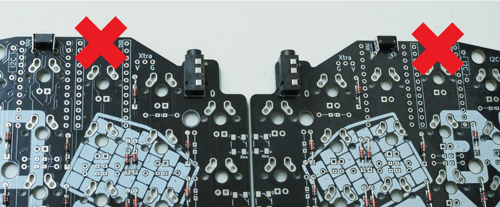

TRRSジャック・リセットスイッチははんだ付け後のリード線の処理は必要ありません。

#### 1-4 スタビライザーの実装
基板の下側の60度傾斜した部分にスタビライザーを装着します。これは2Uのキーキャップを実装する場合に必要なパーツです。左右の端をリンク機構で連動させる事によって、長いキーの端を押しても正しくキーを押せるようにします。

##### 1-4-1 スタビライザーの位置について
Ergodashは親指のスタビライザーの位置を選択することができます。詳しくは[Ergodashの商品ページ](https://shop.yushakobo.jp/collections/keyboard-1/products/ergodash)を参照してください。

##### 1-4-2 基板への取付　
スタビライザーは、1.3ではんだ付けしたTRRSジャックやリセットスイッチの裏側の面に固定します。

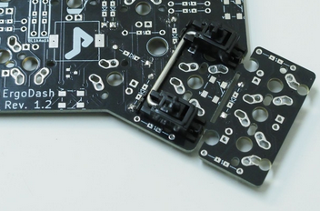

以上でPCBへのはんだ付けと部品の取り付けは完了です。

### 2 トッププレートの組み立て
トッププレートにキースイッチを固定します。

#### 2-1 トッププレートの裏表の確認
トッププレートには裏表があります。トッププレートの表面は、キースイッチが入る穴のみがアクリル板に加工されています。トッププレートの裏面はキースイッチが入る穴に加えて穴の上下にキースイッチを固定する爪がかかる溝が加工されています。

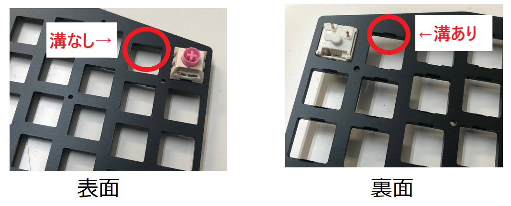

#### 2-2 保護フィルムの除去
トッププレートの裏表の保護フィルムを取り除きます。角を爪などで剥がし、浮いた部分をピンセットで剥がすと簡単に剥離できます。

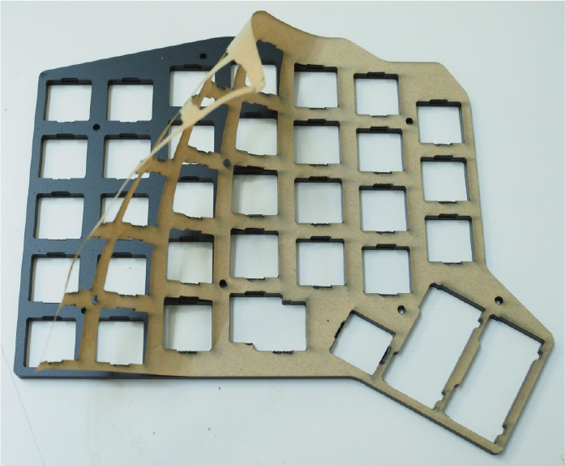

#### 2-3 キースイッチの挿入
キースイッチをトッププレートの表面から挿入します。トッププレートの表面は、キースイッチが入る穴のみがアクリル板に加工されています。トッププレートの裏面はキースイッチが入る穴に加えて穴の上下にキースイッチを固定する爪がかかる溝が加工されています。
正しい向きから挿入すると、キースイッチの爪がトッププレートの溝にかかりしっかりと固定されます。逆向きから挿入すると爪がかかる箇所がないため、簡単に抜けます。

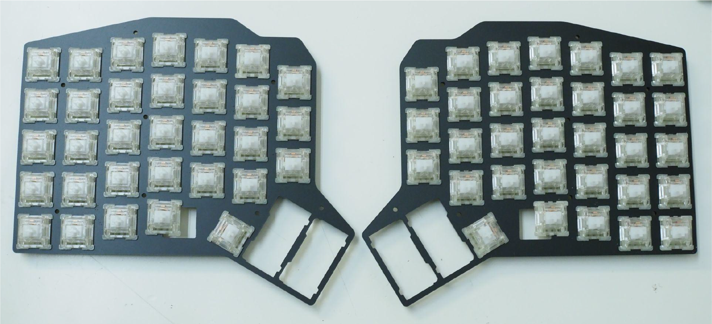

#### 2-4 トッププレートの結合
キースイッチを固定したトッププレートをPCBと固定します。

##### 2-4-1 キースイッチが3ピンの場合
トッププレート上のキースイッチのピンを、PCBの穴に合わせて設置して結合します。引っかかるものはないので、すべてのキースイッチが穴に抵抗なく収まります。PCBが基板から浮く場合は、以下の原因が考えられます。
- キースイッチの電極のピンが曲がってPCBの正しい穴に入っていない
- ダイオードのリード線が長く伸びてトッププレートの底面にあたっている

#### 2-5 キースイッチが5ピンの場合
キースイッチのPCB固定用のピンをPCBの穴に押し込む必要があるため、PCBをキースイッチの上に載せた後に強く押し込みます。押し込む際にキースイッチの電極が指に刺さらないように注意してください。

#### 2-6 キースイッチの位置のチェック
キースイッチがPCBに対して正しい位置に固定されているかを確認します。

##### 2-6-1 キーボードの縁のキースイッチのはめこみの確認
キースイッチの底の突起とPCBが接触していることを確認します。浮いている場合は正しい位置に押し込んでください。

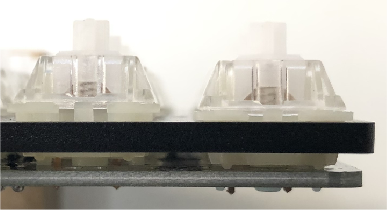

左側：浮いているキースイッチ　右側：正しい位置にあるキースイッチ

##### 2-6-2 内側のキースイッチの目視での確認
縁のキースイッチの挿入位置を確認したら、内側のキースイッチが正しい位置に挿入されているかを確認します。キーボード本体の側面から目視でキースイッチの上端が揃っていることを確認します。こちらも浮いている場合は正しい位置に押し込んでください。

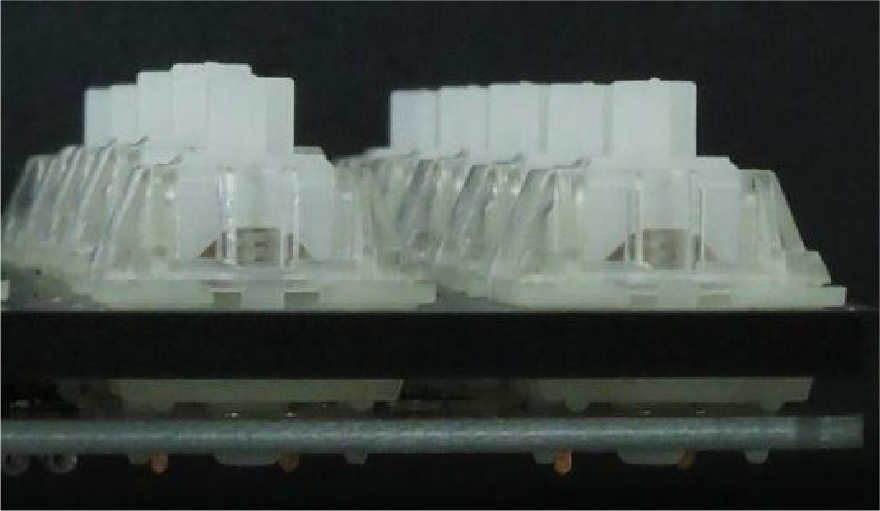

左側：浮いているキースイッチ　右側：正しい位置にあるキースイッチ

#### 2-7 はんだ付け前のキースイッチの処理
ProMicroを実装する部分にあるキースイッチは、キースイッチの種類によっては電極の端子がProMicro上のパーツに接触してProMicroが動作しなくなることがあります。それを防止するため、ProMicroを実装する位置の下にあるキースイッチの電極の端子を短くカットします。
カットする目安は、基板から出る量が樹脂のピンの同じ程度になるまで短くしてください。

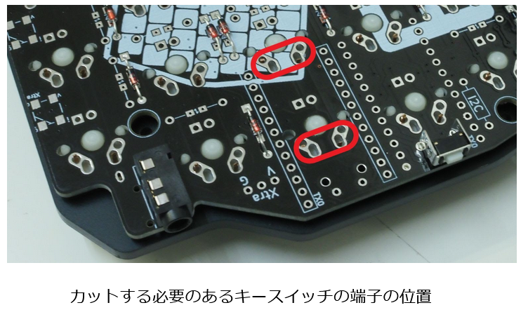
カットする必要のあるキースイッチの端子の位置

#### 2-8 キースイッチのはんだ付け
キースイッチをはんだ付けします。キースイッチは打鍵時に強い衝撃を受けるので、ハンダは多く使ってしっかりとパッド全体から部品の頭までフィレットができるようにはんだ付けをします

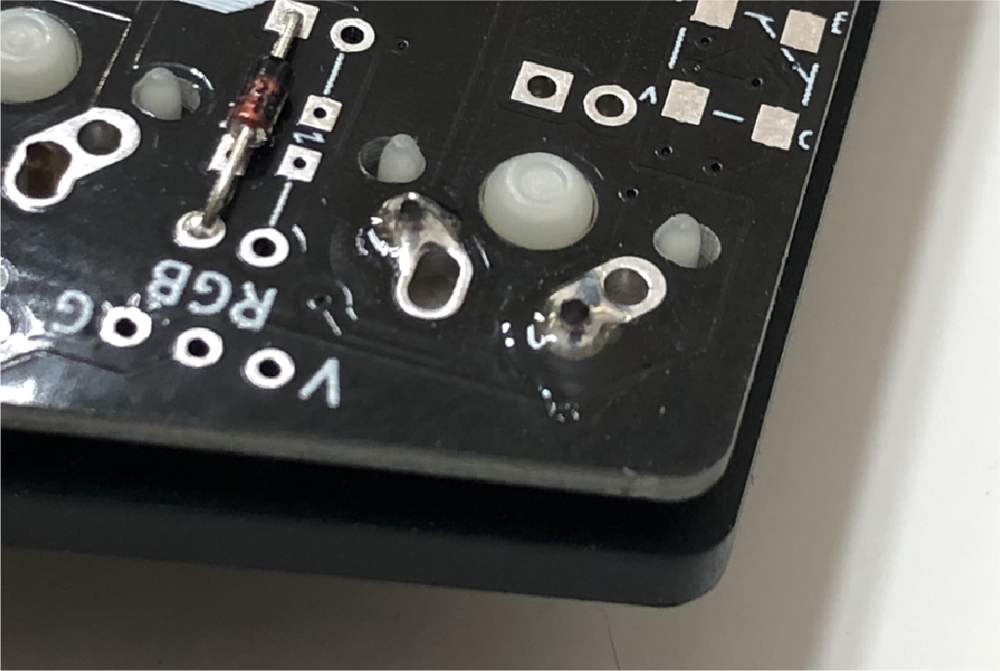

#### 2-9 ProMicroの下のキースイッチの処理の確認
ProMicroの下に来るキースイッチの電極の端子が短くカットされていることを確認します。もし、カットされていないようであれば、はんだ付けごとにっぱーでカットしてください。

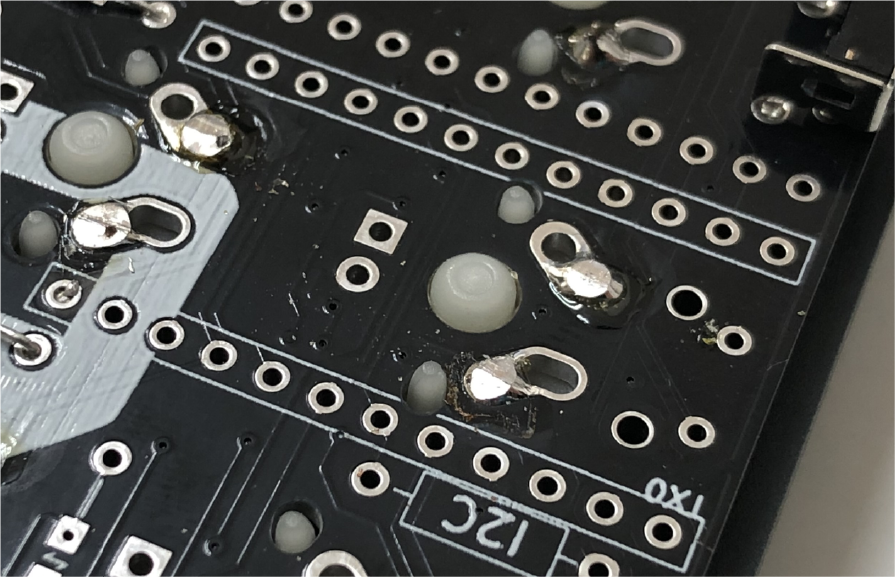

#### 2-10 2Uのキースイッチのはんだ付け
手前の60度傾斜した部分にキースイッチを挿入してはんだ付けします。2U用で実装するキースイッチは電極が手の外側に来るように固定します。1U用で実装するキースイッチは電極が手の内側になる向きで実装します。

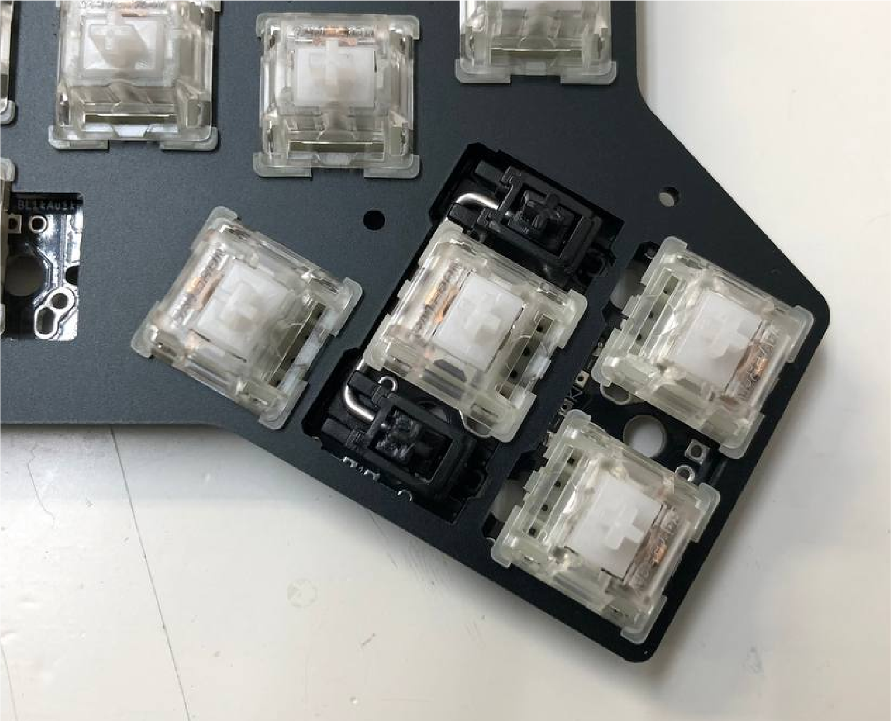

### 3 ProMicroの結合
ProMicroをキーボード本体に接続します。ErgodashのProMicroはコンスルーをはんだ付けし、コンスルーを本体側の対応した径の穴に差し込んで固定します。これはProMicroを外して交換できるようにするためです。

#### 3-1 キースイッチの脚のカット
ProMicroの直下にあるキースイッチの電極につながる端子を短く切断します。これは、キースイッチの端子がProMicroの部品に接触し、ProMicroが装着された状態で動作しなくなることを避けるためです。（キースイッチの電極の端子の厚さや長さはメーカーによって異なり、接触しないメーカーもあります。しかし、かなり電極がProMicroに接近するため、安全のために短く切断しましょう）

#### 3-2 コンスルーの固定
コンスルーとは、対応した穴径のメッキ仕上げ穴に挿入するだけで電気的接続と機械的固定ができるバネ端子です。Ergodashでは、**メイン基板側のProMicroを接続する穴はコンスルーに対応した穴径のため、はんだ付けをせず**、コンスルーを挿入します。ProMicro側の端子穴はコンスルーに対応していないため、はんだ付けをする必要があります。

#### 3-3 推奨するコンスルーの方向
コンスルーは、端子の片方をはんだ付けする場合と、複数のコンスルーを同一基板に実装する場合に推奨される向きがあります。

コンスルーの黒い樹脂のパーツの片方の側面には穴があります。また、穴は樹脂パーツのどちらかの端子側に寄った位置にあります。穴が寄っている側の端子がProMicro側（はんだ付けする側）にくるように本体のPCBに挿入します。また、左右のコンスルーの穴が同じ側に向くようにします。
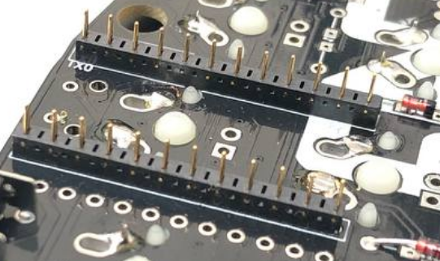

#### 3-4 ProMicroのはんだ付け
ProMicroをはんだ付けします。これではんだ付けは完了です。
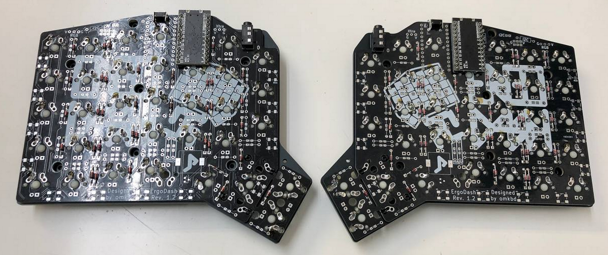

### 4 ファームウェアの書き込み
ProMicroにファームウェアを書き込んで動作をチェックしましょう。まずは動作確認のためデフォルトのキーマップを書き込みます。ファームウェアを書き込んでいない時点ではキーボードとして使用できません。

#### 4-1 書き込み方法の種類
書き込みにはいくつかの方法があります。

- a.ProMicroWebUpdaterで書き込み
- b.[QMK Toolbox](https://github.com/qmk/qmk_toolbox)で書き込み（[こちらの「QMKToolboxを使用する場合」](https://salicylic-acid3.hatenablog.com/entry/qmk-toolbox)がわかりやすいです）
- c.QMK Firmwareをローカルでビルドして書き込み([QMKチュートリアル](https://docs.qmk.fm/#/ja/newbs)が参考になります)

#### 4-2 PromicroWebUpdaterを利用した書き込み
もっとも簡単なaの方法で行います。

##### 4-2-1 キーボードを接続する
キーボードをPCと接続します。片手ずつ、TRRSケーブルでは繋がない状態で書き込みます

##### 4-2-2 hexファイルのダウンロード
[Ergodash作者のファームウェアのページ](https://github.com/omkbd/ErgoDash/blob/master/Firmware/ErgoDash_rev1_via.zip)から「ErgoDash_rev1_via.zip」をダウンロードします。適当な場所に展開します。

##### 4-2-3.Pro Micro Web Updaterを開く

[Pro Micro Web Updater](https://sekigon-gonnoc.github.io/promicro-web-updater/index.html)にChromeでアクセスします。他のブラウザでは動作しませんのでご注意ください。

##### 4-2-4 書き込み
「ファイルを選択」から先程ダウンロードしたフォルダ内の「ergodash_rev1_via.hex」を選択します。
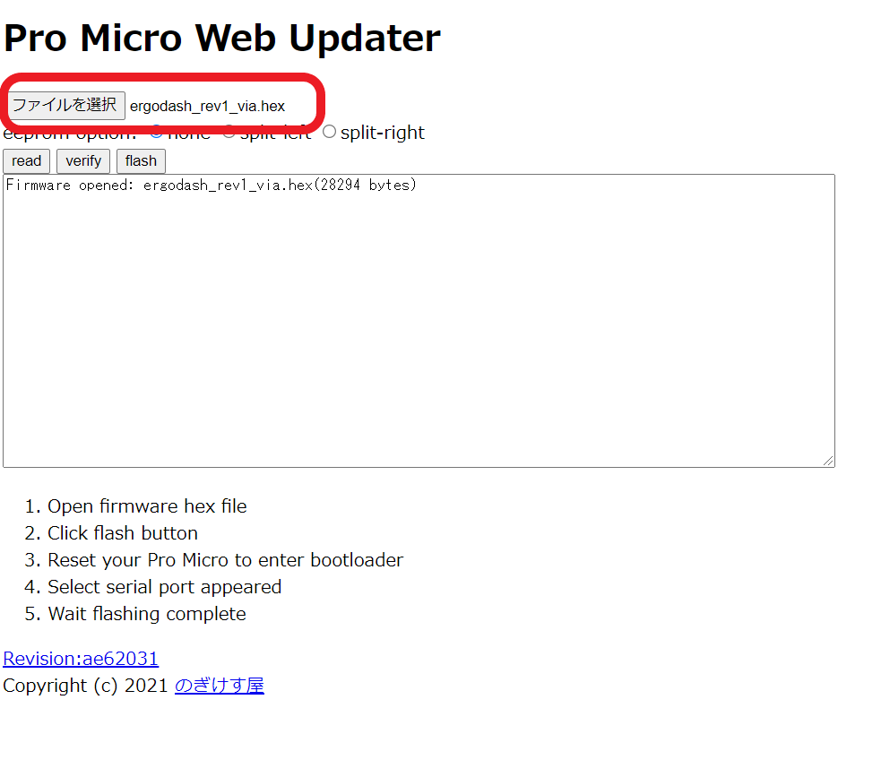

 「flash」ボタンを押します。

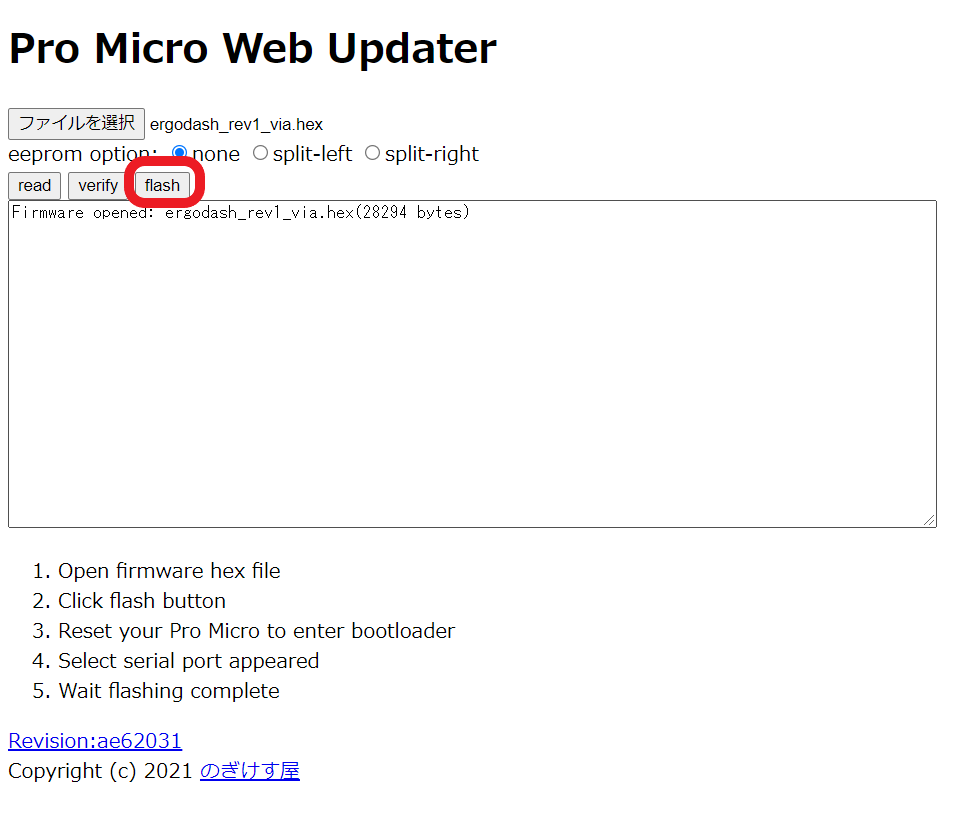

キーボードのリセットスイッチを押します。

接続要求のウィンドウが出るのでリセットスイッチを押して出てきたポートを選択し、接続ボタンを押します（Arduino Microまたはキーボードの名前のポート）。書き込みがはじまります。

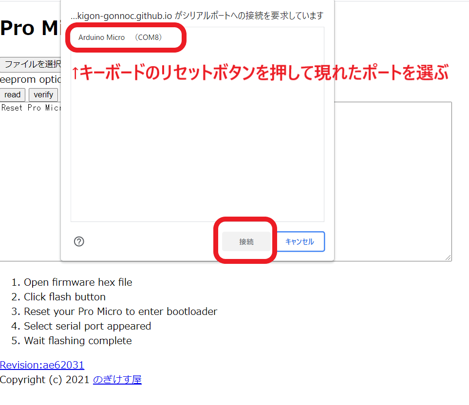

少し待ってVerify OKと出たら終了です。同様にもう片手分も書き込みます。

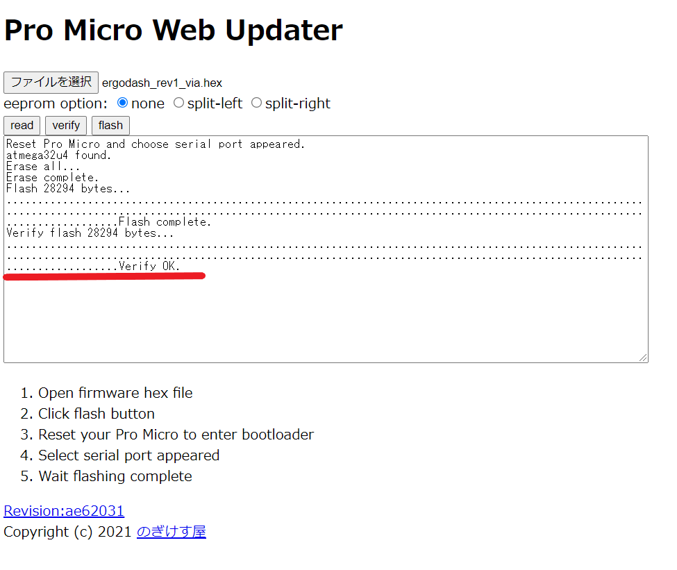

より詳しい設定方法（マスターの設定やLEDの設定）については[作者Ergodashビルドガイドの12 Firmwareの書き込み](https://github.com/omkbd/ErgoDash/blob/master/Doc/build.md#ext-firmware%E3%81%AE%E6%9B%B8%E3%81%8D%E6%8F%9B%E3%81%88)を参照ください

#### 4-3 動作チェック
**！ここで動作チェックをしましょう！**

すべて完成してから動作チェックを行うと、ケースを外しなおしたりといった手間が発生します。ケースに入れる前に完璧に動作する状態にしましょう。

[QMK configratorのテストページ](https://config.qmk.fm/#/test)を開いてすべてのキーの動作をチェックします。

注意：JIS配列の設定のPC使ってる人向けに：～｀はAlt推しながらじゃないとキーを離したキーコードがアプリ側に行かないので、単体で押し込んだときに押しっぱなし表示になります。基本的にPCは英語キーボードの設定にすることをお勧めします。

うまく入力されない場合、一番最後にある「トラブルシューティング」をチェックしてみてください。

### 5 アルミケースとの結合

#### 5-1 スペーサー（高ナット）の固定
固定に利用するのはM2 低頭ネジ（黒くて頭が平坦なネジ）とP0のドライバーです。以下の写真の赤丸の箇所にスペーサーを固定します。
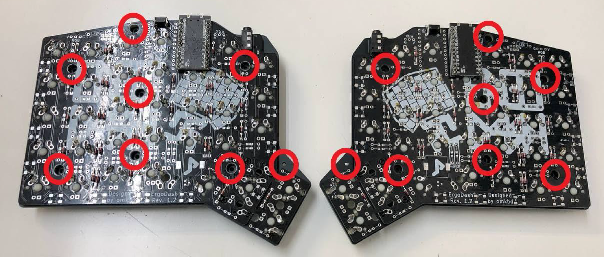
スペーサーをPCB側にネジで固定します。このときに、スペーサーを指で押さえ、ネジをドライバーの先端につけた状態で作業すると簡単に作業できます。また、M2低頭ネジはなめやすいため、ドライバーを普通のネジに比べて強く押し込みながら締めてください。
#### 5-2 アルミケースの固定
PCBが上になる状態でおいた本体にアルミケースを上から置きます。

#### 5-3 ネジの仮止め
　M2 トラスネジ（銀色で頭が丸いネジ）をすべてのネジ穴に入れ、仮止めします。この作業ではP1規格のドライバーを使用してください。また、本体のスペーサーがネジ穴の位置に合うように位置を調整しながらネジを固定してください。

#### 5-4 ネジの本締め
M2トラスネジを底面から本締めして固定します。        

#### 5-5 平置きで使う場合
底面にクッションシール、もしくはお好みの滑り止めグリップを貼ってください。コルクシールなどがおすすめです。

#### 5-6 傾斜をつける場合
付属のM5皿ネジを利用して以下のように傾斜させることができます。
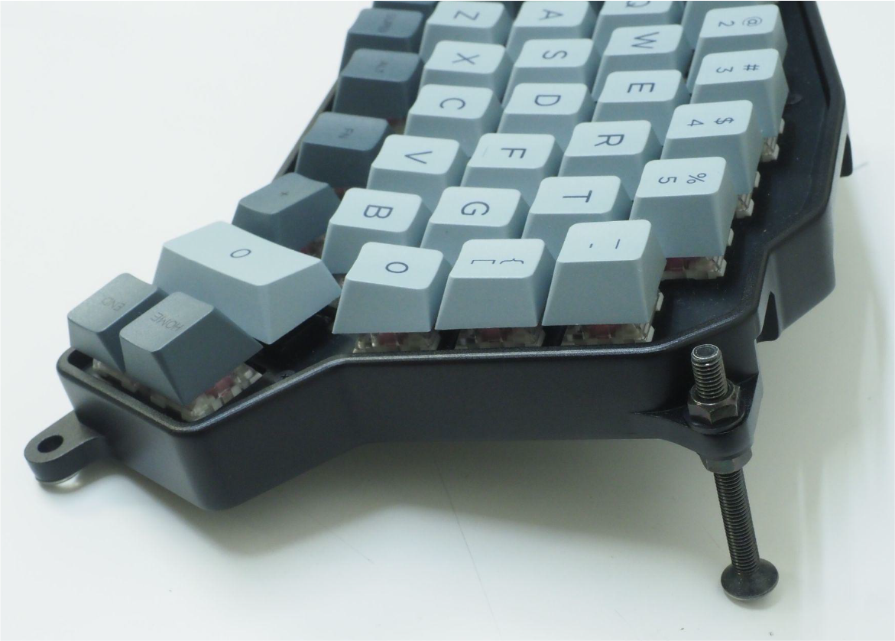

##### 5-6-1 傾斜させる方向の決定
ケースを傾斜させる方向を決定します。2箇所の穴にネジを挿入し、残りの2箇所にケースを設置させる方法と、すべての穴にネジを挿入してケースを任意の方向に傾斜させる方法があります。

##### 5-6-2 ネジで接地する部分のセットアップ
ネジにナットとワッシャーを挿入して固定するための準備をします。このときに設定したい大体の高さの位置にボルトをおいておきます。
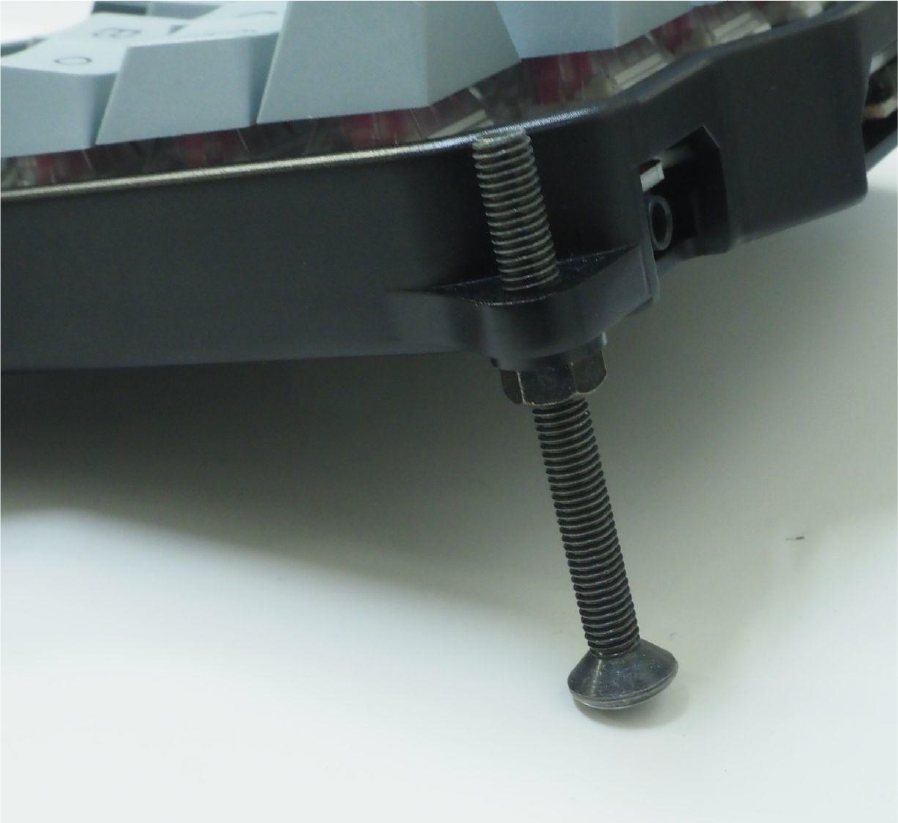

ケースのネジを挿入する穴にネジをいれて、机の上に仮に設置します。この状態で、ナットを回して位置を調整し、ガタツキがない状態で、好みの傾きになるように調整します。

ケースが好みの角度になったら、上からワッシャーとナットをネジに固定し、ケースの位置を固定します。

最後にナットを付属のスパナで締めて下さい。以上でネジを挿入する部位の調整は完了です。

##### 5-6-3 ケースが直接接地する部分のセットアップ
　以下のようにクッションシートを貼り付けてください。

### 6 .キーキャップを装着
キーキャップをつけて完成です。キーキャップを抜く際にはキーキャッププラーというキーキャップを抜く道具を使うのがおすすめです。

### 7.キーマップのカスタマイズ
以下の3つの方法でキーマップを書き換えられます。
- 1.[VIAというアプリ](https://caniusevia.com/)を使用する方法([こちらのサイト](https://salicylic-acid3.hatenablog.com/entry/via-manual)がわかりやすいです。)
- 2.[RemapというWEBアプリ](https://remap-keys.app/)を利用する方法([こちらのサイト](https://salicylic-acid3.hatenablog.com/entry/remap-manual)がわかりやすいです)
- 3.[QMK ConfiguratorとQMKToolbox使用する方法](https://yushakobo.zendesk.com/hc/ja/articles/360051231534-%E3%82%AD%E3%83%BC%E3%83%9E%E3%83%83%E3%83%97%E3%82%92%E5%A4%89%E6%9B%B4%E3%81%97%E3%81%9F%E3%81%84-QMK-Configurator%E5%88%A9%E7%94%A8-)
- 4.直接キーマップの設定ファイルを書き換える方法

### 8 トラブルシューティング

多くのトラブルは下記3点が原因です。トラブルがあった場合は調べてみてください。

- はんだ付け忘れ
- ProMicroの脚切り忘れ
- ケーブルの断線・充電専用ケーブルの利用

#### 8-1 よくあるケース
- キースイッチが一個だけ動かない
 - ダイオードの向きの間違いを確認（全てのダイオードがKの黒線がある方が四角いパッド側を向いているか）
 - キースイッチやダイオードのはんだ付け忘れをしてないか確認

- キースイッチが行ごと動かない
 - ProMicroとコンスルーのはんだ付けが不足していないか（Promicro側にしっかりとはんだが回っているか）を確認。はんだ付けを直す。
 - ProMicroを交換して動かないか確認（ProMicroの配線不良がある場合がある）
 - コンスルーとPCBの導通をしているかテスターで確認（極稀にレジストがスルーホールの中に流れ込んで電気的に接続されない場合がある）

- パソコンにProMicroが認識されない
 ‐ ProMicro単体で認識されるか確認。単体だと認識される場合にはProMicroの下のキースイッチを切ったか確認（ショートしている可能性がある）
 - ProMicroのUSBを差し込む部分がグラグラしてないか確認（USBケーブルさしてねじるとはんだ付けがはずる事ある）。外れかけている場合には新しいProMicroに交換。
 - USBケーブルは正常か確認。他のケーブルを使ってみる、そのケーブルを他の機器で使えるか試してみるなど。（断線や充電専用ケーブルなどの場合がある）

- 片方だけ動く
 - TRRSケーブルがしっかり奥まで押し込まれているか確認（硬めのため半刺し状態になっている場合がある）
  - 違うTRRSケーブルで試す（断線している場合がある）

- ファームウェアが違う
 - 書き込んでいるのがErgodash miniではないかファイル名を確認

 **解決しない場合、[遊舎工房サポートサイト](https://yushakobo.zendesk.com/hc/ja)の内容もご確認ください。**
