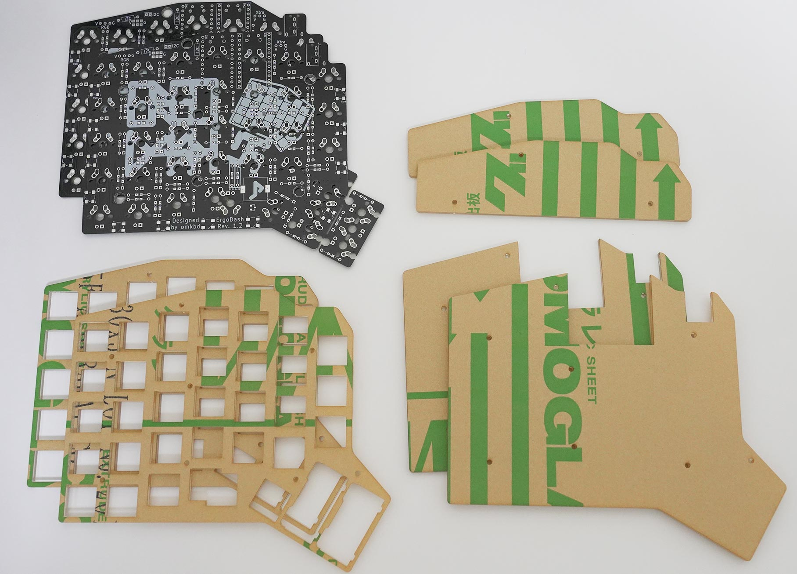

# ErgoDash必要部品/必要工具

## 付属品
|部品名|数量|備考|
|---|---|---|
|基板|2||
|アクリルトッププレート|2||
|アクリルボトムプレート|2||
|アクリルProMicro保護プレート|2||
|ダイオード|70||
|ProMicro|2|銀色の袋に同封されているピンヘッダは使用しません|
|コンスルー|4|ProMicroと一緒に透明の袋に入っている金色の部品です|
|TRRSジャック|2||
|リセットスイッチ|2||
|スタビライザー|2||
|M2 5mmネジ|22|積層版は34|
|M2 8mmネジ|6|積層版は10|
|M2スペーサー 6mm|14|積層版は22|
|ゴム足|12||

積層版はアクリルの構成が異なります

部品が不足している場合はお問い合わせよりご連絡下さい。  
[リクエストを送信 – 遊舎工房サポートサイト](yushakobo.zendesk.com/hc/ja/requests/new)

## 別途必要な部品
|部品名|数量|備考|
|---|---|---|
|CherryMX互換スイッチ|66~70|組み立てるレイアウトで数が変動します|
|CherryMX互換キーキャップ|キースイッチと同数||
|TRRSケーブル|1||
|MicroUSBケーブル|1|データ通信可能なものを使用してください|

## 必要な工具
|名称|備考|
|---|---|
|はんだごて|温度調整機能が付いているものを推奨|
|はんだ線|0.6mm~0.8mmのもの|
|精密ドライバー|
|ニッパー|ダイオードやスイッチをカットするのに必要です|
|ペンチ/ラジオペンチ|PCBを折る場合必要です|
|テープ(マスキングテープなど)|部品を仮固定するのに必要です|

遊舎工房では自作キーボード作成に必要な工具セットを販売しています。
https://shop.yushakobo.jp/collections/accessory/products/a9900to

### 次へ:組み立て
### [親指ありレイアウト ビルドガイド](ErgoDash_BuildGuide.md)
### [親指なしレイアウト ビルドガイド](ErgoDash_BuildGuide_cut.md)
