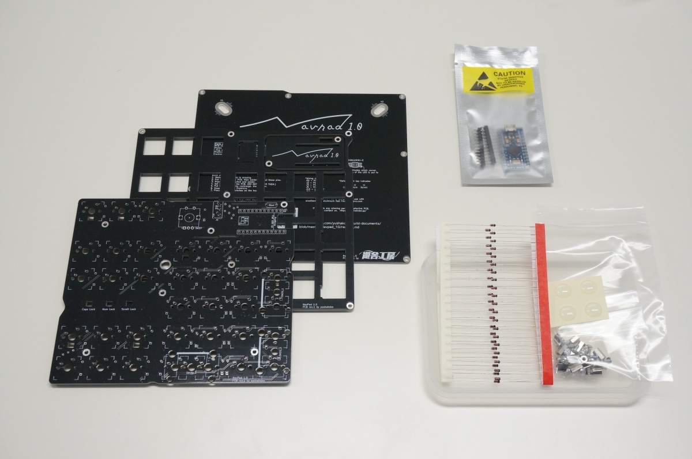

# Navpad 1.0 ビルドガイド

※本ビルドガイドの画像は開発中のものを含むため、お手元の製品と一部異なる場合があります

Aluminum feetやアクリルプレートの使用など、Navpad 1.0のカスタマイズについては[こちら](formore/readme.md) **一部手順が前後する箇所や、レイアウトに指定がある場合がありますので、このビルドガイドの前に必ずご一読ください**

回路図は[こちら](Navpad.pdf)からどうぞ

## 必要な部品

|部品名|数量|備考|
|---|---|---|
|基板|1枚|
|トッププレート|1枚|
|ボトムプレート|1枚|
|ダイオード|36個|スルーホールにのみ対応|
|ProMicro|1個|
|ピンヘッダ|2本|ProMicro付属のものを使用します|
|タクトスイッチ|1個|
|M2 4mm ネジ|22本|
|M2 7mm スペーサー|9個|
|M2 5mm スペーサー|2個|
|Cherry MX互換キースイッチ|~35個|Numpad部分のレイアウトにより変動|
|Cherry MX互換キーキャップ|~35個|Numpad部分のレイアウトにより変動|
|ゴム足|4個|

## オプション部品

|部品名|数量|備考|
|---|---|---|
|コンスルー|2本|MAC8製 XB-3-2.5-12P|
|スタビライザー 2Uサイズ|~3個|`0`キーや`Enter`キーを2Uとする場合に必要|
|LED(SK6812MINI-E)|9個|各種インジケーターとして使用|
|ロータリーエンコーダー|1個|
|ロータリーエンコーダー用ノブ|1個|

## 必要な道具

|名称|備考|
|---|---|
|はんだごて|LEDを使用する場合は、温度調節機能のあるもの|
|ニッパー|コンスルーを使用**しない**場合は約0.3mm以上の切断能力が必要 (ProMicro付属のピンヘッダをカットします)|
|ドライバー|PH1のもの (M2ネジの固定に使用します)|
|棒ヤスリ|#400程度のもの (折り取った基板を整える際に使用します)|

## 組み立ての前に

作業の前に必ずこのビルドガイドを最後までお読みください。また、***以降の作業では先端の非常に熱くなるはんだごてを扱います。作業の途中に席を離れる際は電源を切るなど、やけどや怪我には十分ご注意ください。***

## 組み立ての流れ

1. (オプション)LEDのはんだ付け
1. ダイオードのはんだ付け
1. リセットスイッチのはんだ付け
1. ProMicroの取り付け
1. ファームウェアの書き込み
1. プレートの準備
1. キースイッチの取り付け
1. ロータリーエンコーダーの取り付け
1. キースイッチ、ロータリーエンコーダーのはんだ付け
1. はんだ付けしたキーの動作確認
1. ProMicroカバーの取り付け
1. ボトムプレートの取り付け
1. キーキャップ/ロータリーエンコーダー用ノブの取り付け

