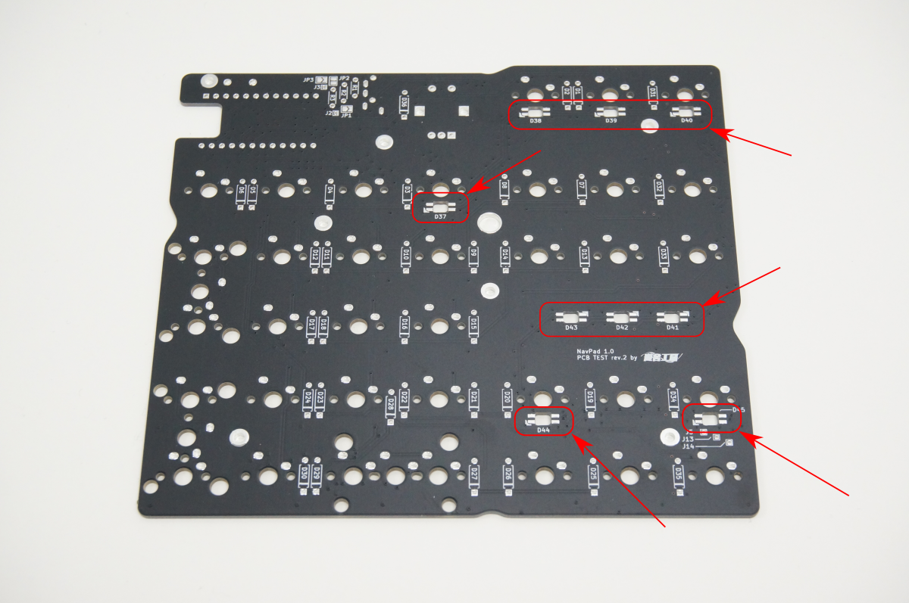
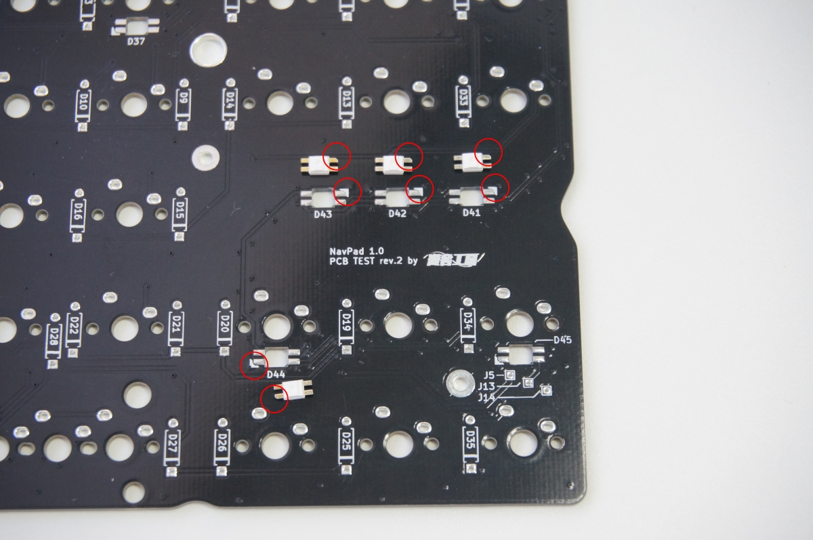

### 1. (オプション)LEDのはんだ付け

*LEDの取り付けは最後へ回すことができます

基板上、次の箇所にLEDを取り付け、はんだ付けします。**このとき、はんだごての温度を270℃以下に設定することをおすすめします。** LED以外の部品については一定の耐熱があるので320℃程度で使用できます。

LEDにはそれぞれ向きがあり、取り付ける場所によって向きが異なりますのでご注意ください

