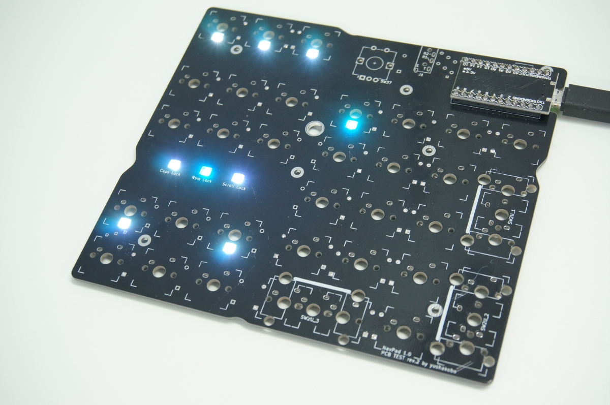

### 5. ファームウェアの書き込み

Navpad 1.0はファームウェアとしてqmk_firmwareを使用しています。[公式のDocs]()のとおりに環境を用意し、書き込みます。

コマンドラインからの書き込みを予定している場合は必要な環境のダウンロードに時間がかかることがあるため、前もってダウンロードを進めておくとスムーズです。

`qmk flash -kb yushakobo/navpad/10/rev1 -km default`

*コマンドラインから書き込む場合は`/rev1`の部分を省略できます

ファームウェアの書き込みが完了したら、はんだ付けしたLEDが白色に光ることを確認しましょう(CapsLockやNumLockがオンになっていると一部は青く点灯します)

