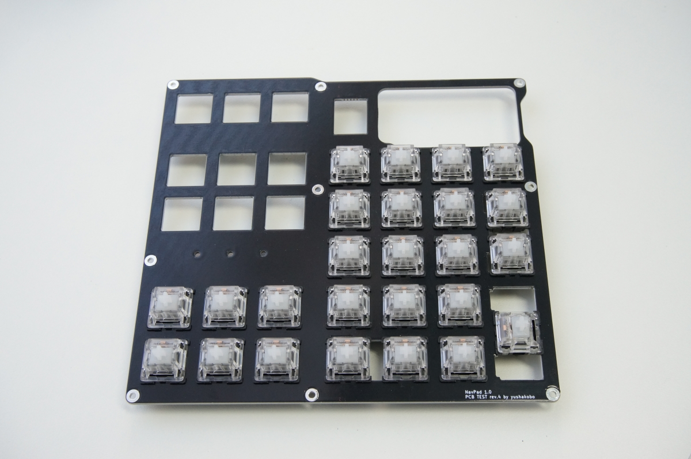
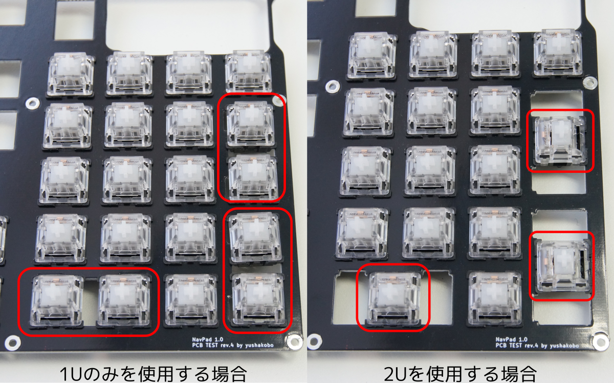
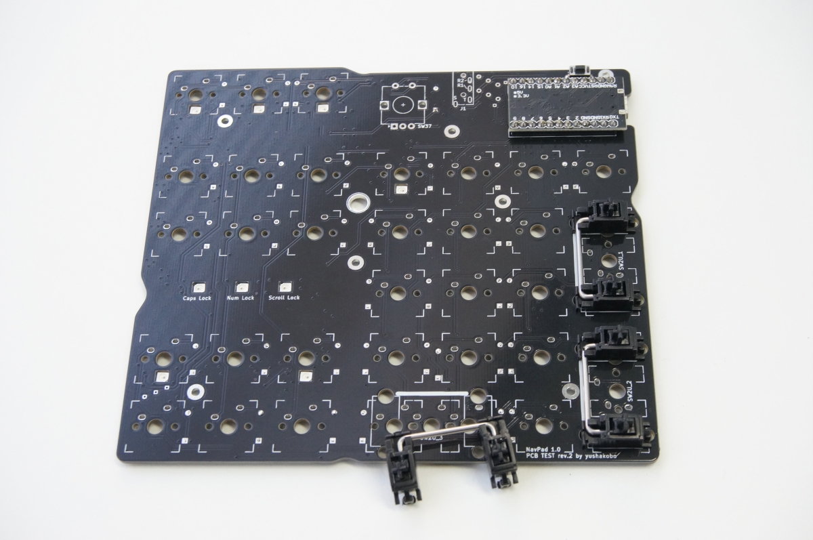

### 7. キースイッチの取り付け

準備したトッププレートにキースイッチを取り付けます。このとき、右下部のレイアウトによって取り付け位置や向きが異なるので注意します

2Uを使うレイアウトの場合、このタイミングで基板にスタビライザーを取り付けます

スタビライザーの取り付け方について、詳しくは[こちら](https://github.com/yushakobo/build-documents/blob/master/ErgoDash/ErgoDash_BuildGuide.md#4%E3%82%B9%E3%82%BF%E3%83%93%E3%83%A9%E3%82%A4%E3%82%B6%E3%83%BC%E3%81%AE%E5%8F%96%E3%82%8A%E4%BB%98%E3%81%91)をご確認ください

