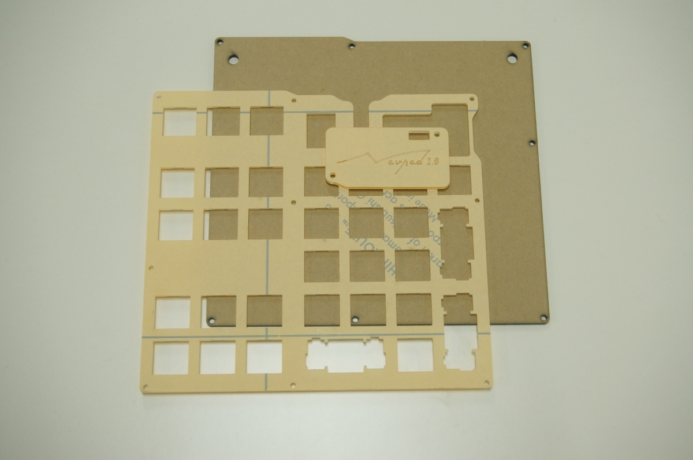
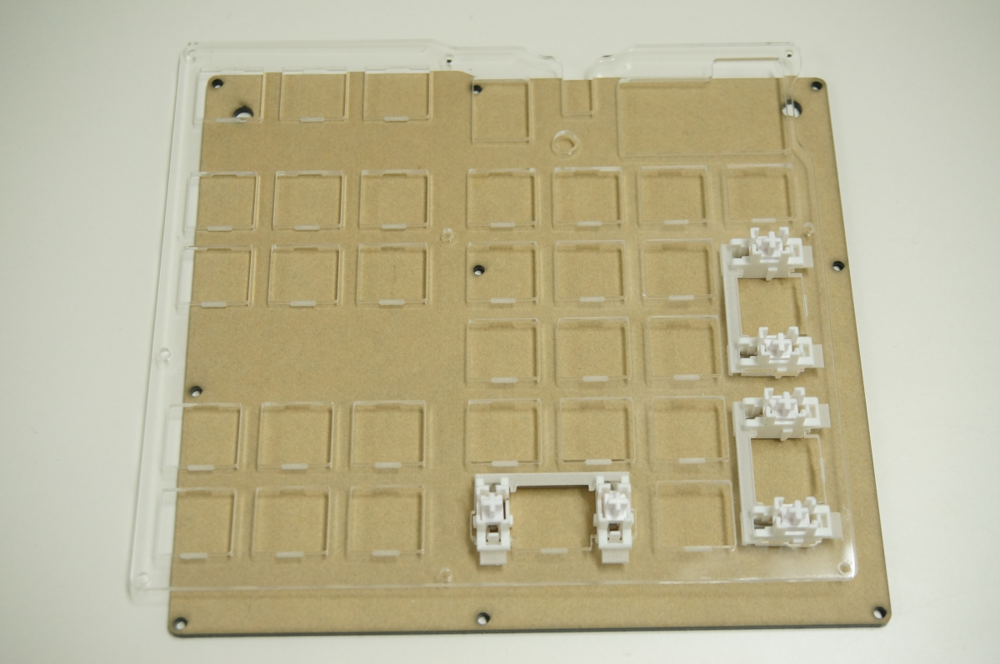
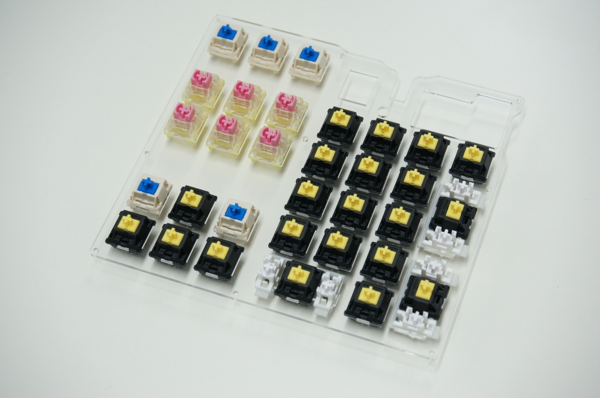
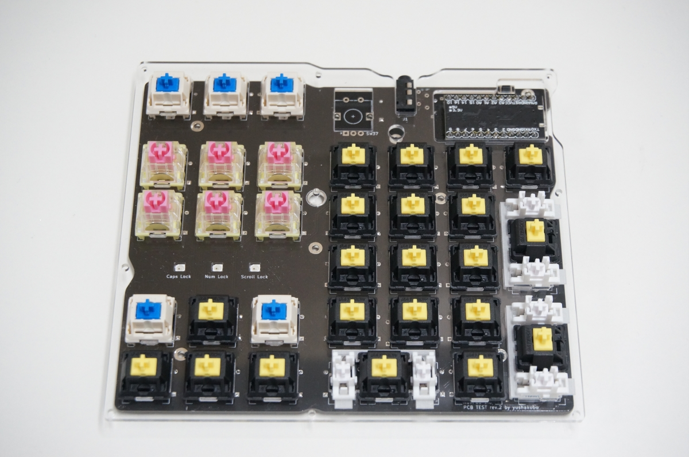
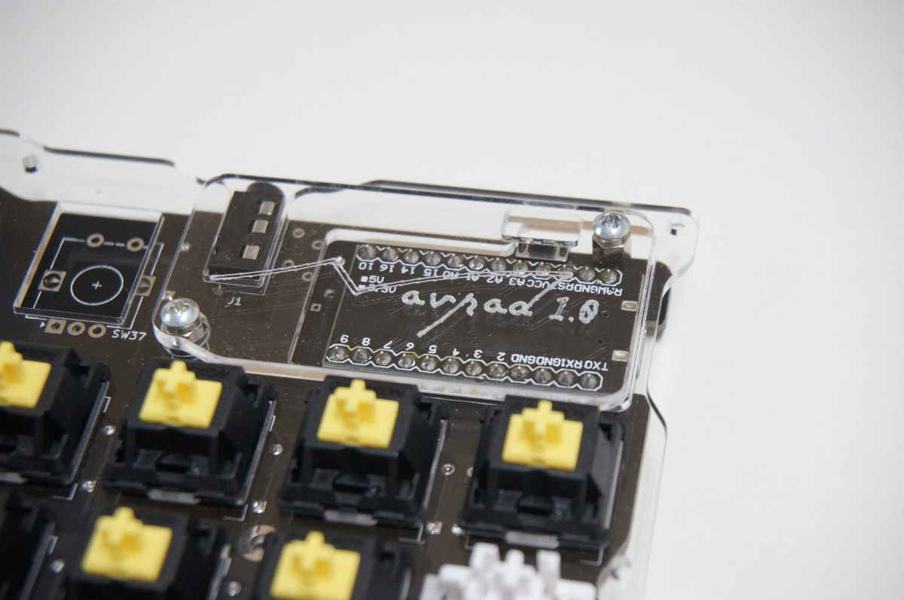
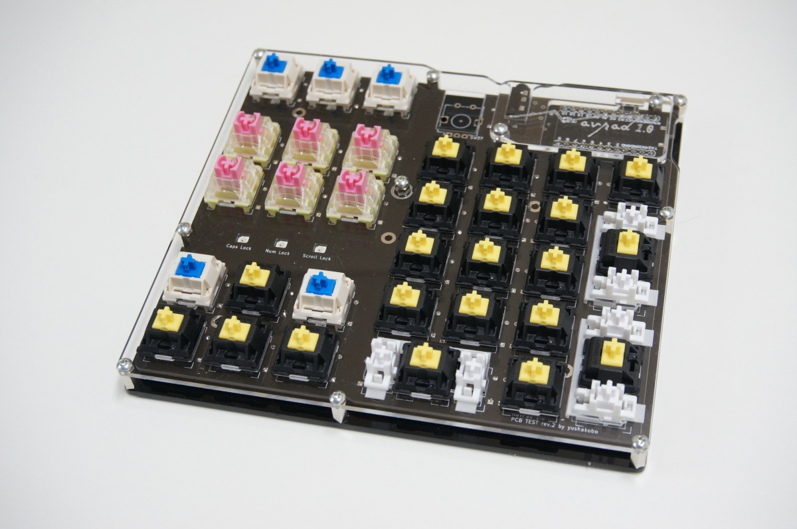

# Navpad 1.0用『キーボードアクリルプレート』を使用する

Navpad 1.0には[専用のキーボードアクリルプレート](https://shop.yushakobo.jp/products/keyboard_acrylic_plate)があります。このプレートを使用することで、プレートマウント用スタビライザーを使用することができます。

### 追加で必要になる部品

|名称|数量|備考|
|---|---|---|
|キーボードアクリルプレート|一式|
|M2 7mm スペーサー|2個|ProMicroカバー部に使用します。<br />(キット付属のProMicroカバーを使用する場合は不要)|

※本ビルドガイド中のアクリルプレートの画像は開発中のもののため、お届けする製品版とは一部デザインが異なります。

基本の組み立て方とは次の手順が異なりますので、それぞれ読み替えた上作業を進めましょう

```
6. プレートの準備
7. キースイッチの取り付け
9. キースイッチ、ロータリーエンコーダーのはんだ付け
10. ProMicroカバーの取り付け
11. ボトムプレートの取り付け
```

### 6b. プレートの準備

プレート表面の保護シートを剥がします



スタビライザーを装着します(アクリルプレートを使用する場合のみ、プレートマウント用スタビライザーを使用することができます)

***アクリルプレートを使用する場合、Numpad部のレイアウトは2Ux3で固定となります。***



### 7b. キースイッチの取り付け

アクリルプレートに破損がないよう注意してキースイッチを取り付けます



* ロータリーエンコーダーを使用する場合はここで忘れず基板に取り付けましょう

### 9.キースイッチ、ロータリーエンコーダーのはんだ付け

アクリルプレートに破損がないよう注意しつつPCBに載せます。このとき、キースイッチが基板にしっかりと差し込まれていることを確認します



### 10. ProMicroカバーの取り付け

用意したスペーサーを使用し、アクリル製ProMicroカバーを取り付けます



### 11. ボトムプレートの取り付け

キット付属の7mmスペーサーを使用し、ボトムプレートを取り付けます


