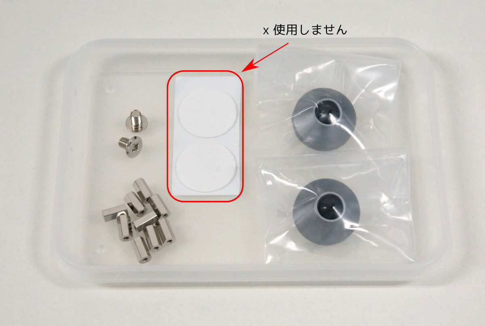

# チルト用 Aluminum feet セットを使用する

Navpad 1.0 の各ボトムプレートには、M4の穴が2箇所開いています。この穴を使用することで[Aluminum feet](https://shop.yushakobo.jp/products/3270)を取り付けることができます。

### 「チルト用 Aluminum feet セット」の内容

|名称|数量|備考|
|---|---|---|
|M2 8mmスペーサー|9個|
|M4 6mmスリムヘッド小ネジ|2個|
|Anodized CNC Aluminum Feet|1セット|

### その他に必要になる道具

|名称|備考|
|---|---|
|カプトンテープ または マスキングテープ|

### A1. ボトムプレートを取り外す

キット組み立てに使用したボトムプレートを一度取り外します 
取り外したネジをなくさないように気をつけます

### A2. セット付属の8mmスペーサへと交換する

「チルト用 Aluminum feet セット」に付属のM2 8mmスペーサーへ交換します

### A3. M4ネジを使用し、ボトムプレートへAluminum feetを取り付ける

M4 スリムヘッド小ネジを使用し、Aluminum feetを取り付けます このとき、Aluminum feet セットに付属の皿ネジは**使用しません**ので注意してください

### A4. ボトムプレートをネジ止めする

A1で取り外したネジをもとに戻します。このとき、ProMicroのピンとM4 スリムヘッド小ネジが接触する場合は、マスキングテープなどで絶縁します

