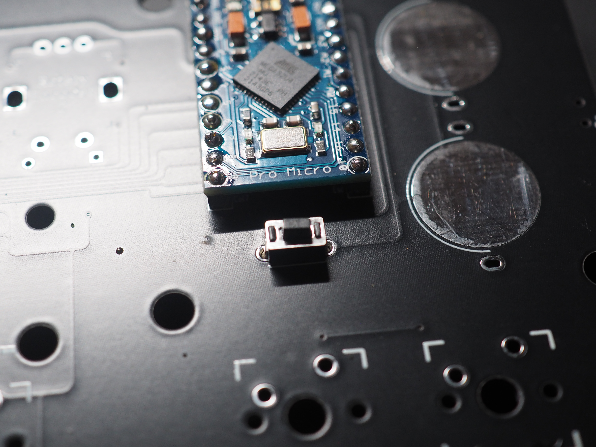
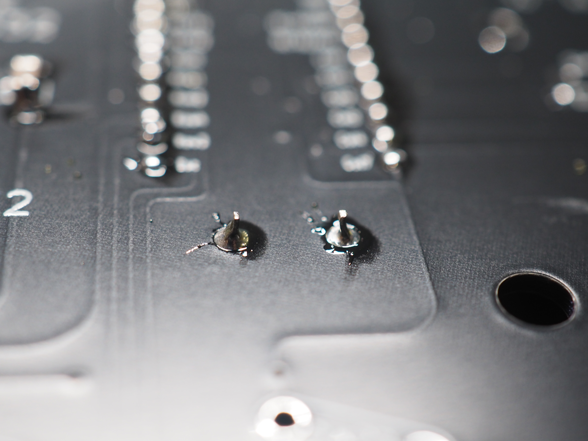
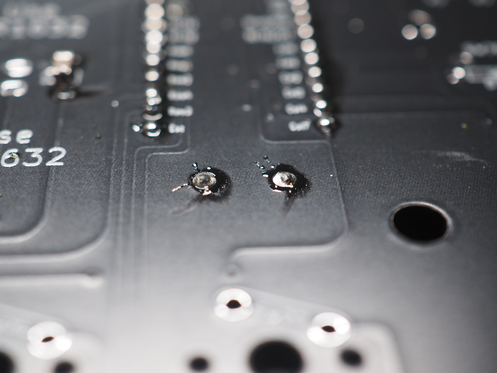

## 3. リセットスイッチのハンダ付け

**Point:リセットスイッチはハンダ付けせずに使うことも出来ます。** 
**使う機会も少ないので、頻繁にファームウェアを書き換える予定がなければハンダ付けを省略しても大丈夫です。** 
**なお、キーマップの書き換えにリセットスイッチは不要です。** 

基板右側、ProMicroの下に`Reset`とある部分にリセットスイッチを表面に取り付け、裏側からハンダ付けします。 

 
 

ハンダ付けした後、ニッパーで切り取ってもう一度ハンダごてで温めることで机に傷をつけずに使うことが出来ます。

 

