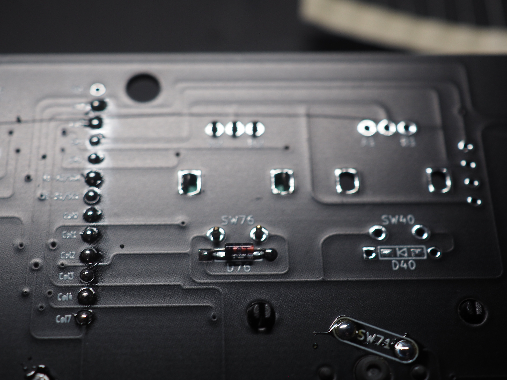
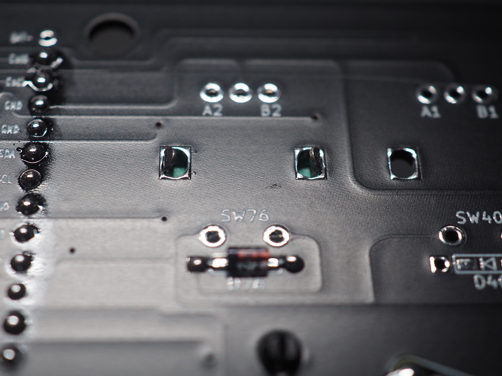
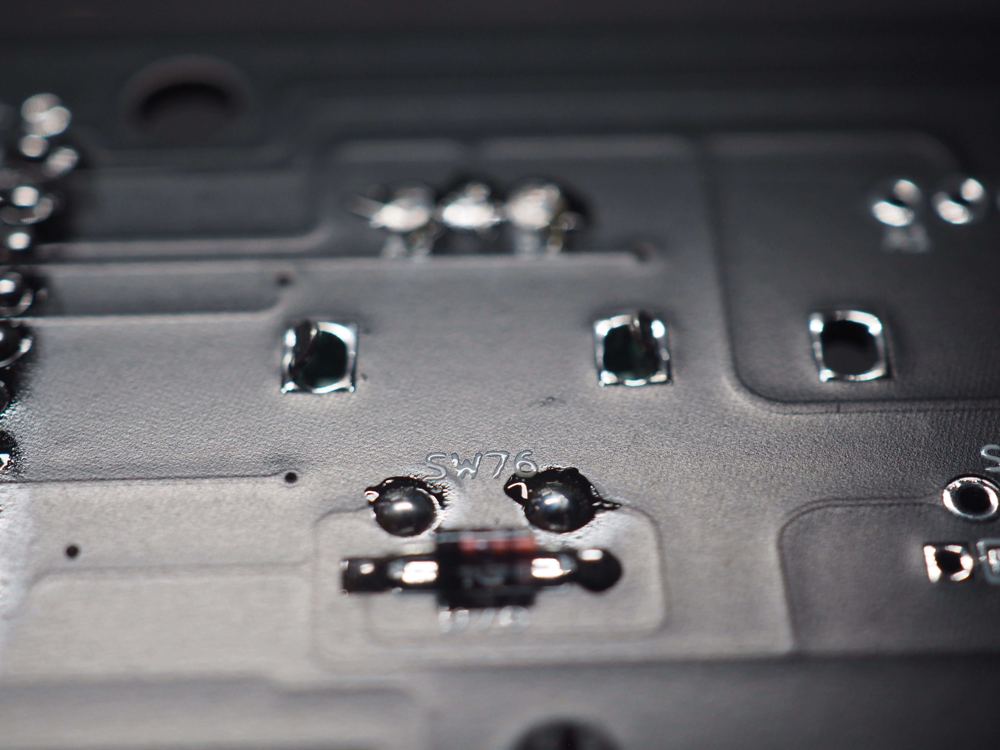

## 5. (オプション)ロータリーエンコーダーのハンダ付け

表面からロータリーエンコーダーを取り付けます。 
取付箇所はF11と12キーの部分です。 

机を傷つけないように裏面から飛び出たピンを切ってからハンダ付けをしてください。 
ピンを切る際は余分を残さず、できるだけ根本から切り取ってください。 
 
 
 

**Point:ロータリーエンコーダの横の曲がっている部分は固定用のピンなので、切り取り及びハンダ付けは不要です。** 

