## 2. ProMicroとピンヘッダ/13ピンソケットのハンダ付け

**Check:** 
**ProMicroの裏表に十分に注意してください。** 
**逆に取り付けてしまった場合、ピンヘッダを取り外すのはとても大変です。** 

**Check:** 
**無線対応をしたい場合、ProMicroの代わりにBLE Micro Proをハンダ付けします。** 
**この場合も裏表に十分注意してください。** 
**後述の「EX2．無線対応」を変わりに参照してください。** 

### 2-1．ピンソケット/ピンヘッダの差し込み

ピンソケットを基板の **表側** から差し込みます。 
表側はProMicro部分のピンの説明が書かれている側です。 

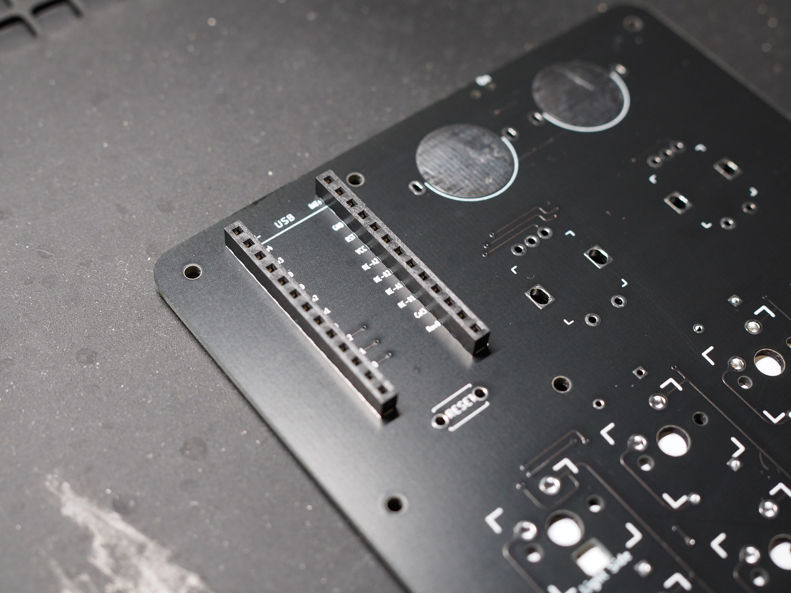 

ピンヘッダの短い方をピンソケットの上に当てます。 
**Check:** 
**ピンソケットの一番上のピンを開けておきます。** 
**BMPの印字がある箇所が一番上です。** 
**Point:** 
**この時点では奥まで挿さなくても大丈夫です。** 

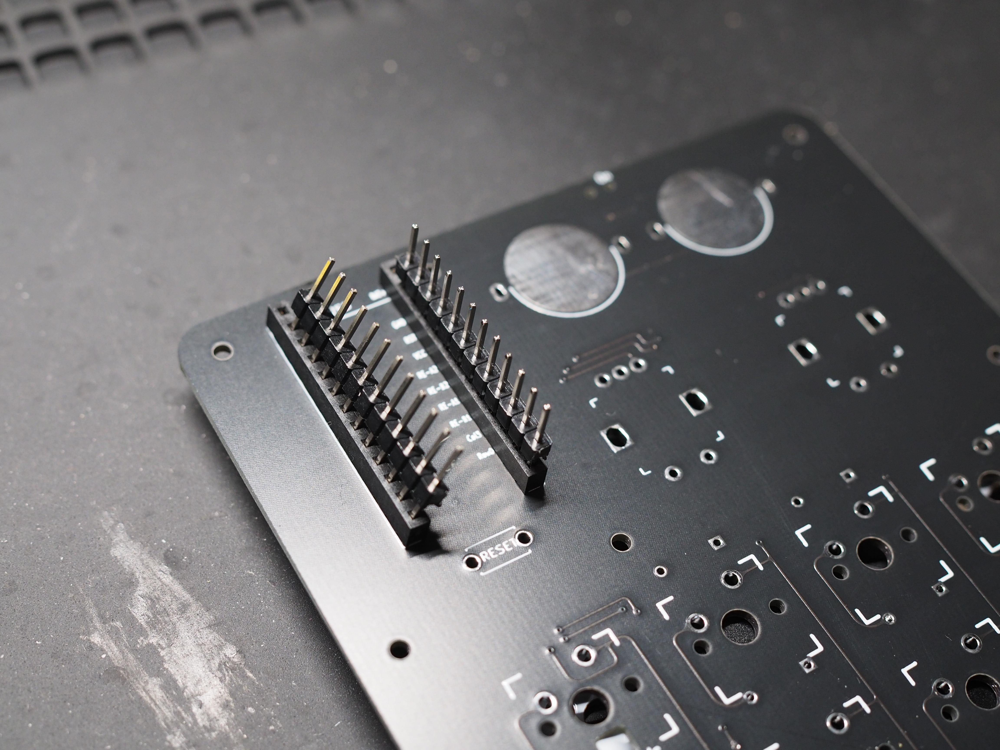 

ProMicroをピンヘッダに通します。 
**Check:** 
**まだこの時点では固定されていなくてもOKです。** 
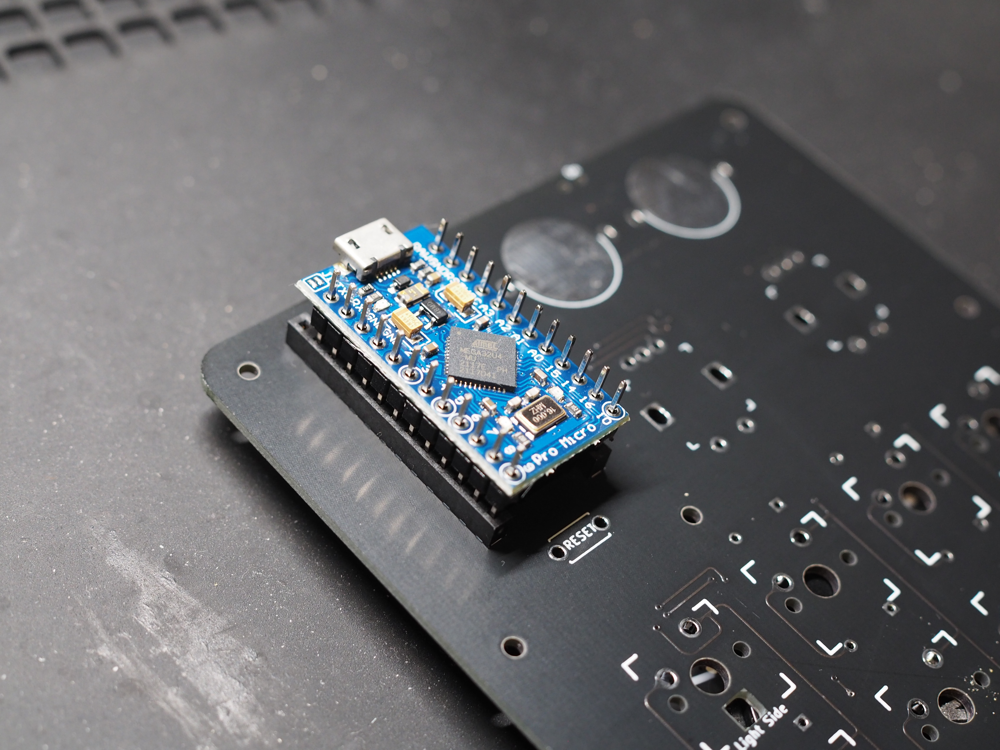 

ProMicroの両端を持ち、まっすぐ押してピンヘッダをピンソケットに押し込んでいきます。 
横からピンヘッダが見えないことを確認します。 
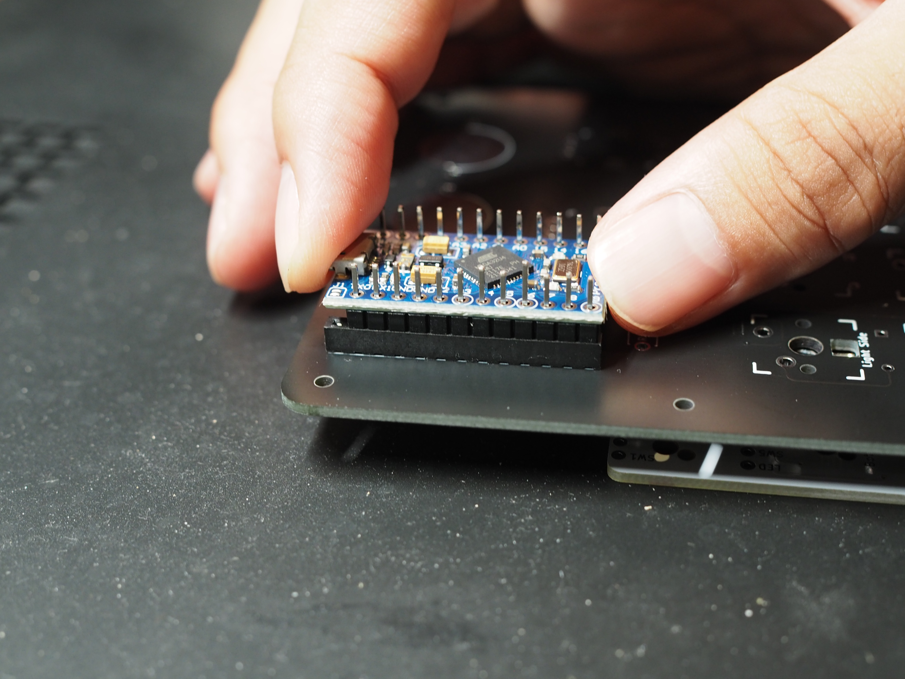 

### 2-2．ProMicroの仮止め

このとき、ProMicroの向きに十分に注意します。 
基板の**表側**からProMicroの**チップ部品が見えるように**なっているはずです。 
後でProMicroのハンダを外すのは大変な労力を伴いますので、ここで**必ず上の写真と相違が無いかチェック**しておきます。

ProMicroとピンヘッダの **一番上だけ** をハンダ付けします。

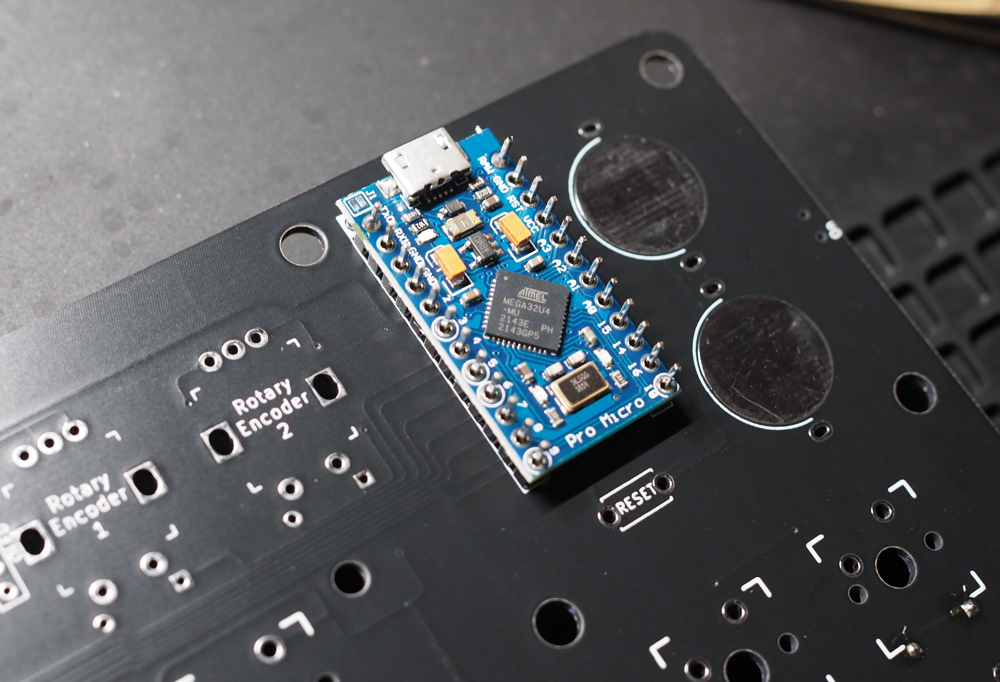 
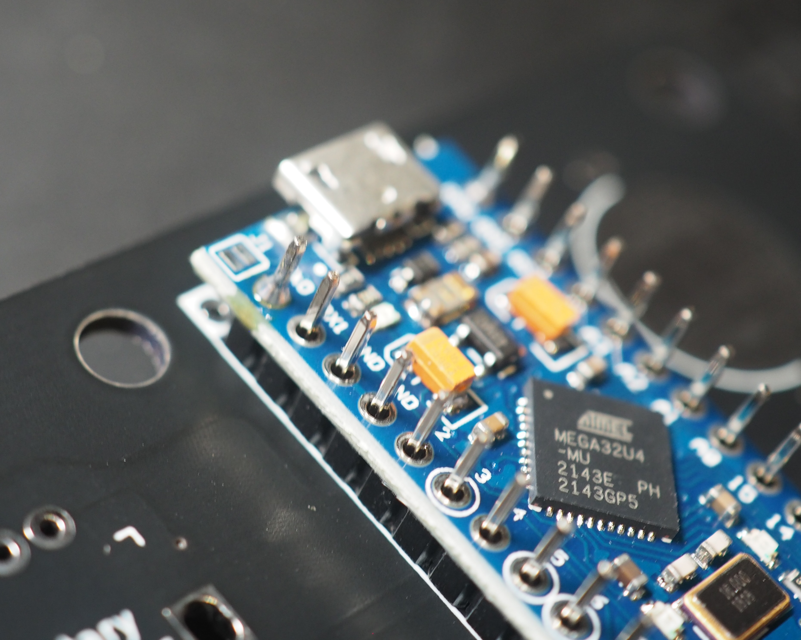 

ProMicroとピンソケットが斜めになっていたり、浮いていたりしないか確認します。 
※もし斜めになっていたり浮いていた場合はもう一度ハンダごてで温めて直してください。

裏側も同様に **一番上だけ** をハンダ付けし、浮いていないか確認します。 
**Point:** 
**浮いていたり傾いていた場合は、もう一度ハンダごてで温めて直して修正してください。** 
**修正時は、ハンダごてでProMicroのハンダを溶かしながら、ProMicro本体を指で抑えるなどすることで傾きなどを修正できます。** 
**複数箇所を固定してしまった場合、後から傾きなどを修正するのは非常に難しいです。** 

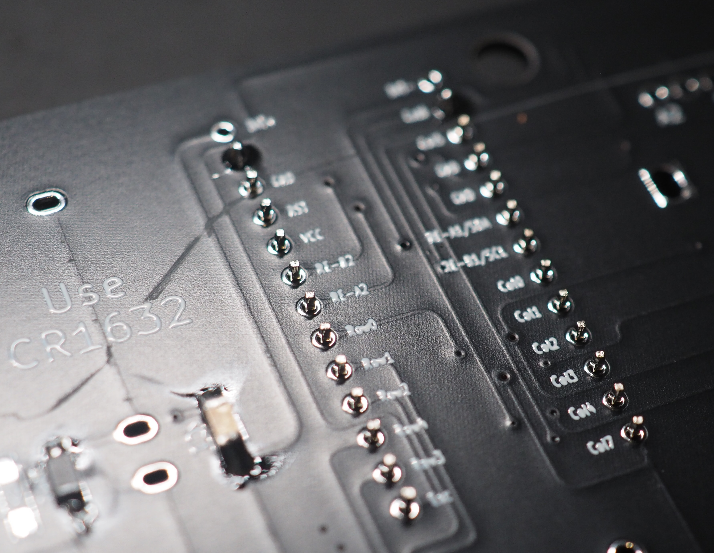 
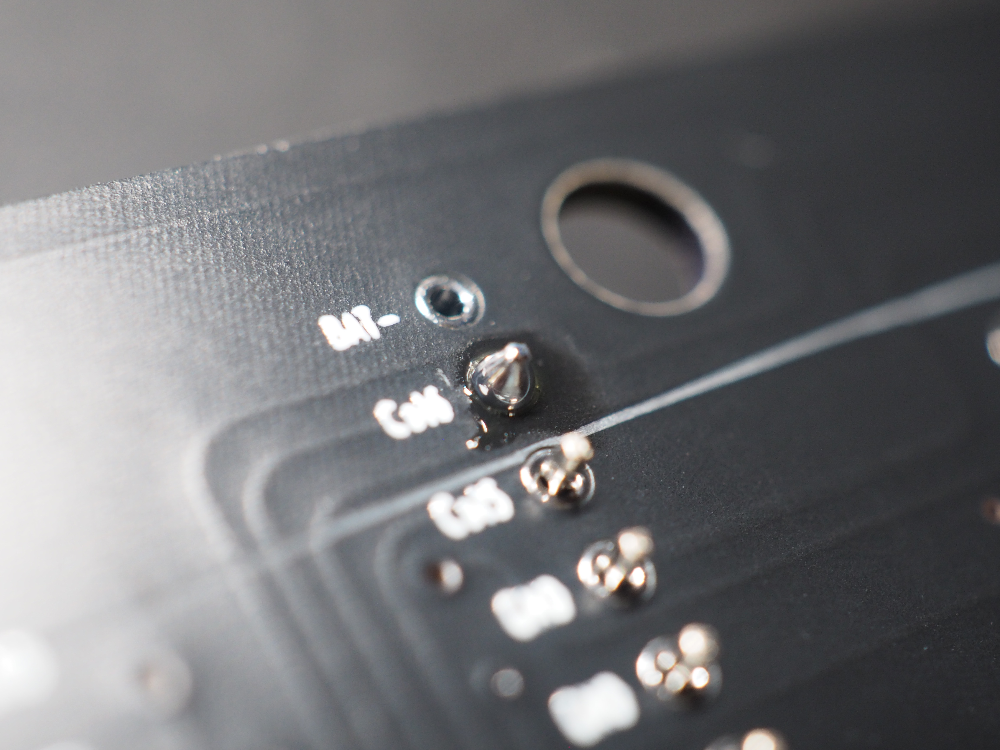 

### 2-3．ProMicroのハンダ付け

**Check:** 
**ピンヘッダをニッパーで切る際、勢いよく飛んで怪我をする可能性があります。** 
**切る箇所のピンヘッダーを指などで抑えて飛ぶのを防ぐと安全です。** 
**マスキングテープでピンヘッダー同士を固定する方法もあります。** 

他のピンヘッダの飛び出ている部分をニッパーで切り取ります。 
**Point:** 
**ProMicroや基板ギリギリでピンヘッダを切り取ってください。余裕は不要です。** 
**すでにハンダ付けしたピンヘッダも切り取ってください。** 

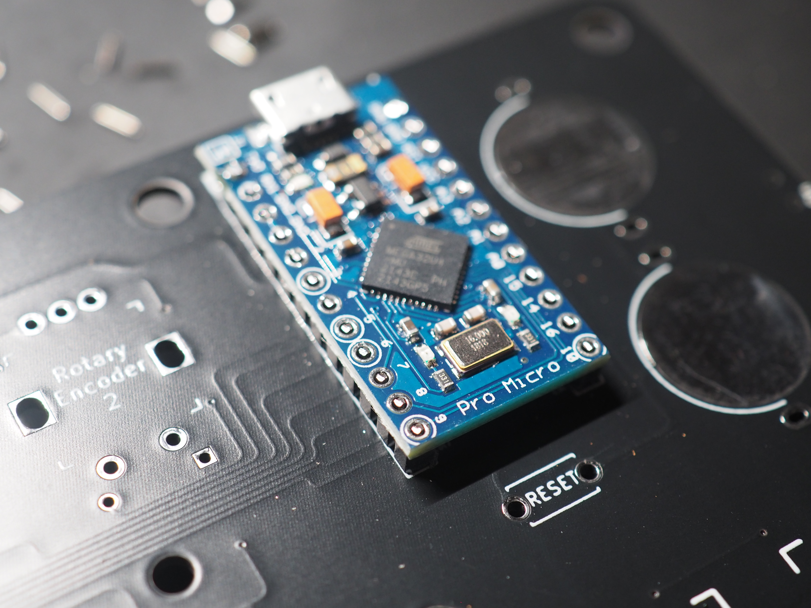 
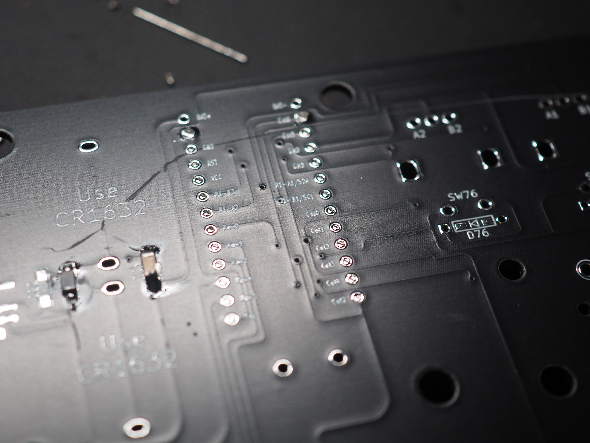 

**Check:** 
**ニッパーでそのまま切り取ろうとすると勢いよくピンヘッダの切れ端が飛んでいきます。** 
**飛ぶ際に目に刺さったりすると非常に危険ですし、落ちた切れ端を踏むと刺さります。** 
**必ず飛ばないようにピンヘッダを押さえながら切り取り、作業を中断する際は必ず片付けてください。**

基板の表側からProMicroをハンダ付けし、基板の裏側からピンソケットをハンダ付けします。 

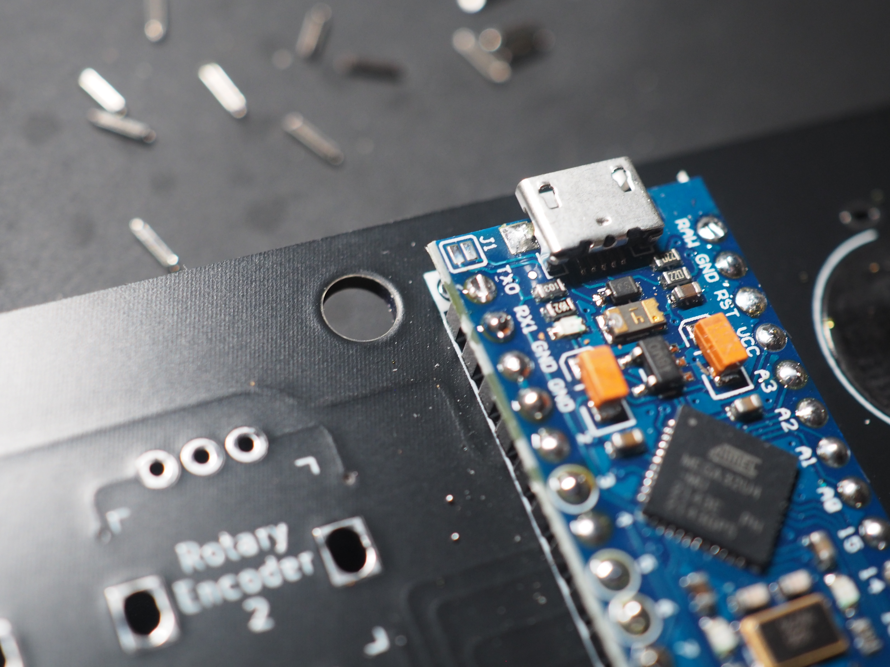 
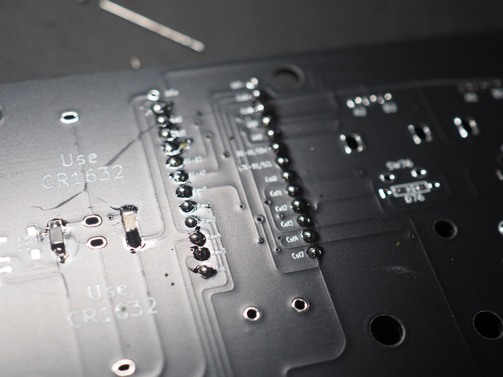 

**Point:** 
**最初にハンダ付けして切り取ったピンヘッダは最後に温めることで丸く綺麗な状態になります。** 

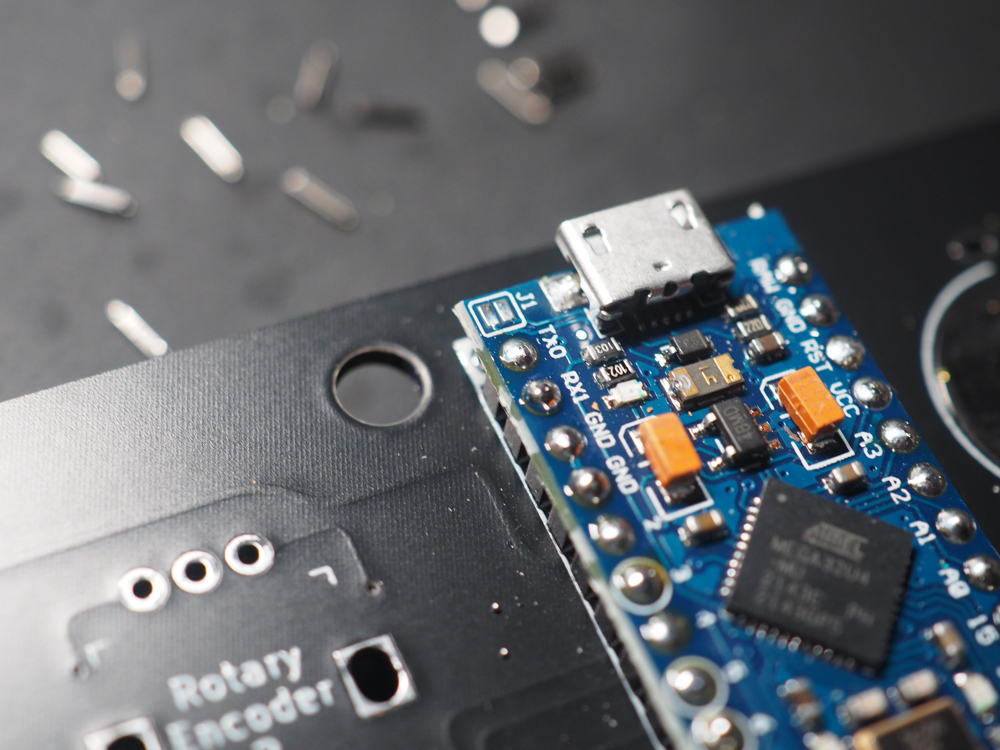 

