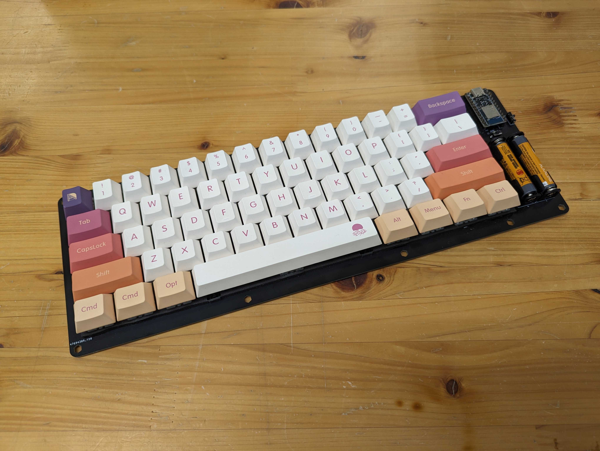
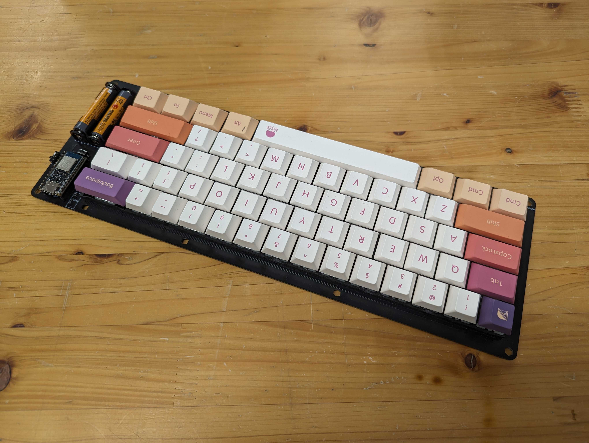
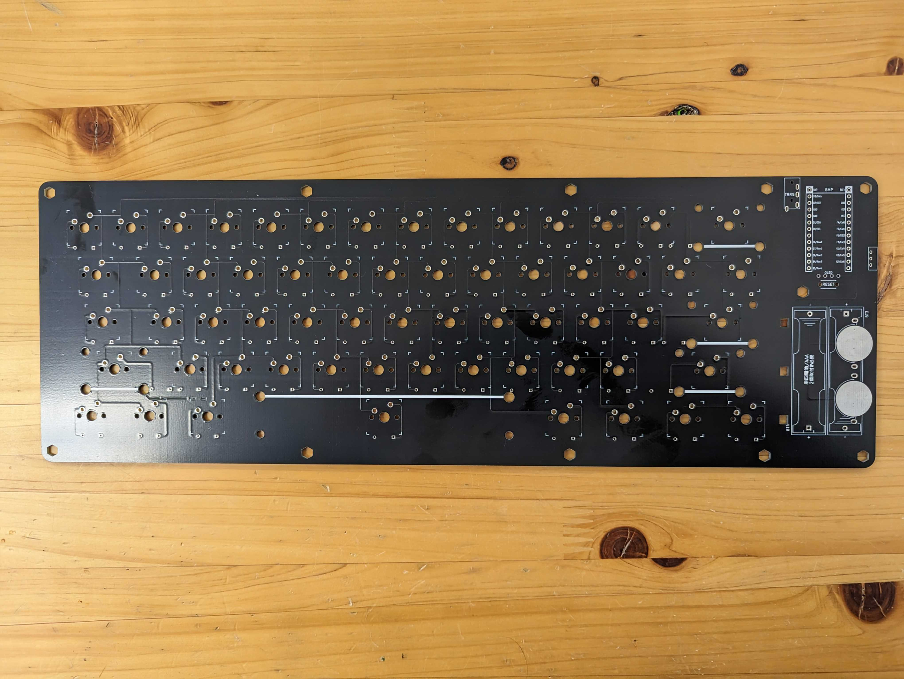
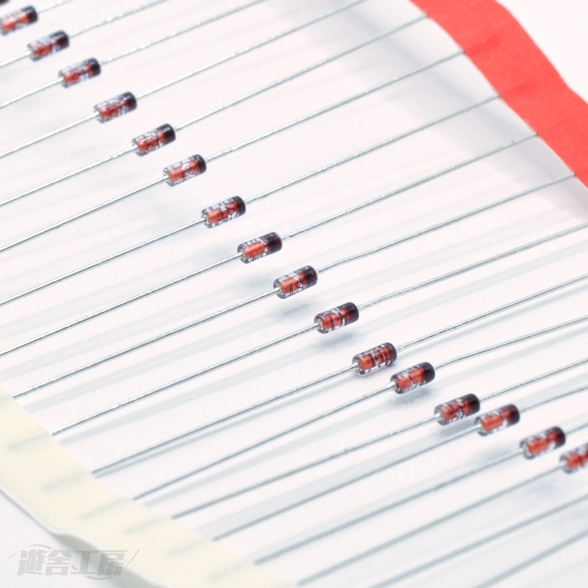
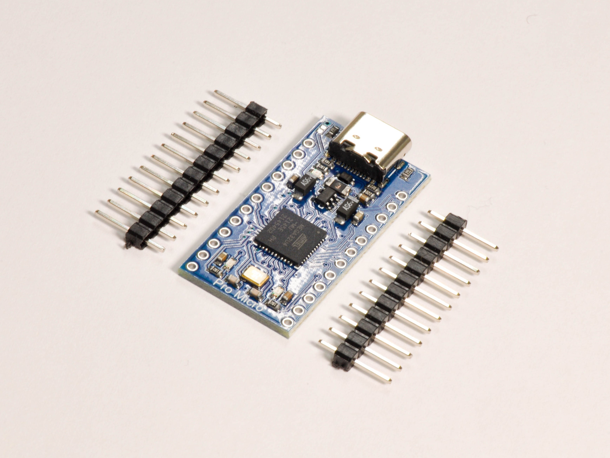
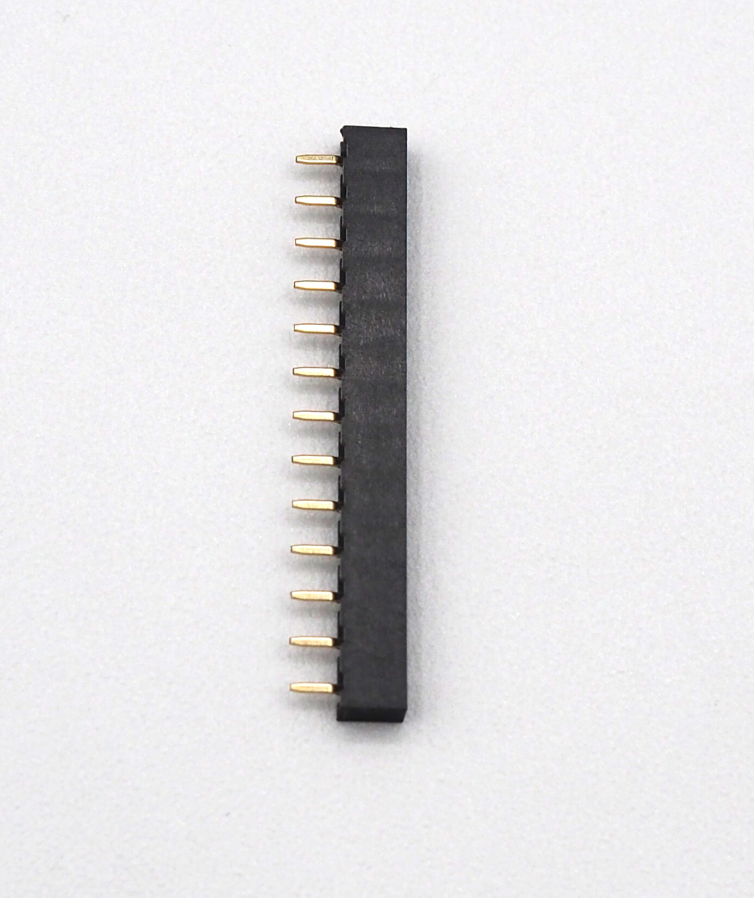
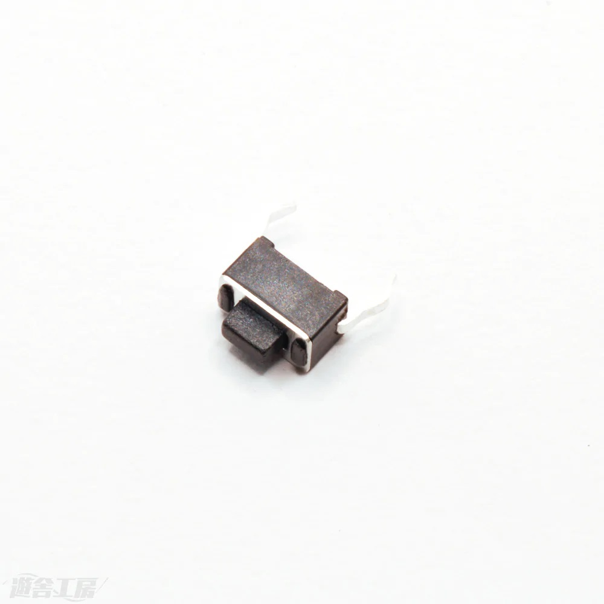
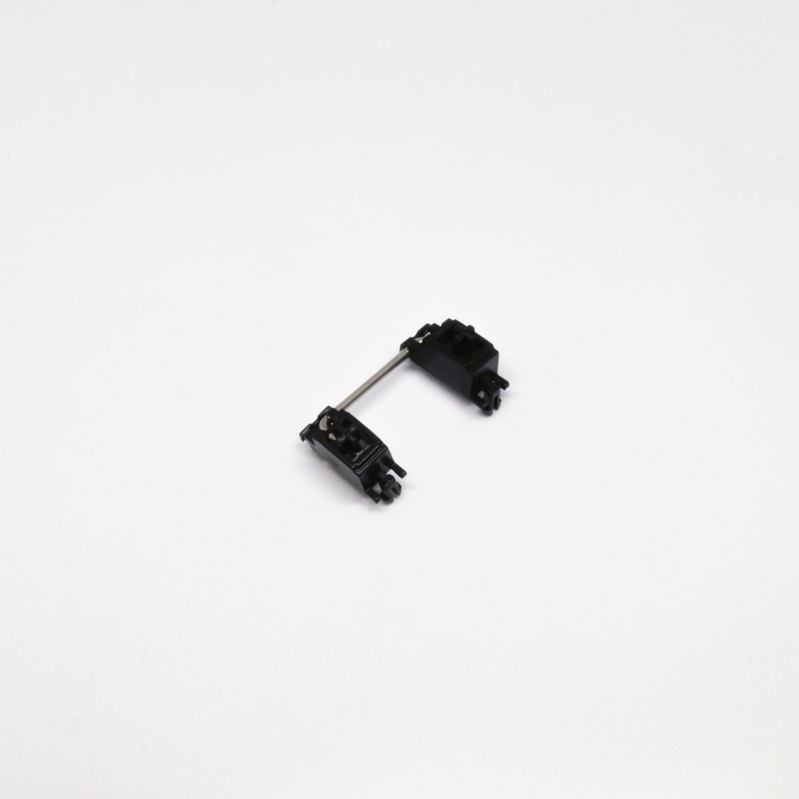
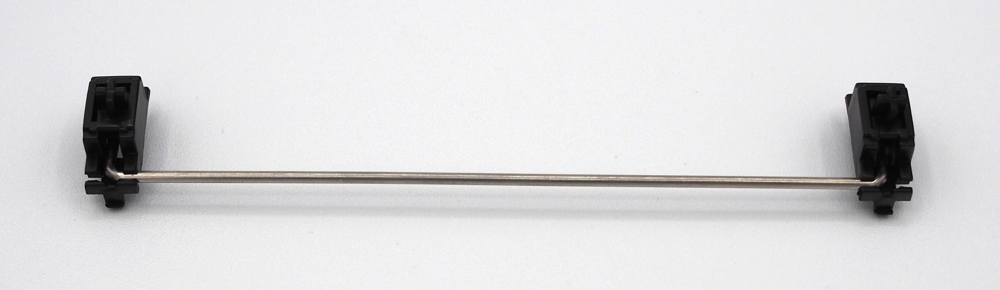
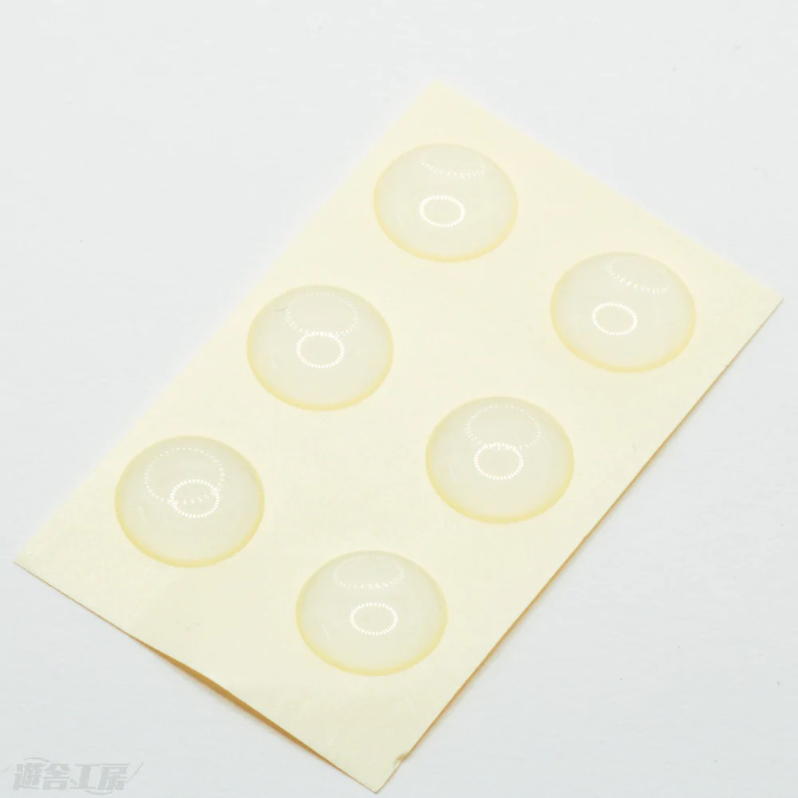

# Primer61 ビルドガイド

 
 

Primer61のお買い上げありがとうございます。 

**実際の組み立てを始める前に、このビルドガイドを最後までお読みください。**

組み立ては本手順に沿って行ってください。 
本手順に疑問等がある場合は遊舎工房の[サポートページ](https://yushakobo.zendesk.com/hc/ja)を参照の上、お気軽にお問い合わせください。 

## 注意事項

本キットの組み立てにはニッパーなどの刃物やハンダごてなどの火傷の危険性がある道具を使用しますので、十分に注意して作業を行ってください。 
キットの部品には細かい部品も含まれますので、保管する際はお子様などの手に届かない場所に保管してください。 
作業中に出るゴミ、切ったダイオードの足やピンヘッダの足などが刺さったりしますので、適宜清掃をしながら作業されることをお勧めします。 

**本ガイド内の写真は一部Primer79/Primer29/Primer16のものを流用しています。** 
**適宜読み替えてください。** 

## １．キットに同梱されている部品をチェックする

まずはキットに同梱されている部品が足りているかチェックしてください。 
万が一部品に不足がある場合は、大変お手数ですが遊舎工房の[お問い合わせフォーム](https://yushakobo.zendesk.com/hc/ja/requests/new)のカテゴリ **「購入した商品の不足・初期不良等」** を選択してお問い合わせください。 

|名称|数量|画像|備考|
|---|---|---|---|
|基板|1||
|スルーホールダイオード|61||表面実装タイプにも対応（別途購入）|
|ProMicro|1||USB Type-Cタイプのコネクタ|
|13ピンソケット|2||
|リセットスイッチ|1||
|スタビライザー（2u）|4||
|スタビライザー（6.25u）|1||
|ゴム足|8||

### １－１．オプション部品（アクリルケース）

アクリルケースはNormal、単4電池無線化仕様、コイン電池無線化仕様のケースの3種類があります。 
ケースは形状が異なる以外、同梱品に差がありません。 
|名称|数量|備考|
|---|---|---|
|アクリルプレート（3,5mm）|1式|[キーボードアクリルプレート](https://shop.yushakobo.jp/products/keyboard_acrylic_plate)にて購入してください|
|ネジ（5mm）|5|
|ネジ（10mm）|4|ネジ（12mm）と混同しやすいので気をつけてください|
|ネジ（12mm）|6|ネジ（10mm）と混同しやすいので気をつけてください|
|キャップボルト（18mm）|3|
|スペーサー（4.5mm）|9|

### １－２．オプション部品（単4電池無線化部品）

単4電池を利用した無線化をする場合に必要な部品リストです。 
|名称|数量|備考|
|---|---|---|
|BLE Micro Pro|1|ご購入は[こちら](https://shop.yushakobo.jp/products/ble-micro-pro)|
|13ピンヘッダー|2|ご購入は[こちら](https://shop.yushakobo.jp/products/3696?_pos=1&_sid=1101c0a6d&_ss=r&variant=42476836880615)|
|Primer61/29用電池部品セット（単4電池）|1|ご購入は[こちら](https://shop.yushakobo.jp/products/ble-micro-pro-battery-board)|
|単4電池|2|単４電池を購入してください|

### １－３．オプション部品（コイン電池無線化部品）

コイン電池を利用した無線化をする場合に必要な部品リストです。 
|名称|数量|備考|
|---|---|---|
|BLE Micro Pro|1|ご購入は[こちら](https://shop.yushakobo.jp/products/ble-micro-pro)|
|13ピンヘッダー|2|ご購入は[こちら](https://shop.yushakobo.jp/products/3696?_pos=1&_sid=1101c0a6d&_ss=r&variant=42476836880615)|
|Primer61/29用電池部品セット（コイン電池）|1|ご購入は[こちら](https://shop.yushakobo.jp/products/ble-micro-pro-battery-board)|
|コイン電池|2|CR1632を購入してください|

## ２．別途準備するパーツをチェックする

キットには含まれていないパーツは別途用意する必要があります。 
予め購入し、組立前に不足がないかチェックしてください。 

|名称|数量|備考|
|---|---|---|
|キースイッチ|61|ご購入は[こちら](https://shop.yushakobo.jp/collections/all-switches/cherry-mx-%E4%BA%92%E6%8F%9B-%E3%82%B9%E3%82%A4%E3%83%83%E3%83%81) CherryMX互換スイッチのみ対応|
|キーキャップ|61|ご購入は[こちら](https://shop.yushakobo.jp/collections/keycaps/cherry-mx-%E4%BA%92%E6%8F%9B-%E3%82%AD%E3%83%BC%E3%82%AD%E3%83%A3%E3%83%83%E3%83%97) キーレイアウトとキーキャップセットをよくチェックして購入してください|

## 必要な道具

|名称|備考|
|---|---|
|ハンダごて|できるだけ温度調節機能付きのもの|
|ハンダ線|0.6mm~0.8mm径程度のもの|
|ニッパー|
|ピンセット|基板（スイッチ部分）の導通チェック用（代用可）|
|プラスドライバー|アクリルケースオプションの際に必要です。|

**こちらに[工具セット](https://shop.yushakobo.jp/products/a9900to)の用意もありますので、よろしければ部品と一緒にどうぞ。**

## 組み立ての手順

1. ダイオードのハンダ付け
1. ProMicroとピンヘッダ/13ピンソケットのハンダ付け
1. リセットスイッチのハンダ付け
1. ファームウェアの書き込みと動作確認
1. キースイッチのハンダ付け
1. スタビライザーの取り付け
1. キーキャップの取り付け
1. ゴム足の貼り付け
1. キーマップを変更する
1. 完成！

