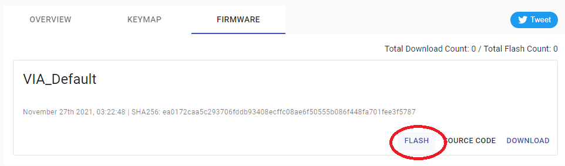
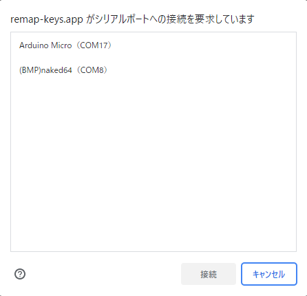
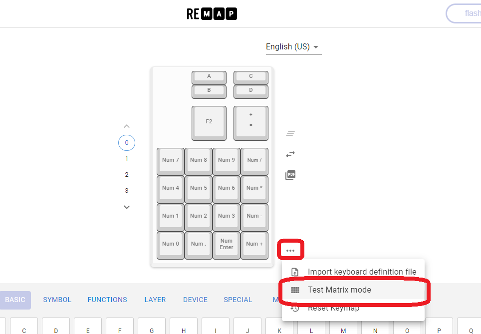
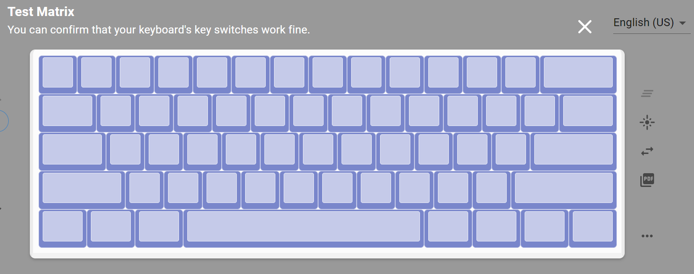

## 4. ファームウェアの書き込みと動作確認

Primer61はファームウェアとしてqmk_firmwareを使用しています。 
ファームウェアはRemapのカタログページにファームウェア書き込むことができます。 
Google Chromeにてページを開いた上、書き込みを行ってください。 

※BLE Micro Proの書き込みは本ビルドガイドの末尾の`EX1-3．ファームウェアの書き込み`を参照してください。 

https://remap-keys.app/catalog/CoU6WxxUfBhZEAvNWqTE/firmware 

FLASHをクリックします。 

 

通常のProMicroは「caterina」を、Elite-Cは「dfu」を選択してからFLASHをクリックします。 
※「dfu」を使用しての書き込みは別途Zadigというツールを用いた作業が必要になる場合があります。 

 

下図のように小ウインドウに「Arduino Micro」等が表示されることを確認します。 
表示されない場合、ケーブルや接続するポートを変更して試してみます。 

 

リセットスイッチをすばやくに2回押すと一瞬USB機器が抜けたような音がするので先程の小ウインドウのArduino Microのポート番号が変化したことを確認し、該当のArduino Microを選択し素早く「接続」をクリックしてください。 
（本ビルドガイドの図例の場合、COM17がCOM18に変化） 

 

ファームウェアの書き込みが完了したら下図のようにメッセージの最後に「successfully」が表示されます。

 

ファームウェアの書き込みが完了したらRemapのコンフィギュレータ画面を開きます。 

https://remap-keys.app/configure

Remapで正常に認識できたらテストモード（Test Matrix Mode）を開き、ピンセットでスイッチ用の穴に触れて導通をチェックします。 

 
 

**Point:** 
**ピンセットがない場合、切り取ったダイオードの足やアルミ箔を切ったものでも代用できます。** 

全て正常だと下図のように全てのキーが青くなります。 
 

**Point:** 
**ダイオードの番号とスイッチの番号はリンクしています。** 
**違う部分のキーが反応した場合はダイオードの向きを確認してください。** 
**Point:** 
**もし違う部分のキーが反応した場合はスイッチに対応するダイオードの向きを確認してください。** 
**ダイオードの番号とスイッチの番号はリンクしています。** 

