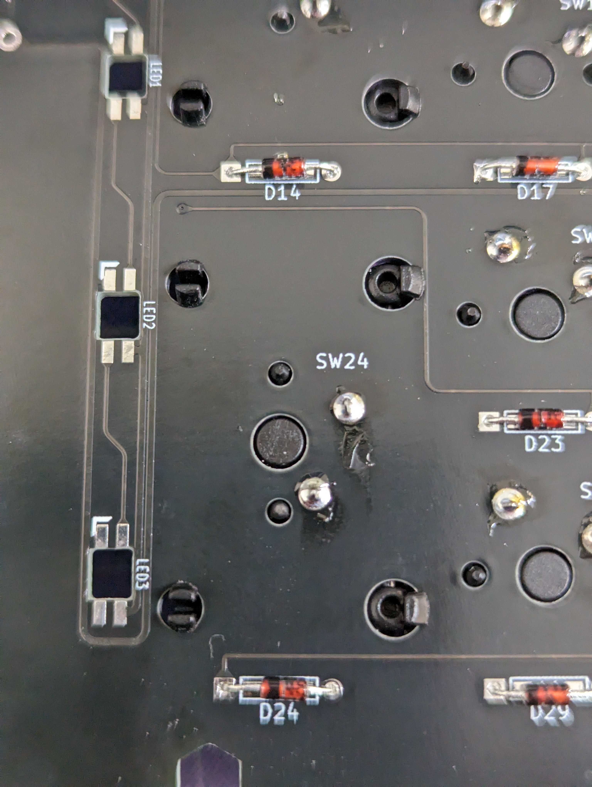

## 6. スタビライザーの取り付け

2Uおよび6.25Uのキーキャップを取り付ける箇所について、基板の白い印字を元にスタビライザーを取り付けてください。 
バラ状態のスタビライザーが同梱されるので、下のリンクより組み立ててください。 
https://shop.yushakobo.jp/pages/stabilizerbuild 

スタビライザーは穴に対して引っ掛ける爪のような出っ張りがあるので、それをPCBに引っ掛けて取り付けます。 
出っ張りを取り付けた後、もう片方の方をピンセットなどで押さえて取り付けを行います。 
 

