# Primer61 ビルドガイド

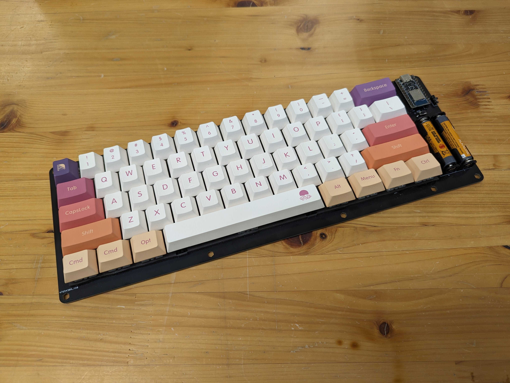  
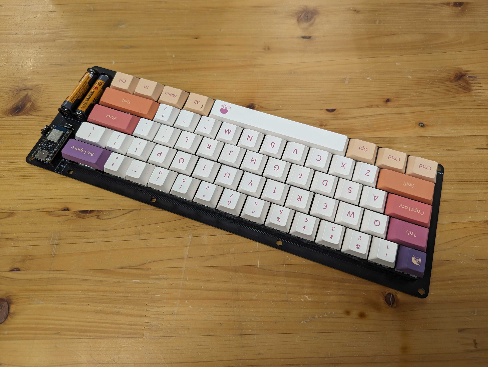  

Primer61のお買い上げありがとうございます。  

**実際の組み立てを始める前に、このビルドガイドを最後までお読みください。**

組み立ては本手順に沿って行ってください。  
本手順に疑問等がある場合は遊舎工房の[サポートページ](https://yushakobo.zendesk.com/hc/ja)を参照の上、お気軽にお問い合わせください。  

## 注意事項

本キットの組み立てにはニッパーなどの刃物やハンダごてなどの火傷の危険性がある道具を使用しますので、十分に注意して作業を行ってください。  
キットの部品には細かい部品も含まれますので、保管する際はお子様などの手に届かない場所に保管してください。  
作業中に出るゴミ、切ったダイオードの足やピンヘッダの足などが刺さったりしますので、適宜清掃をしながら作業されることをお勧めします。  

**本ガイド内の写真は一部Primer79/Primer29/Primer16のものを流用しています。**  
**適宜読み替えてください。**  

## １．キットに同梱されている部品をチェックする

まずはキットに同梱されている部品が足りているかチェックしてください。  
万が一部品に不足がある場合は、大変お手数ですが遊舎工房の[お問い合わせフォーム](https://yushakobo.zendesk.com/hc/ja/requests/new)のカテゴリ **「購入した商品の不足・初期不良等」** を選択してお問い合わせください。  

|名称|数量|画像|備考|
|---|---|---|---|
|基板|1||
|スルーホールダイオード|61||表面実装タイプにも対応（別途購入）|
|ProMicro|1|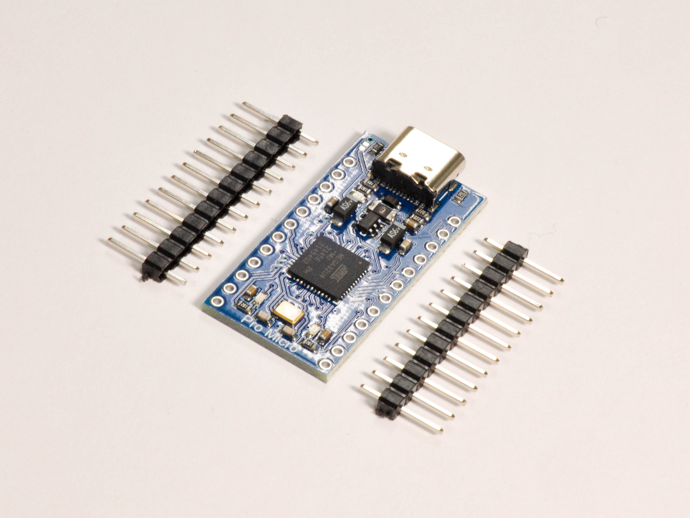|USB Type-Cタイプのコネクタ|
|13ピンソケット|2|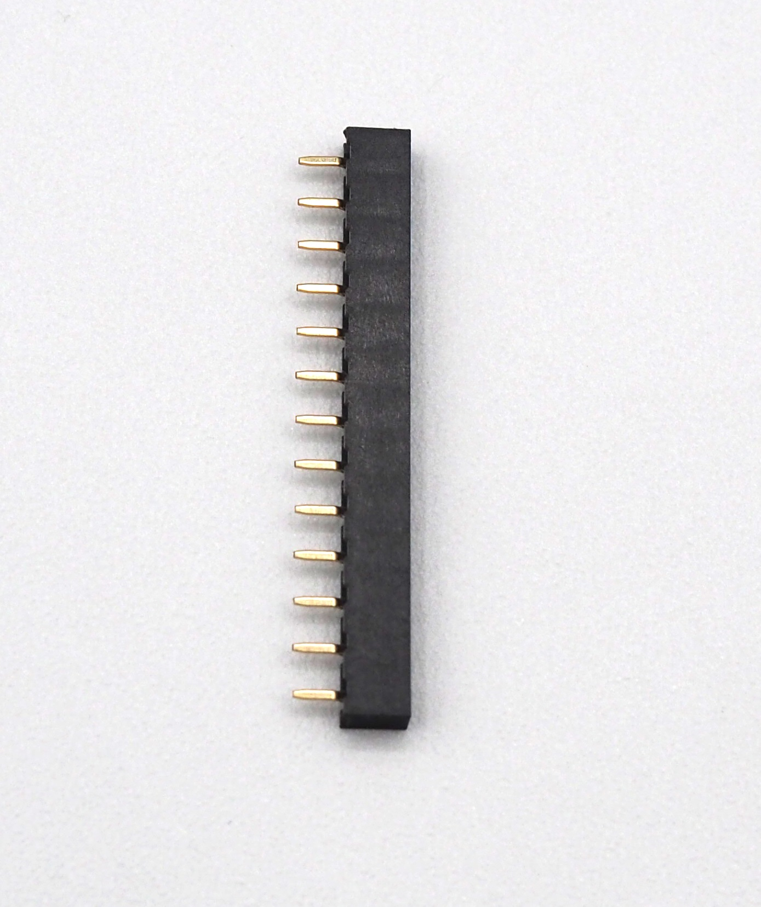|
|リセットスイッチ|1|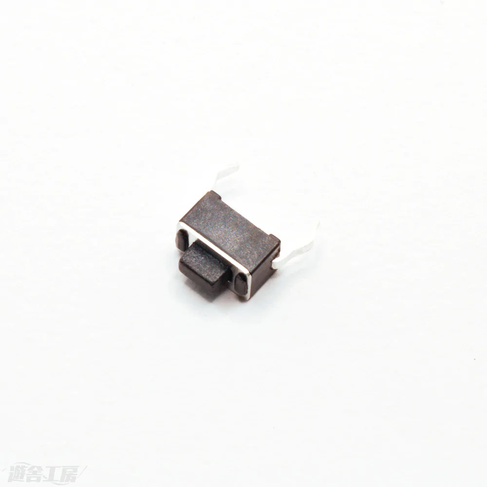|
|スタビライザー（2u）|4|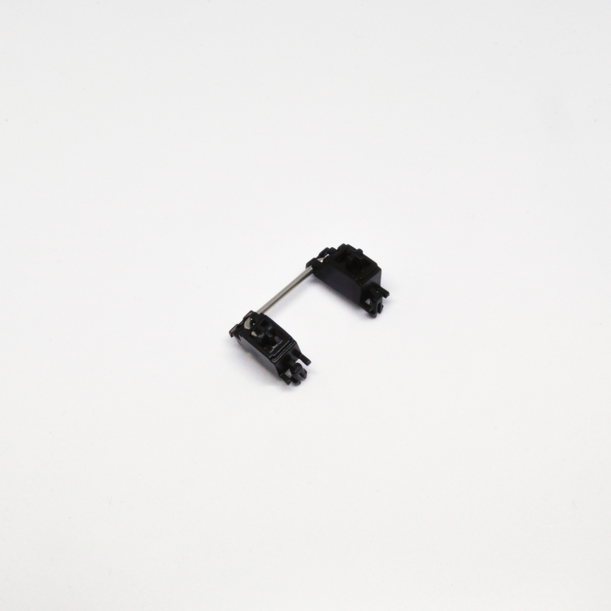|
|スタビライザー（6.25u）|1||
|ゴム足|8|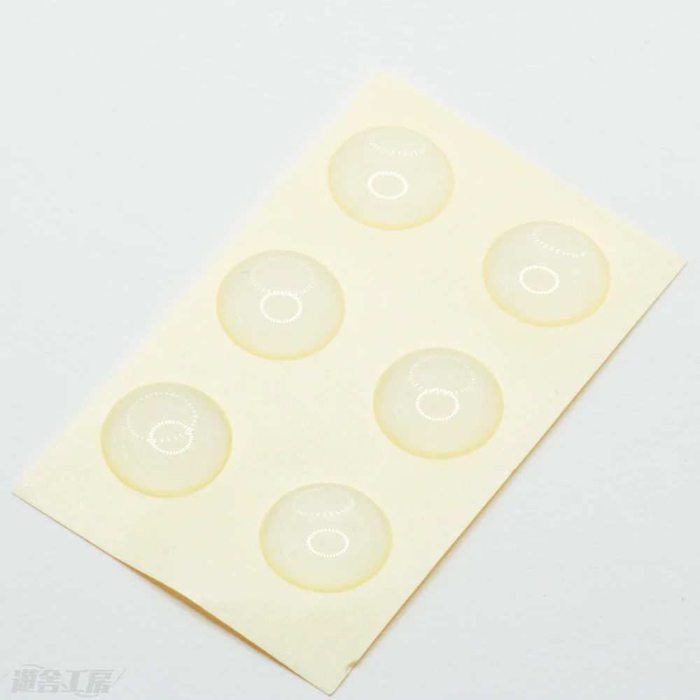|

### １－１．オプション部品（アクリルケース）

アクリルケースはNormal、単4電池無線化仕様、コイン電池無線化仕様のケースの3種類があります。  
ケースは形状が異なる以外、同梱品に差がありません。  
|名称|数量|備考|
|---|---|---|
|アクリルプレート（3,5mm）|1式|[キーボードアクリルプレート](https://shop.yushakobo.jp/products/keyboard_acrylic_plate)にて購入してください|
|ネジ（5mm）|5|
|ネジ（10mm）|4|ネジ（12mm）と混同しやすいので気をつけてください|
|ネジ（12mm）|6|ネジ（10mm）と混同しやすいので気をつけてください|
|キャップボルト（18mm）|3|
|スペーサー（4.5mm）|9|

### １－２．オプション部品（単4電池無線化部品）

単4電池を利用した無線化をする場合に必要な部品リストです。  
|名称|数量|備考|
|---|---|---|
|BLE Micro Pro|1|ご購入は[こちら](https://shop.yushakobo.jp/products/ble-micro-pro)|
|13ピンヘッダー|2|ご購入は[こちら](https://shop.yushakobo.jp/products/3696?_pos=1&_sid=1101c0a6d&_ss=r&variant=42476836880615)|
|Primer61/29用電池部品セット（単4電池）|1|ご購入は[こちら](https://shop.yushakobo.jp/products/ble-micro-pro-battery-board)|
|単4電池|2|単４電池を購入してください|

### １－３．オプション部品（コイン電池無線化部品）

コイン電池を利用した無線化をする場合に必要な部品リストです。  
|名称|数量|備考|
|---|---|---|
|BLE Micro Pro|1|ご購入は[こちら](https://shop.yushakobo.jp/products/ble-micro-pro)|
|13ピンヘッダー|2|ご購入は[こちら](https://shop.yushakobo.jp/products/3696?_pos=1&_sid=1101c0a6d&_ss=r&variant=42476836880615)|
|Primer61/29用電池部品セット（コイン電池）|1|ご購入は[こちら](https://shop.yushakobo.jp/products/ble-micro-pro-battery-board)|
|コイン電池|2|CR1632を購入してください|

## ２．別途準備するパーツをチェックする

キットには含まれていないパーツは別途用意する必要があります。  
予め購入し、組立前に不足がないかチェックしてください。  

|名称|数量|備考|
|---|---|---|
|キースイッチ|61|ご購入は[こちら](https://shop.yushakobo.jp/collections/all-switches/cherry-mx-%E4%BA%92%E6%8F%9B-%E3%82%B9%E3%82%A4%E3%83%83%E3%83%81) CherryMX互換スイッチのみ対応|
|キーキャップ|61|ご購入は[こちら](https://shop.yushakobo.jp/collections/keycaps/cherry-mx-%E4%BA%92%E6%8F%9B-%E3%82%AD%E3%83%BC%E3%82%AD%E3%83%A3%E3%83%83%E3%83%97) キーレイアウトとキーキャップセットをよくチェックして購入してください|

## 必要な道具

|名称|備考|
|---|---|
|ハンダごて|できるだけ温度調節機能付きのもの|
|ハンダ線|0.6mm~0.8mm径程度のもの|
|ニッパー|
|ピンセット|基板（スイッチ部分）の導通チェック用（代用可）|
|プラスドライバー|アクリルケースオプションの際に必要です。|

**こちらに[工具セット](https://shop.yushakobo.jp/products/a9900to)の用意もありますので、よろしければ部品と一緒にどうぞ。**

## 組み立ての手順

1. ダイオードのハンダ付け
1. ProMicroとピンヘッダ/13ピンソケットのハンダ付け
1. リセットスイッチのハンダ付け
1. ファームウェアの書き込みと動作確認
1. キースイッチのハンダ付け
1. スタビライザーの取り付け
1. キーキャップの取り付け
1. ゴム足の貼り付け
1. キーマップを変更する
1. 完成！

## 1. ダイオードのハンダ付け

基板上に実装するキースイッチを正しく認識させるため、ダイオードを正しい向きでハンダ付けします。  
間違った向きで取り付けると正しく認識できないので、注意してください。  
### 1-1．ダイオードの足を曲げる

**Check:**  
**基板は裏返して作業します。**  
**裏側はダイオードの番号（D1、D2…など）が書かれた面です。**  
**向きを間違えた場合、スイッチと干渉してしまう場合があります。**  

ダイオードには円筒形の素子部分と基板にハンダ付けをする針金状の足部分があります。  
あらかじめ針金状の足部分を曲げておき、後の工程で基板に差し込みやすくしておきます。  
下の画像はダイオードを差し込み、ハンダ付けする部分の拡大図です。  
  
この部分の左右の穴にあわせてダイオードの足を折り曲げておきます。  
  
※一個ずつダイオードの台紙から切り離してから曲げる必要はなく、ダイオードがついている台紙ごと一気に折り曲げても大丈夫です。

### 1-2．基板の穴にダイオードを差し込む

**Check:ダイオードの向きに注意。**  
**ダイオードの向きを間違えると押したキーと違う文字が入力されてしまいます。**  

ダイオードの向きは円筒形の素子に印刷されたラインから判断します。  
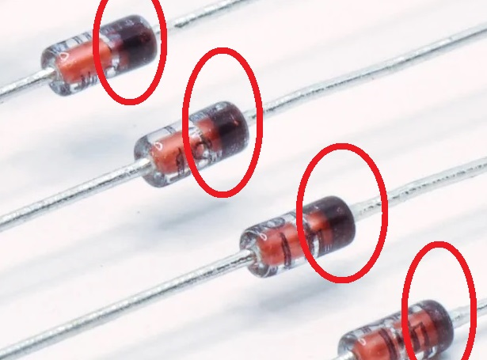  
基板に取り付ける向きは基板の印刷を確認してください。  
`[|◁]`の三角形の向いた先にダイオードのラインが来るように差し込みます。  
  
※Primer61は基板裏側から見た時に、全てのダイオードの左側にラインが来るように向きを揃えています。  

**Point:**
**ダイオードを差し込んだままだとハンダ付けをする際に基板をひっくり返す際に落ちてしまいます。**  
**落ちないようにダイオードの足を少し曲げるか、マスキングテープなどで素子を留めて上げると後の工程をスムーズに進める事ができます。**  

### 1-3．ダイオードをハンダ付けする

**Check:**  
**ハンダごては高温になりますので火傷に注意してください。**  
**Check:**  
**基板は表面で作業します。**  
**裏側はスイッチの番号（SW1、SW2…など）が書かれた面です。**  

基板をひっくり返して、表面からダイオードの足をハンダ付けします。  
ハンダ付けは、まず基板とダイオードの足をハンダごての先で触れて温め、その1秒後くらいにハンダを温めている部分に送ってハンダ付けをします。  
ハンダを多く送る必要はありません。  
富士山型になるようハンダ付けできていると、きれいなハンダ付けと言えます。  
以下の写真のハンダの量、またはYouTubeなどのハンダ付け動画を目安にハンダ付けを行ってください。  
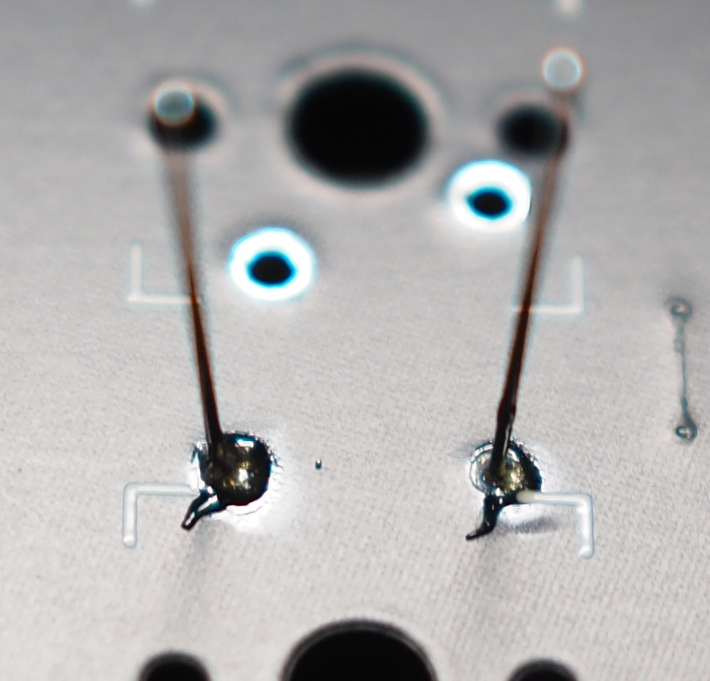  

**Point:**  
**温度調節ができるハンダごてなら320℃位がちょうどいいです。**  

### 1-4．余ったダイオードの足をニッパーで切る

**Check:**  
**ダイオードの足を切った残りの針金はすぐにまとめて捨ててください。**  
**床に落ちたまま放置すると足に刺さるなど危険です。**  

ダイオードの足をニッパーで切り取ります。  
余裕を持って切る必要はありません。  
基板ギリギリで切り取ってください。  
  

**Check:**  
**ここで余裕を持って切ってしまうと、完成後の使用時に机へ傷をつけてしまう場合があります。**  

### 1-5．切り取った断面にハンダごてを当てる

ニッパーで切り取っただけでは切断面が尖っている場合があります。  
  
※上の写真では尖っている部分は見えづらいですが、指で触ると尖っていることがわかります。  

もう一度ハンダごてで触れてハンダを溶かすことで切断面が丸まります。  
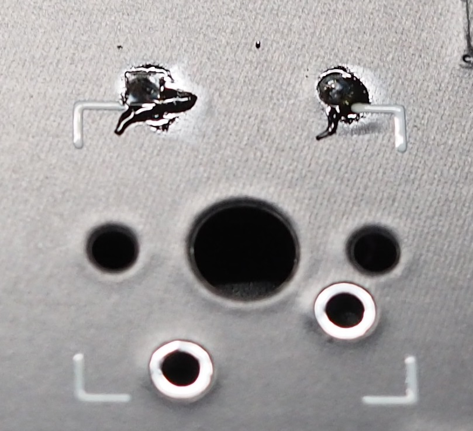  

**Point:**  
**ハンダごてを当てただけでは丸まらない場合は、ハンダを少量追加すると丸まります。**  

## 2. ProMicroとピンヘッダ/13ピンソケットのハンダ付け

**Check:**  
**ProMicroの裏表に十分に注意してください。**  
**逆に取り付けてしまった場合、ピンヘッダを取り外すのはとても大変です。**  

**Check:**  
**無線対応をしたい場合、ProMicroの代わりにBLE Micro Proをハンダ付けします。**  
**この場合も裏表に十分注意してください。**  
**後述の「EX2．無線対応」を変わりに参照してください。**  

### 2-1．ピンソケット/ピンヘッダの差し込み

ピンソケットを基板の **表側** から差し込みます。  
表側はProMicro部分のピンの説明が書かれている側です。  

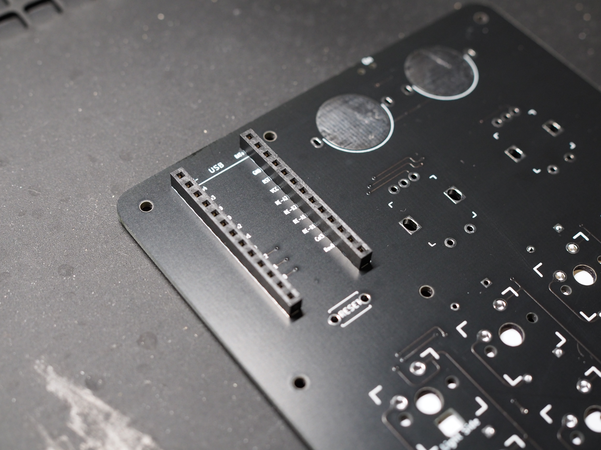  

ピンヘッダの短い方をピンソケットの上に当てます。  
**Check:**  
**ピンソケットの一番上のピンを開けておきます。**  
**BMPの印字がある箇所が一番上です。**  
**Point:**  
**この時点では奥まで挿さなくても大丈夫です。**  

  

ProMicroをピンヘッダに通します。  
**Check:**  
**まだこの時点では固定されていなくてもOKです。**  
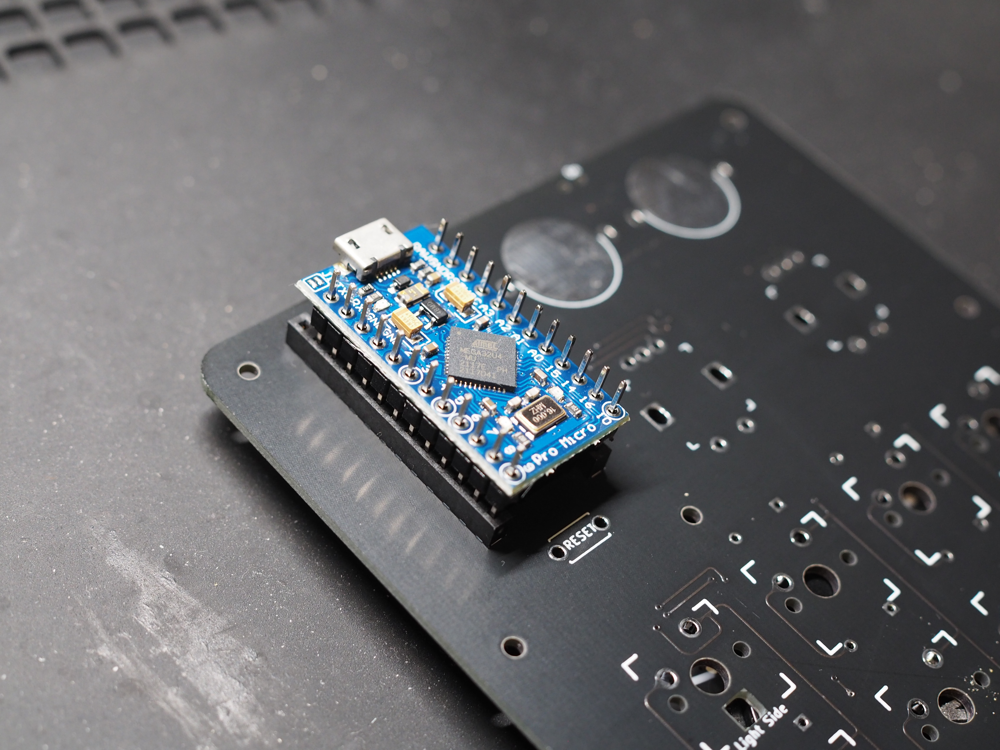  

ProMicroの両端を持ち、まっすぐ押してピンヘッダをピンソケットに押し込んでいきます。  
横からピンヘッダが見えないことを確認します。  
  

### 2-2．ProMicroの仮止め

このとき、ProMicroの向きに十分に注意します。  
基板の**表側**からProMicroの**チップ部品が見えるように**なっているはずです。  
後でProMicroのハンダを外すのは大変な労力を伴いますので、ここで**必ず上の写真と相違が無いかチェック**しておきます。

ProMicroとピンヘッダの **一番上だけ** をハンダ付けします。

  
  

ProMicroとピンソケットが斜めになっていたり、浮いていたりしないか確認します。  
※もし斜めになっていたり浮いていた場合はもう一度ハンダごてで温めて直してください。

裏側も同様に **一番上だけ** をハンダ付けし、浮いていないか確認します。  
**Point:**  
**浮いていたり傾いていた場合は、もう一度ハンダごてで温めて直して修正してください。**  
**修正時は、ハンダごてでProMicroのハンダを溶かしながら、ProMicro本体を指で抑えるなどすることで傾きなどを修正できます。**  
**複数箇所を固定してしまった場合、後から傾きなどを修正するのは非常に難しいです。**  

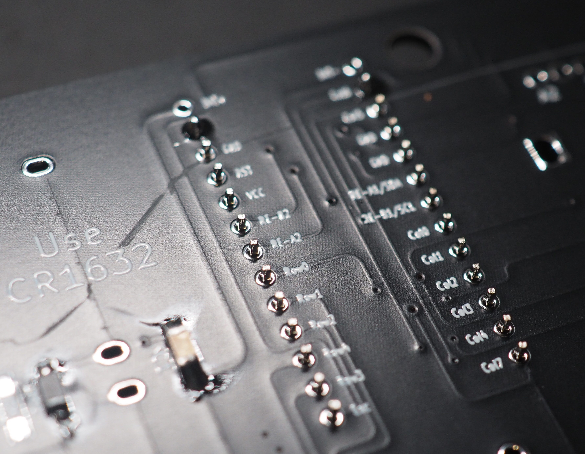  
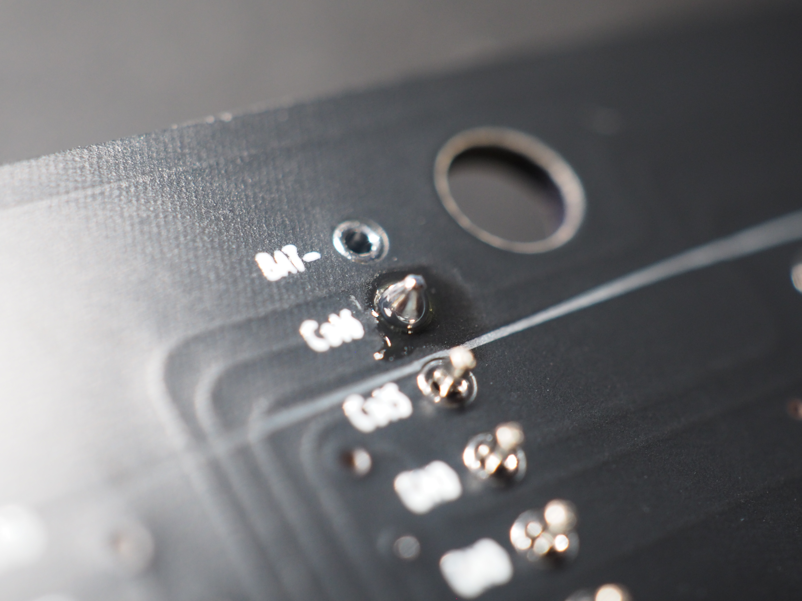  

### 2-3．ProMicroのハンダ付け

**Check:**  
**ピンヘッダをニッパーで切る際、勢いよく飛んで怪我をする可能性があります。**  
**切る箇所のピンヘッダーを指などで抑えて飛ぶのを防ぐと安全です。**  
**マスキングテープでピンヘッダー同士を固定する方法もあります。**  

他のピンヘッダの飛び出ている部分をニッパーで切り取ります。  
**Point:**  
**ProMicroや基板ギリギリでピンヘッダを切り取ってください。余裕は不要です。**  
**すでにハンダ付けしたピンヘッダも切り取ってください。**  

  
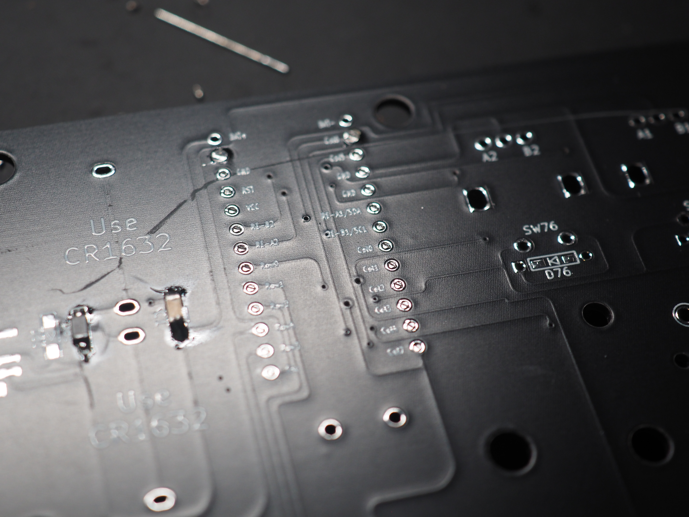  

**Check:**  
**ニッパーでそのまま切り取ろうとすると勢いよくピンヘッダの切れ端が飛んでいきます。**  
**飛ぶ際に目に刺さったりすると非常に危険ですし、落ちた切れ端を踏むと刺さります。**  
**必ず飛ばないようにピンヘッダを押さえながら切り取り、作業を中断する際は必ず片付けてください。**

基板の表側からProMicroをハンダ付けし、基板の裏側からピンソケットをハンダ付けします。  

  
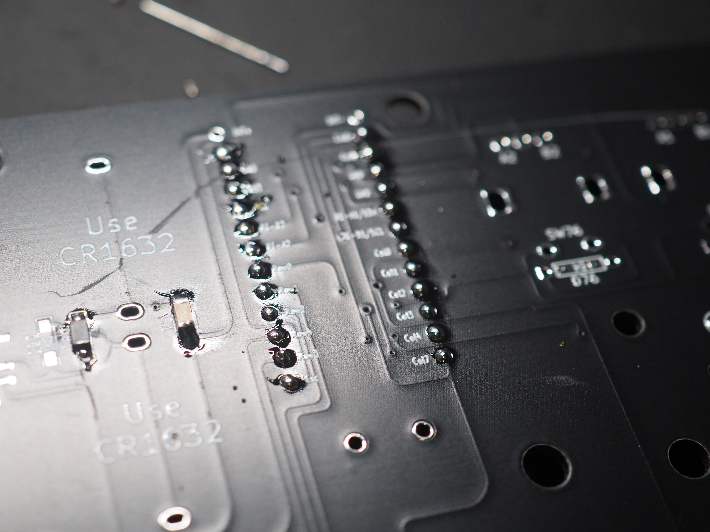  

**Point:**  
**最初にハンダ付けして切り取ったピンヘッダは最後に温めることで丸く綺麗な状態になります。**  

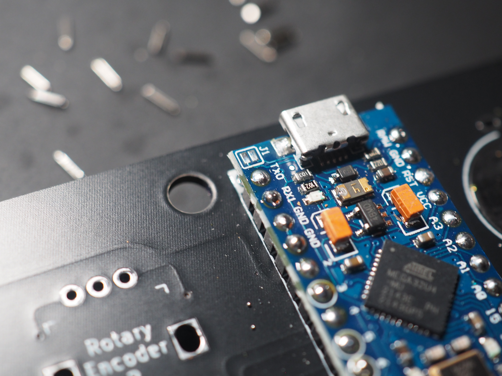  

## 3. リセットスイッチのハンダ付け

**Point:**  
**リセットスイッチはハンダ付けせずに使うことも出来ます。**  
**使う機会も少ないので、頻繁にファームウェアを書き換える予定がなければハンダ付けを省略してしまっても大丈夫です。**  
**なお、一度ファームウェアの書き込みを行った後は、リセットスイッチを使用せずにキーマップが変更可能になります。**  

基板右側、ProMicroの下に`Reset`とある部分にリセットスイッチを表面に取り付け、裏側からハンダ付けします。  

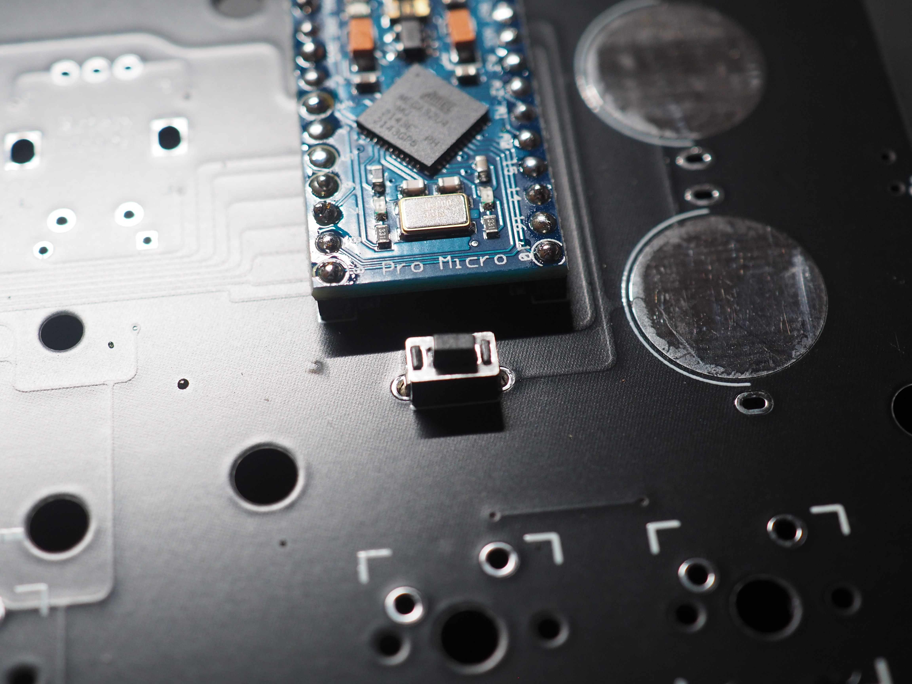  
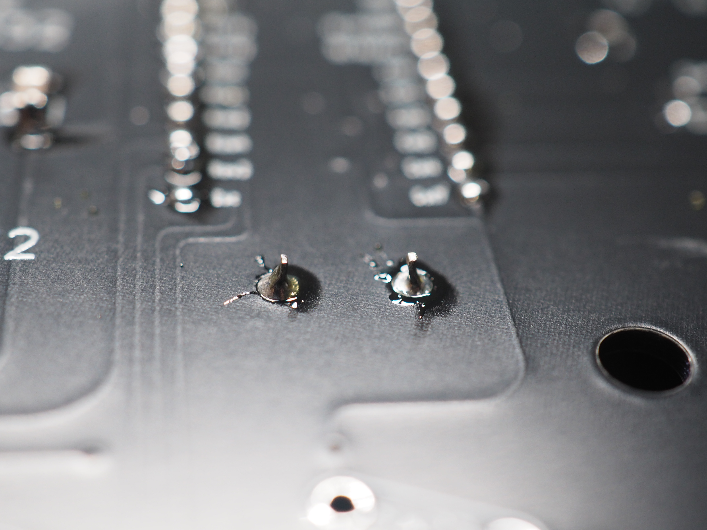  

ハンダ付けした後、ニッパーで切り取ってもう一度ハンダごてで温めることで机に傷をつけずに使うことが出来ます。  

  

## 4. ファームウェアの書き込みと動作確認

Primer61はファームウェアとしてqmk_firmwareを使用しています。  
ファームウェアはRemapのカタログページにファームウェア書き込むことができます。  
Google Chromeにてページを開いた上、書き込みを行ってください。  

※BLE Micro Proの書き込みは本ビルドガイドの末尾の`EX1-3．ファームウェアの書き込み`を参照してください。  

https://remap-keys.app/catalog/CoU6WxxUfBhZEAvNWqTE/firmware  

FLASHをクリックします。  

  

通常のProMicroは「caterina」を、Elite-Cは「dfu」を選択してからFLASHをクリックします。  
※「dfu」を使用しての書き込みは別途Zadigというツールを用いた作業が必要になる場合があります。  

  

下図のように小ウインドウに「Arduino Micro」等が表示されることを確認します。  
表示されない場合、ケーブルや接続するポートを変更して試してみます。  

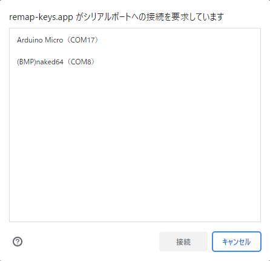  

リセットスイッチを1秒ほど押すと一瞬USB機器が抜けたような音がするので先程の小ウインドウのArduino Microのポート番号が変化したことを確認し、該当のArduino Microを選択し素早く「接続」をクリックしてください。  
（本ビルドガイドの図例の場合、COM17がCOM18に変化）  
ポート番号が変化しない場合、リセットを素早く2回実施する等も試してみてください。  

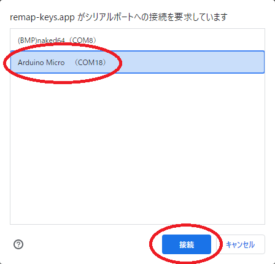  

ファームウェアの書き込みが完了したら下図のようにメッセージの最後に「successfully」が表示されます。

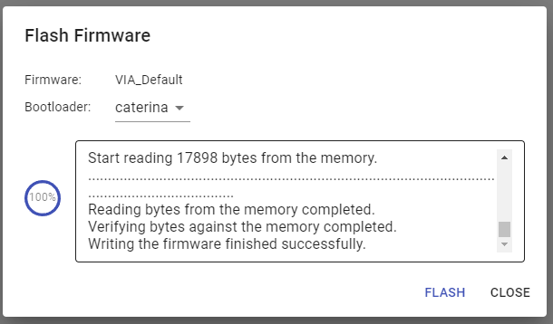  

ファームウェアの書き込みが完了したらRemapのコンフィギュレータ画面を開きます。  

https://remap-keys.app/configure

Remapで正常に認識できたらテストモード（Test Matrix Mode）を開き、ピンセットでスイッチ用の穴に触れて導通をチェックします。  

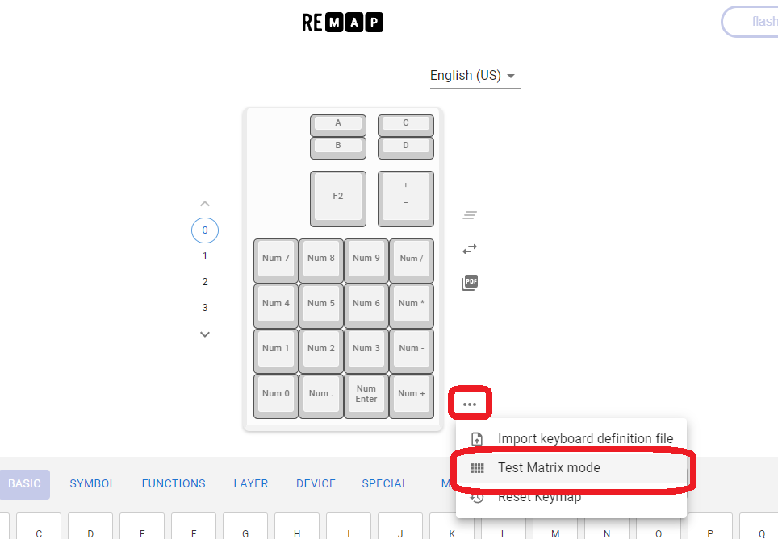  
  

**Point:**  
**ピンセットがない場合、切り取ったダイオードの足やアルミ箔を切ったものでも代用できます。**  

全て正常だと下図のように全てのキーが青くなります。  
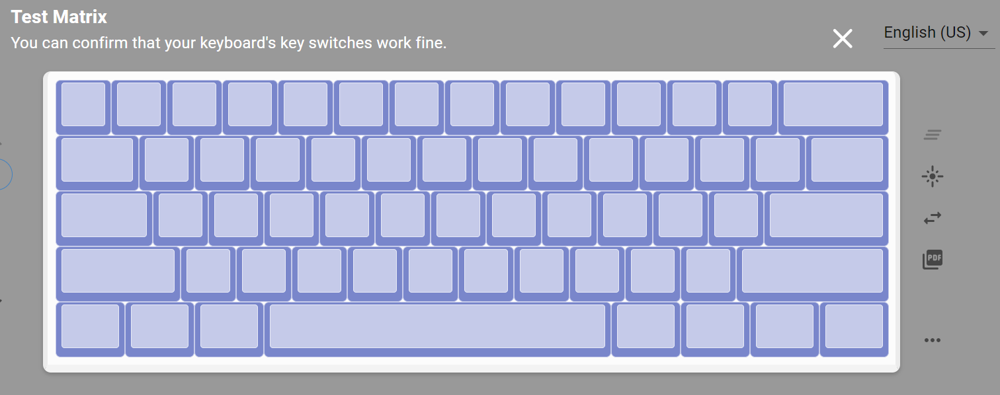  

**Point:**  
**ダイオードの番号とスイッチの番号はリンクしています。**  
**違う部分のキーが反応した場合はダイオードの向きを確認してください。**  
**Point:**  
**もし違う部分のキーが反応した場合はスイッチに対応するダイオードの向きを確認してください。**  
**ダイオードの番号とスイッチの番号はリンクしています。**  

## 5. キースイッチのハンダ付け

キースイッチを取り付け、ピンをハンダ付けします。  
机を傷つけないように飛び出たピンを切ってからハンダ付けをしてください。  
**Check:**  
**ハンダ付けの前にキースイッチが奥まで差し込まれていることを確認してください。**  

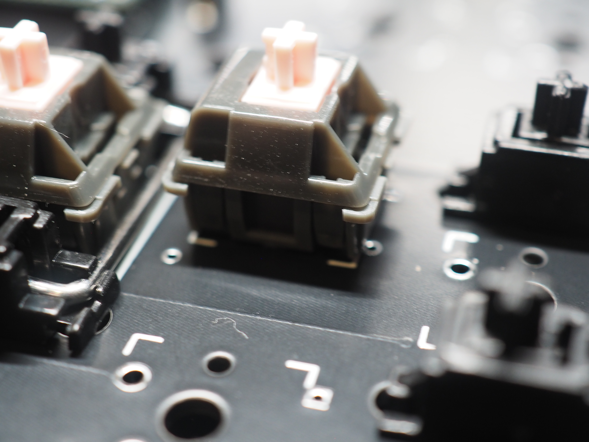  
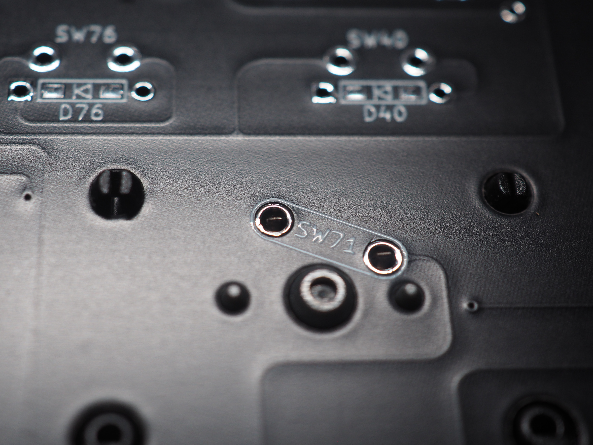  
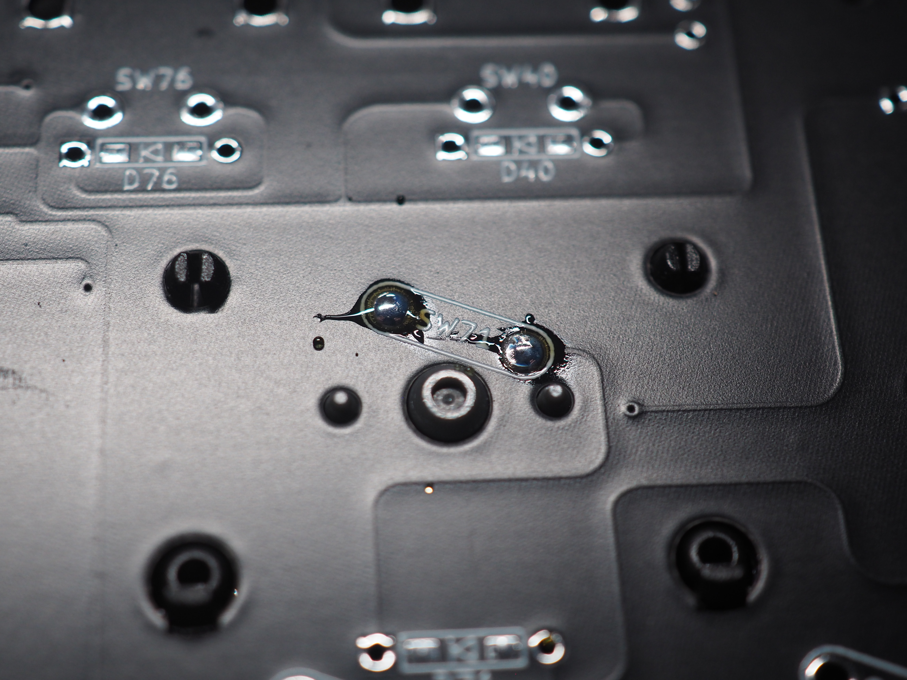  

## 6. スタビライザーの取り付け

2Uのキーキャップを取り付ける箇所について、基板の白い印字を元にスタビライザーを取り付けてください。  
画像では赤くマーキングしている場所に、スタビライザーの金属のワイヤーを取り付けます。  
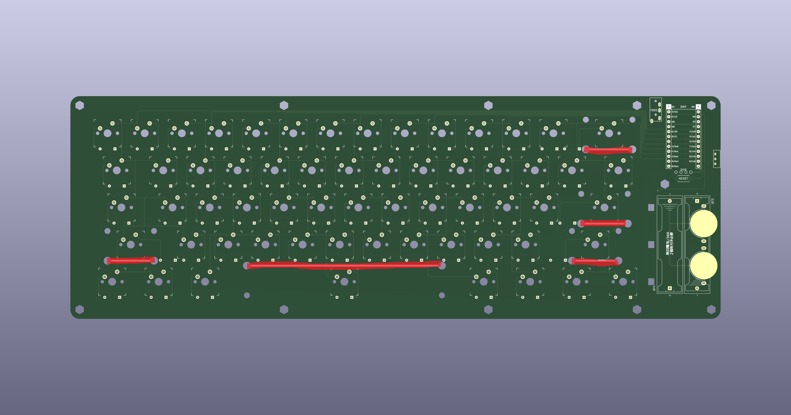  
スタビライザーは穴に対して引っ掛ける爪のような出っ張りがあるので、それをPCBに引っ掛けて取り付けます。  
出っ張りを取り付けた後、もう片方の方をピンセットなどで押さえて取り付けを行います。  
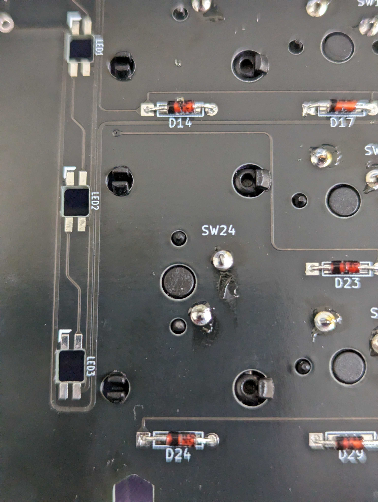  

## 7. キーキャップの取り付け

キーキャップを取り付けます。

## 8. ゴム足の貼り付け

下の写真を参考に、基板端の4箇所にゴム足を貼り付けます。

## 9. キーマップを変更する

あなたが使用しやすいようにキーマップを変更してください。  
キーマップの変更はRemapを使用すると便利です。  

https://remap-keys.app/configure

Remapの使用方法は以下のサイトを参考にしてください。  

https://salicylic-acid3.hatenablog.com/entry/remap-manual
  
## 10. 完成！

以上で完成となります！  
  
## EX1．無線化対応

ProMicroの代わりにBLE Micro Proというマイコンボードを使うことでBluetoothを用いた無線接続を行う事ができます。  
そのままでもモバイルバッテリー等によるUSB給電を行えますが、[Primer61/29用電池部品セット](hogehoge)の部品を用いることで、単4電池またはコイン電池（CR1632）による完全無線を実現することが出来ます。

### EX1-1．BLE Micro Proのハンダ付け

基本的に取付方法はProMicroと同じですが、電池用のピンのために、右側だけ上にオフセットして取り付ける必要があります。  
左側はそのままの状態ではんだ付けを行います。  
または13ピンのピンヘッダーをお使いいただき、全てのピンをハンダ付けすることでも取り付け可能です。  
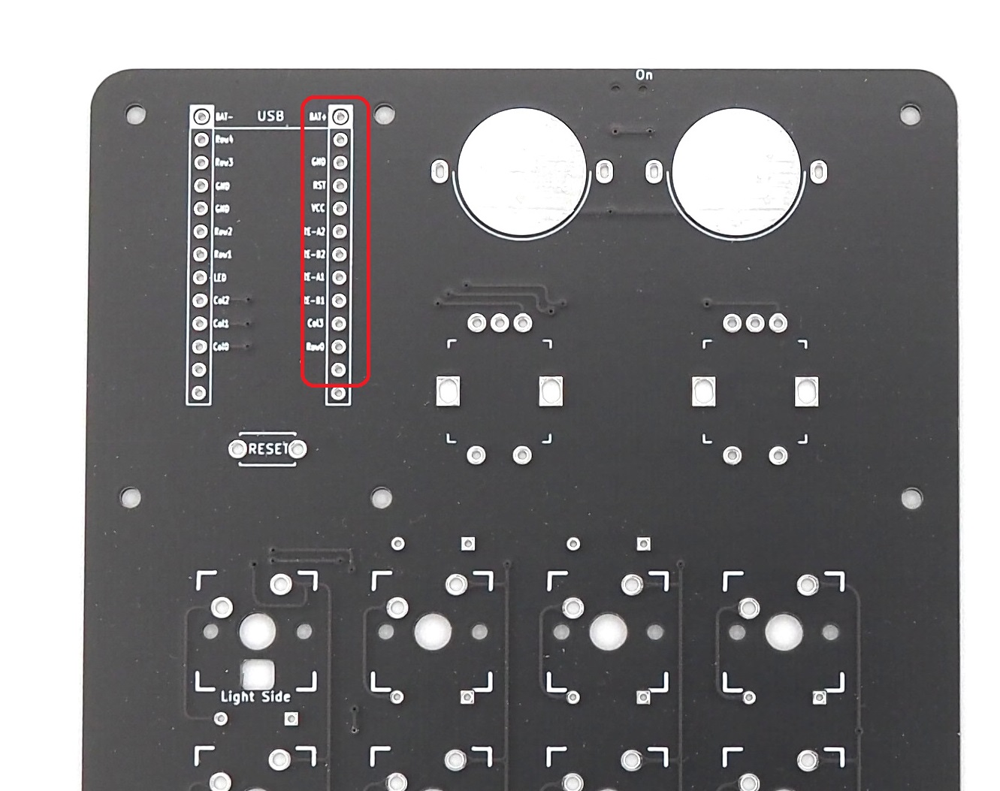  

### EX1-2-a．電池部品のハンダ付け（単4電池の場合）

単4電池ホルダーを表側に装着します。  
ホルダーには+方向、-方向の向きがあるので、単4電池ホルダー内のバネと基板の印刷を一致させるようにして取り付けます。  
画像を参照した上で注意して取り付けてください。  

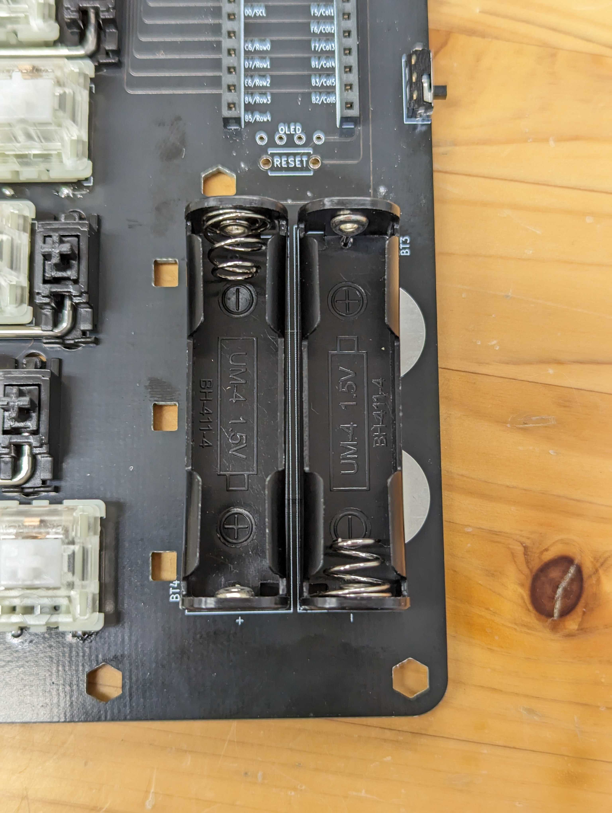  

裏返してハンダ付けをする際に浮いてしまわないように、マスキングテープなどでホルダーを押さえておきます。

  
  

ショットキーバリアダイオードとチップコンデンサ、スライドスイッチをハンダ付けします。
ショットキーバリアダイオードとチップコンデンサのハンダ付けは表面実装ダイオードの取り付けと同じです。  

まず基板に予備ハンダと呼ばれるハンダを少し盛っておきます。  
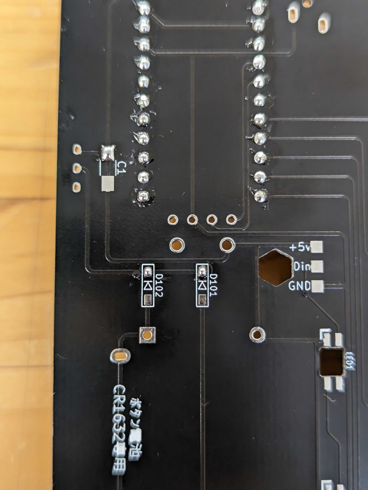  
その後、ピンセットでダイオードやコンデンサを持ち、予備ハンダをハンダごてで溶かしつつダイオードやコンデンサを基板に設置します。  
長く温めすぎてハンダが尖ってしまったら、フラックスを追加してあげるとうまくいきやすいです。
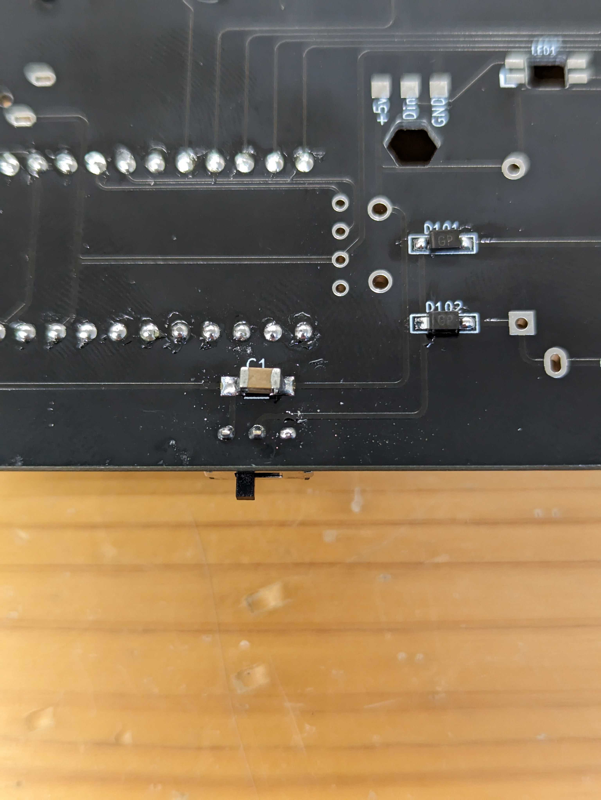  
**Point:**  
**電池用のショットキーバリアダイオードとスイッチ用のスイッチングダイオードは異なります。**  
**スイッチングダイオードを電池に使用してしまうと使用できる電池容量の低下を招きます。**  

最後にスライドスイッチをハンダ付けします。  
  

**Check:**  
**ハンダの量が多いとスイッチの内部にハンダが流れ込み、スイッチが動かなくなる場合があります。**  
**ハンダごてで加熱しすぎるとスイッチのノブが取れやすくなる場合があります。**  

### EX1-2-b．電池部品のハンダ付け（コイン電池の場合）

コイン電池ホルダーを表側に装着します。  
ホルダーには向きがあるので注意してください。  
  

裏返してハンダ付けをする際に浮いてしまわないように、マスキングテープなどでホルダーを押さえておきます。  
その後、はんだ付けを行います。  

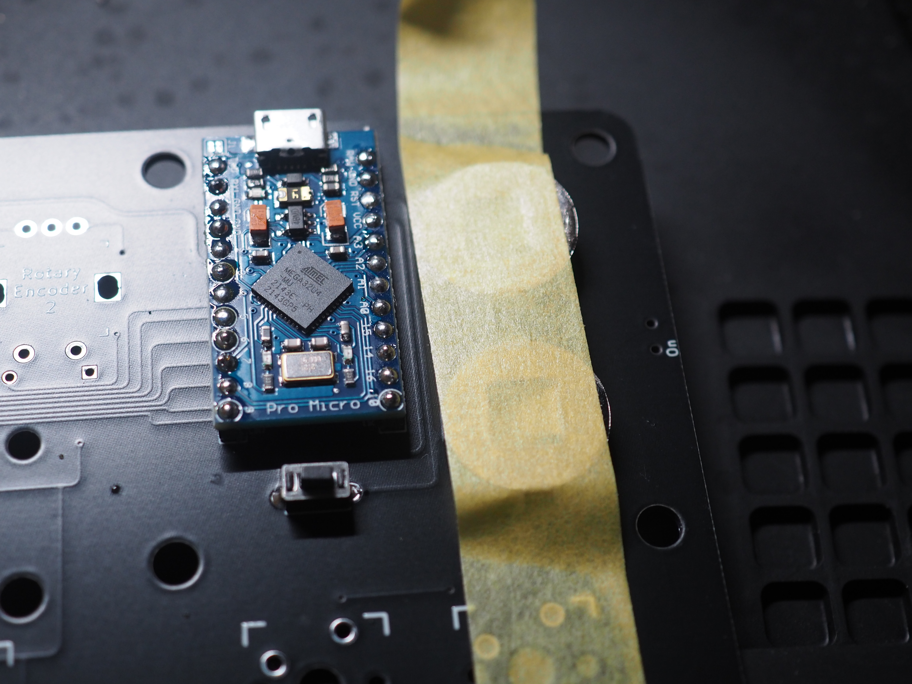  
  

ショットキーバリアダイオードとチップコンデンサ、スライドスイッチをハンダ付けします。  
ショットキーバリアダイオードとチップコンデンサのハンダ付けは表面実装ダイオードの取り付けと同じです。  

まず基板に予備ハンダと呼ばれるハンダを少し盛っておきます。  
  
その後、ピンセットでダイオードやコンデンサを持ち、予備ハンダをハンダごてで溶かしつつダイオードやコンデンサを基板に設置します。  
長く温めすぎてハンダが尖ってしまったら、フラックスを追加してあげるとうまくいきやすいです。
  
**Point:**  
**電池用のショットキーバリアダイオードとスイッチ用のスイッチングダイオードは異なります。**  
**スイッチングダイオードを電池に使用してしまうと使用できる電池容量の低下を招きます。**  

最後にスライドスイッチをハンダ付けします。  
  

**Check:**  
**ハンダの量が多いとスイッチの内部にハンダが流れ込み、スイッチが動かなくなる場合があります。**  
**ハンダごてで加熱しすぎるとスイッチのノブが取れやすくなる場合があります。**  

### EX1-3．ファームウェアの書き込み

ファームウェアは以下のBLE Micro Pro Web Configuratorから書き込みをしてください。  

https://sekigon-gonnoc.github.io/BLE-Micro-Pro-WebConfigurator/  

BLE Micro Pro Web Configuratorの上から順番に実行してください。  
上から順番に実行した後、「キーボードごとの設定を書き込む」ボタンから「Primer29」を選択して書き込んでください。  

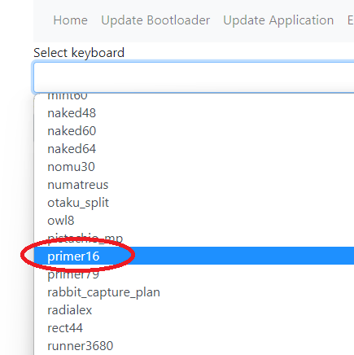  
  

書き込み後は「3. リセットスイッチのハンダ付け」と同様の手順となります。  

**Point:**  
**Bluetooth接続が不安定、キーマップの書き換えが出来ない、などのBLE Micro Pro特有の問題については[こちら](https://github.com/sekigon-gonnoc/BLE-Micro-Pro/blob/master/docs/FAQ.md)のFAQを確認してください。**  

## EX2．アクリルケースの装着

カットしたアクリルをケースとして用いることで、自由な配色のケースを装着することが出来ます。  
ケースを装着すると剛性が向上し、堅牢かつ良好な打鍵感を体験できます。  
無線化対応をする場合は、専用のケースをお選びいただく必要がございますが、基本的な組み立て方法は共通です。  
わかりやすさを重視するため、作成手順ではアクリルの表面の保護シートをつけたまま解説を行います。  

### EX2-1．ボトムプレートにスペーサーを取り付けてネジ止め

まず本工程で使用する部品を確認します。  

- 底面のプレート(3mm)  
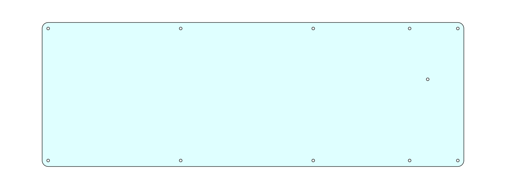

- 部品プレート(3mm)  
基板のすぐ下に取り付け、部品の干渉を避けるためにフレーム状になっています。  
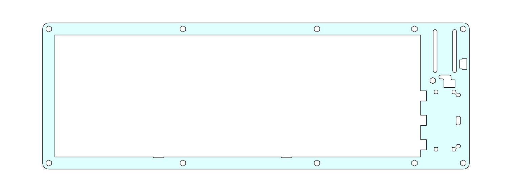

- チルト用フットプレート(5mm)  
底面のプレート(3mm)の上面側の下に取り付けて傾斜をつけます。  
右側のネジ穴の幅が若干狭くなるように使います。  

手前側は底面のプレート(3mm)、部品プレート(3mm)を重ね、スペーサーを落とし込んで裏側から5mmのネジで止めます。  
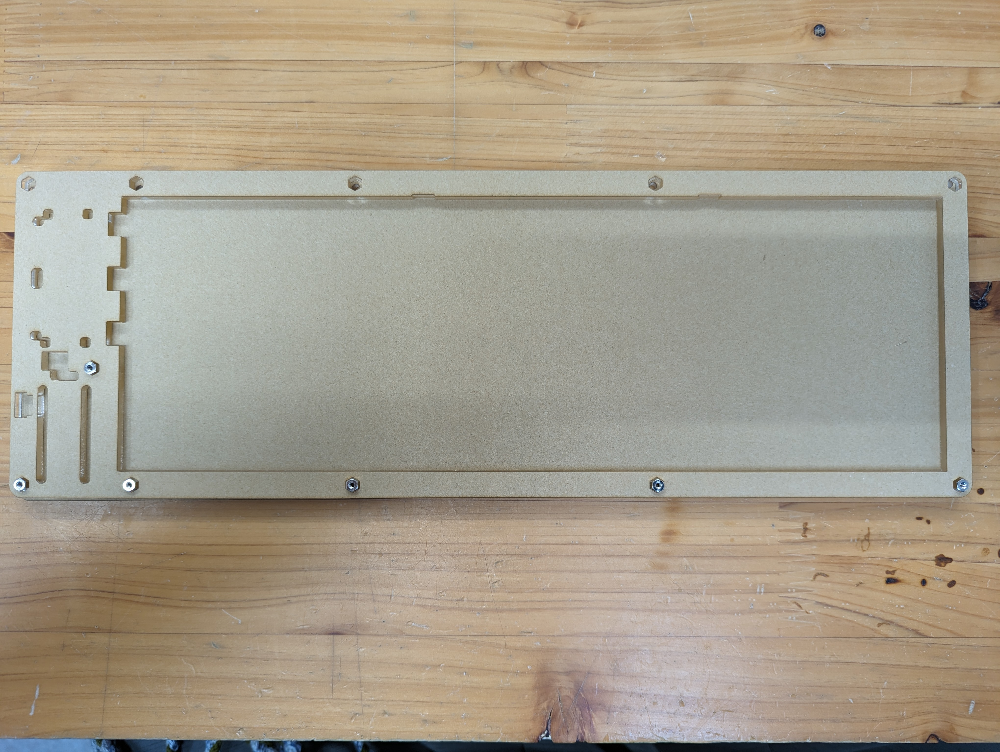

後ろ側はチルト用フットプレート(5mm)、底面のプレート(3mm)、部品プレート(3mm)を重ね、スペーサーを落とし込んで裏側から10mmのネジで止めます。  
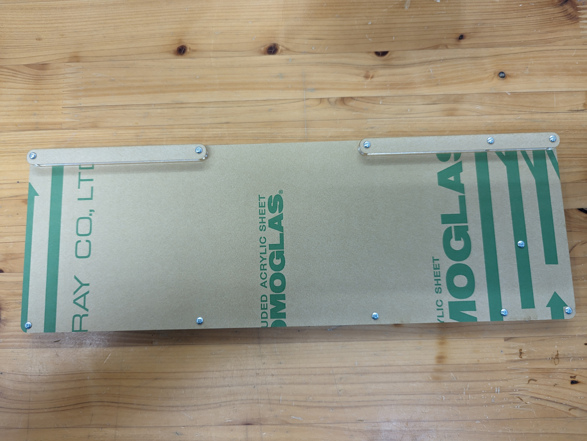

### EX2-2．ボトムプレートに基板、トッププレートを取り付けてネジ止め

まず本工程で使用する部品を確認します。  
アクリルケースのデザインによって3種類の組み合わせがあります。  

- アクリルケース(Normal)
    - 基板上面プレート1(5mm)
基板のすぐ上に取り付けるプレートです。  
部品の干渉を避けるためにフレーム状になっています。  

    - 基板上面プレート2(5mm)
基板上面プレート1の上に取り付けるプレートです。  
部品の干渉を避けるためにフレーム状になっています。  
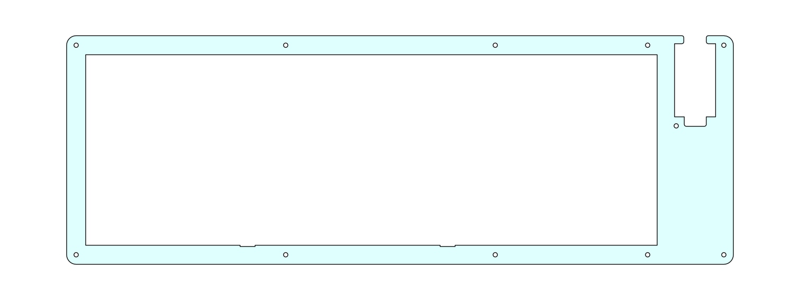

- アクリルケース(単4電池無線化仕様)
    - 基板上面プレート1(5mm)
基板のすぐ上に取り付けるプレートです。  
部品の干渉を避けるためにフレーム状になっています。  
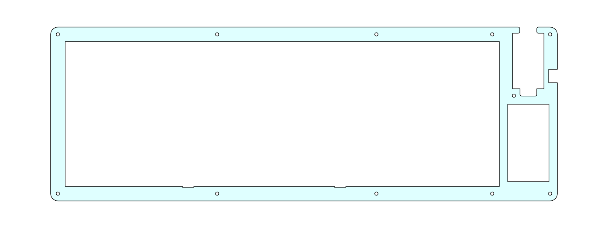
    - 基板上面プレート2(5mm)
基板上面プレート1の上に取り付けるプレートです。  
部品の干渉を避けるためにフレーム状になっています。  
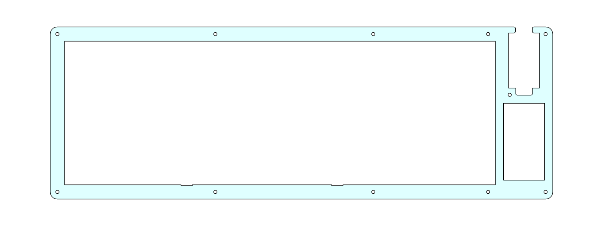

- アクリルケース(コイン電池無線化仕様)
    - 基板上面プレート1(5mm)
基板のすぐ上に取り付けるプレートです。  
部品の干渉を避けるためにフレーム状になっています。  
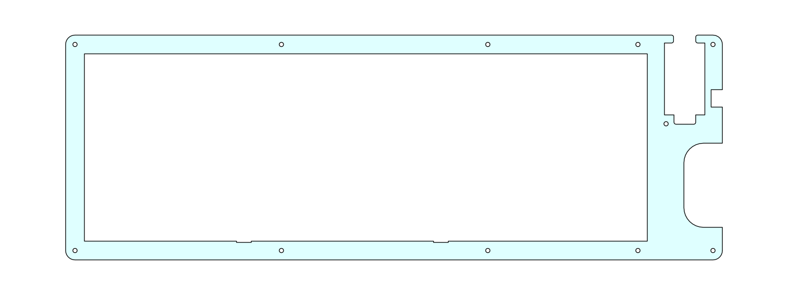

    - 基板上面プレート2(5mm)
基板上面プレート1の上に取り付けるプレートです。  
部品の干渉を避けるためにフレーム状になっています。  

EX3-1でボトムプレートを重ねたものの上に基板とプレート2種を重ね、12mmのネジで**手前2箇所だけを軽く**ネジ止めをします。  
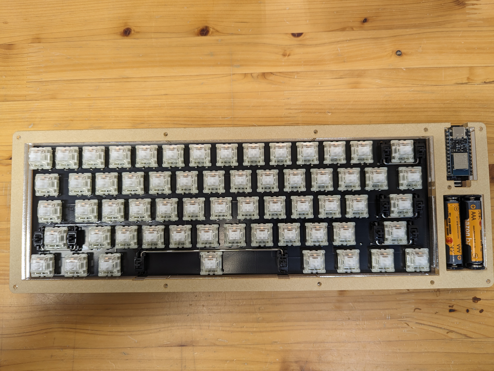

軽くネジ止めをしたあと、キーキャップを取り付けて実際に押しながら干渉をチェックし、干渉しないことを確認出来たら他のネジも取り付けて増し締めします。  
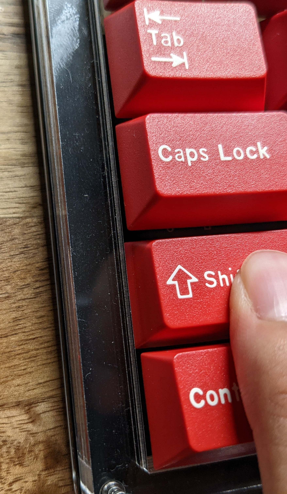
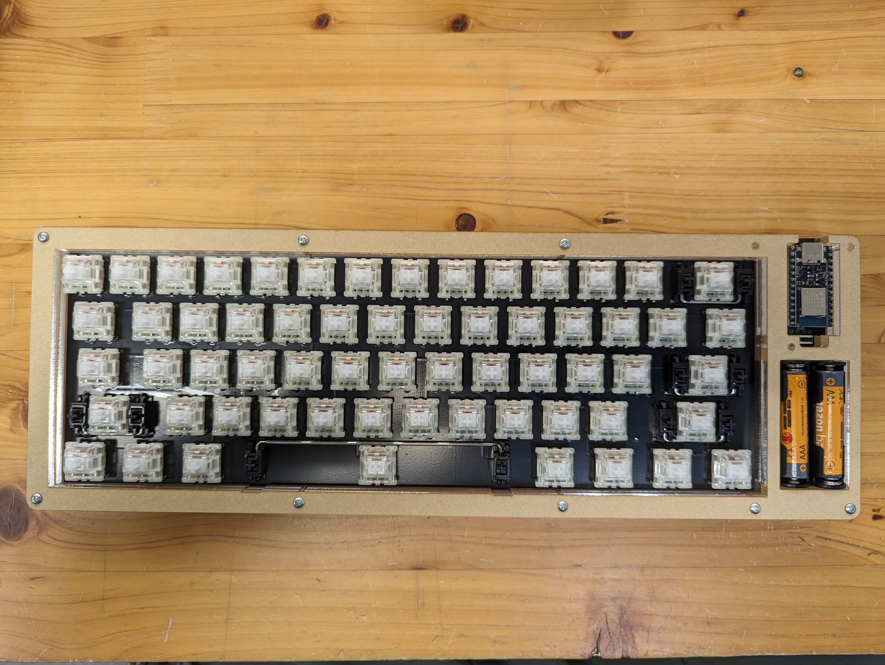

### EX2-3．ProMicroをカバーするプレートを取り付けてネジ止め

まず本工程で使用する部品を確認します。  

- ProMicroカバープレート1(3mm)
ProMicroを避ける形状をしています。  
  

- ProMicroカバープレート2(3mm)
ProMicroを覆う形状をしています。
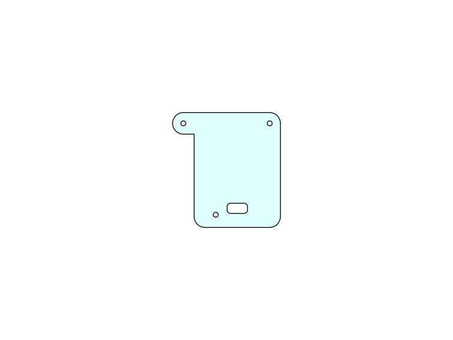

まず基板上面プレート2の上にProMicroカバープレート1、ProMicroカバープレート2を順に重ね、18mmのキャップボルト（指で回せるように背が高くなっているボルト）を使って3箇所ネジ止めします。  
キャップボルトは六角のT1.5を使うことでしっかり締めることができます  
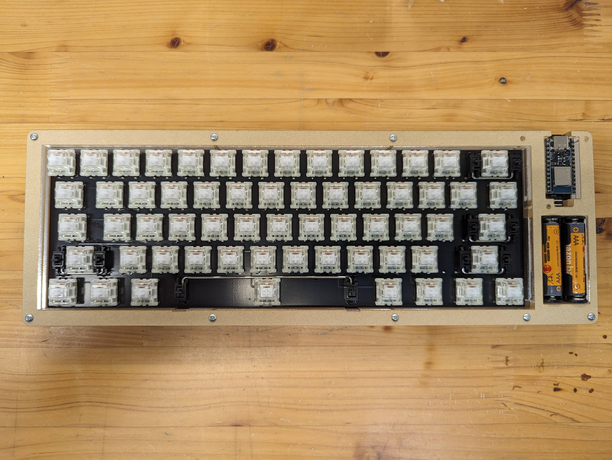  
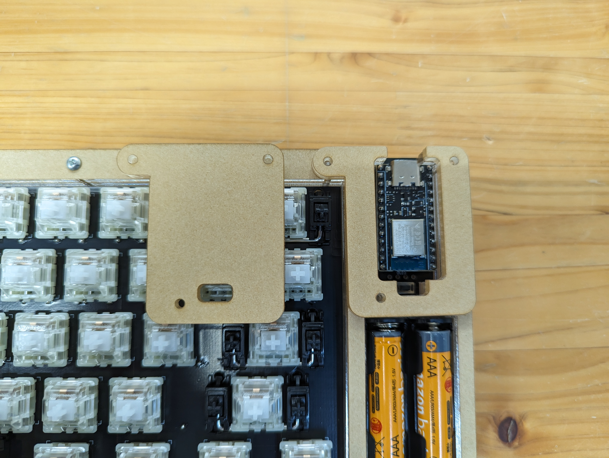  
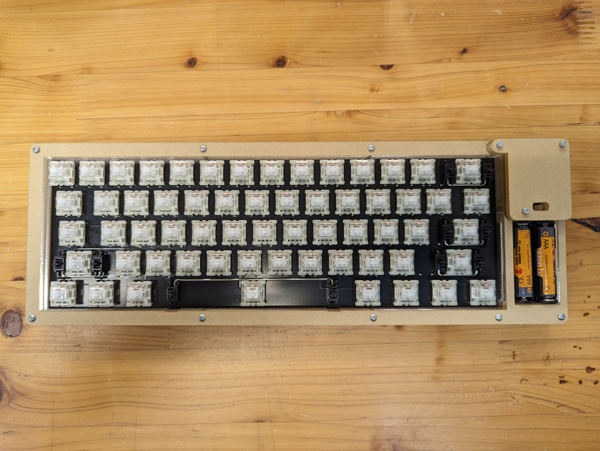  

### EX2-4．ゴム足を貼り付ける

裏面にゴム足を貼り付けます。  

## EX3．ケースフォームの装着

アクリルケースとスイッチの隙間を埋めるPoron製フォームを使用することで、打鍵音を静かにすることができます。  

## EX3-1. スイッチの上にフォームを被せる

フォームをスイッチの上に乗せます。  
フォームには向きがあるので、正しい方向になるよう、画像を確認してください。  


## EX3-2. フォームを押し込む

フォームをスイッチの側面に収まるよう、押し込んでいきます。  
押し込む際は変形しますが、Poronは柔らかいため、最終的には内部に収まります。  
ピンセットなどのように細長いもので押し込んでみてください。  

