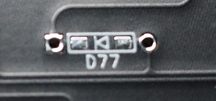
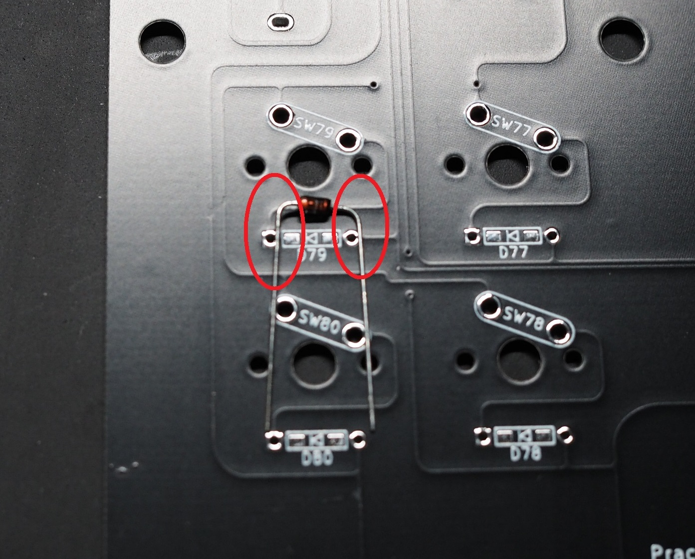
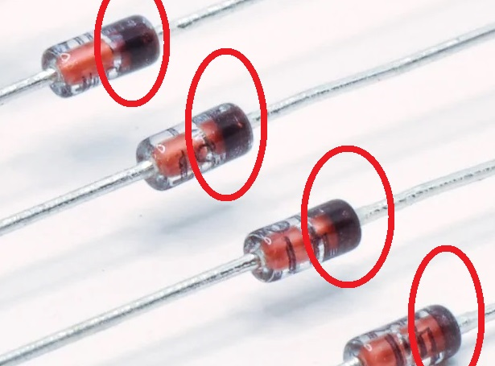
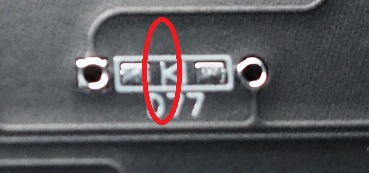
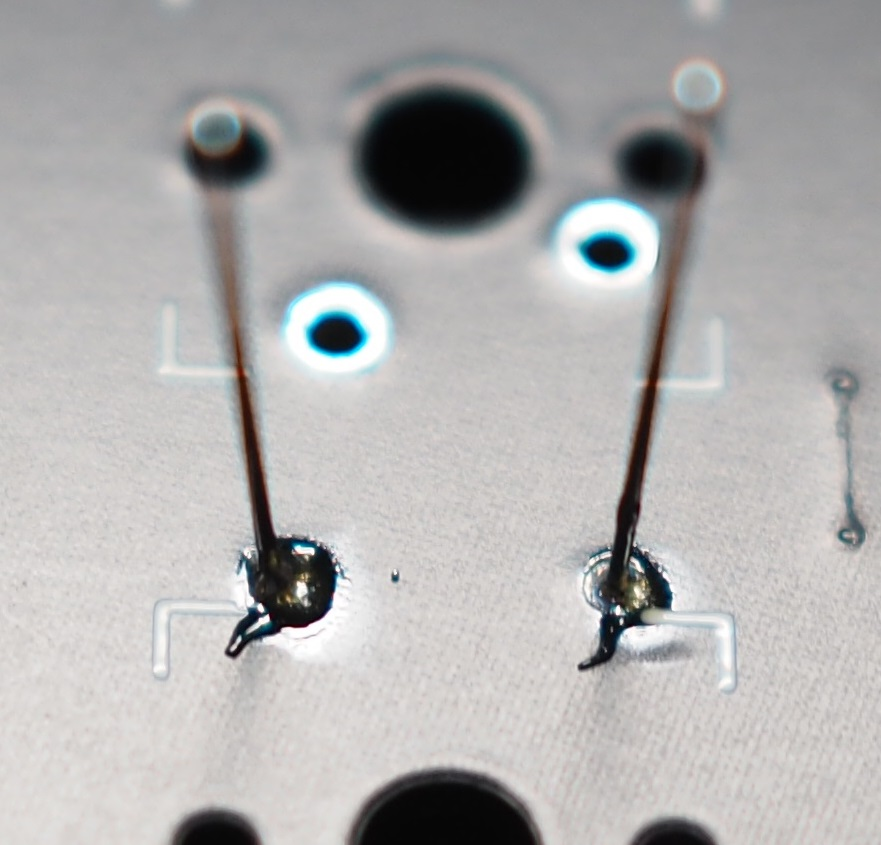
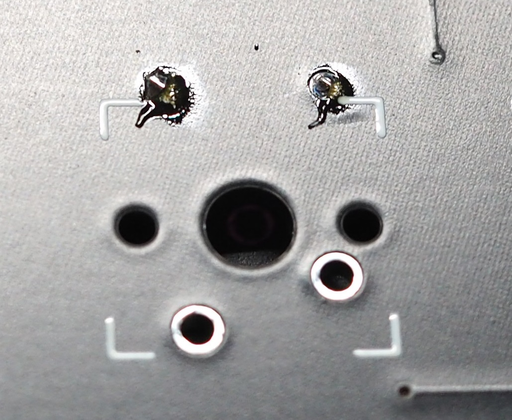
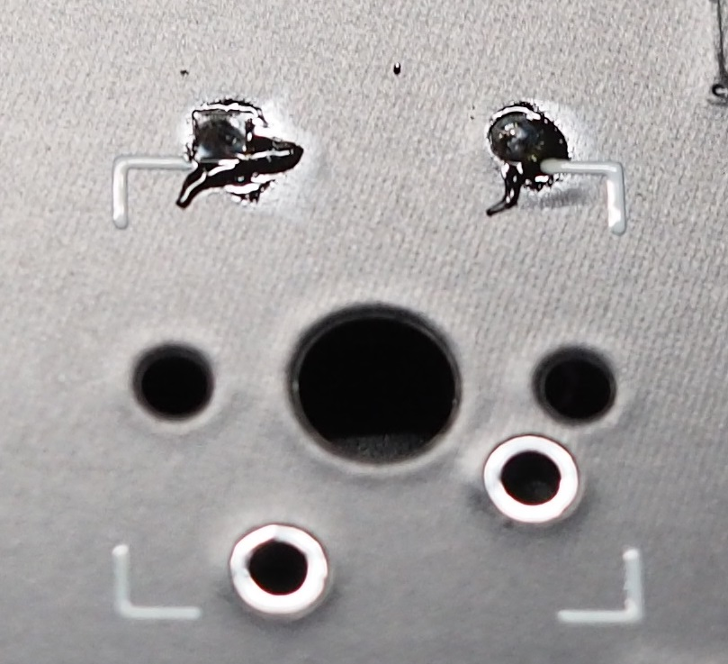
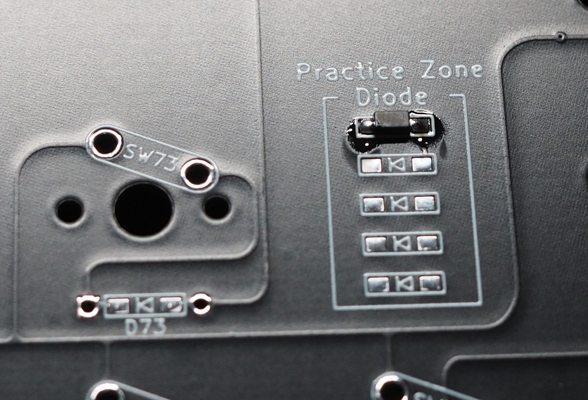

## 1. ダイオードのハンダ付け

基板上に実装するキースイッチを正しく認識させるため、ダイオードを正しい向きでハンダ付けします。 
間違った向きで取り付けると正しく認識できないので、注意してください。 
### 1-1．ダイオードの足を曲げる

**Check:基板は裏返して作業します。** 
**裏側はスイッチの番号やダイオードの番号が書かれた面です。** 

ダイオードには円筒形の素子部分と基板にハンダ付けをする針金状の足部分があります。 
あらかじめ針金状の足部分を曲げておき、後の工程で基板に差し込みやすくしておきます。 
下の画像はダイオードを差し込み、ハンダ付けする部分の拡大図です。 
 
この部分の左右の穴にあわせてダイオードの足を折り曲げておきます。 
 
※一個ずつダイオードの台紙から切り離してから曲げる必要はなく、ダイオードがついている台紙ごと一気に折り曲げても大丈夫です。

### 1-2．基板の穴にダイオードを差し込む

**Check:ダイオードの向きに注意。** 
**ダイオードの向きを間違えると押したキーと違う文字が入力されてしまいます。** 

ダイオードの向きは円筒形の素子に印刷されたラインから判断します。 
 
基板に取り付ける向きは基板の印刷を確認してください。 
`[|◁]`の三角形の向いた先にダイオードのラインが来るように差し込みます。 
 
※Primer79は基板裏側から見た時に、全てのダイオードの左側にラインが来るように向きを揃えています。 

**Point:ダイオードを差し込んだままだとハンダ付けをする際に基板をひっくり返す際に落ちてしまいます。** 
**落ちないようにダイオードの足をちょっと曲げるか、マスキングテープなどで素子を留めて上げると後の工程をスムーズに進める事ができます。**

### 1-3．ダイオードをハンダ付けする

**Check:ハンダごては高温になりますので火傷に注意してください。** 
**Check:基板は表面で作業します。** 

基板をひっくり返して、表面からダイオードの足をハンダ付けします。 
ハンダ付けは、まず基板とダイオードの足をハンダごての先で触れて温め、その1秒後くらいにハンダを温めている部分に送ってハンダ付けをします。 
ハンダを多く送る必要はありません。 
以下の写真のハンダの量、またはYouTubeなどのハンダ付け動画を目安にハンダ付けを行ってください。 
 

**Point:温度調節ができるハンダごてなら320°位がちょうどいいです。** 

### 1-4．余ったダイオードの足をニッパーで切る

**Check:ダイオードの足を切った残りの針金はすぐにまとめてください。** 
**床に落ちたまま放置すると足に刺さります。** 

ダイオードの足をニッパーで切り取ります。 
余裕を持って切る必要はありません。 
基板ギリギリで切り取ってください。 
 

**Check:ここで余裕を持って切ってしまうと使用時に机に傷をつけてしまう場合があります。**

### 1-5．切り取った断面にハンダごてを当てる

ニッパーで切り取っただけでは切断面が尖っている場合があります。 
 
※上の写真では尖っている部分は見えづらいですが、指で触ると尖っていることがわかります。 

もう一度ハンダごてで触れてハンダを溶かすことで切断面が丸まります。 
 
**Point:ハンダごてを当てただけでは丸まらない場合は、ハンダを少量追加すると丸まります。** 

### EX1．表面実装ダイオードのハンダ付け

表面実装ダイオードは慣れるとリードダイオードより早くハンダ付けをすることが可能です。 
もし表面実装ダイオードの実装を練習する場合、カーソルキー付近の練習ゾーンをご活用ください。 
 
**Point:練習ゾーンは回路には使用していません。** 
**存分に練習してください。** 

