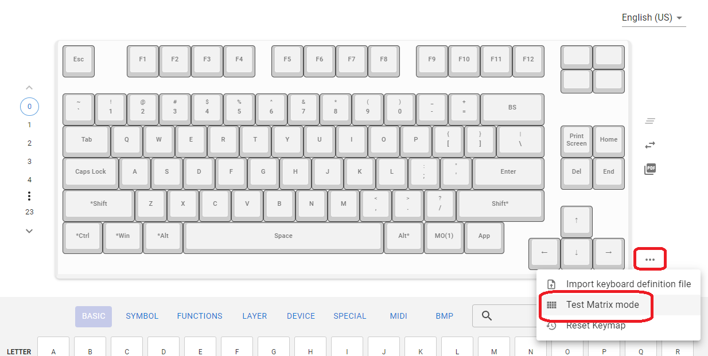
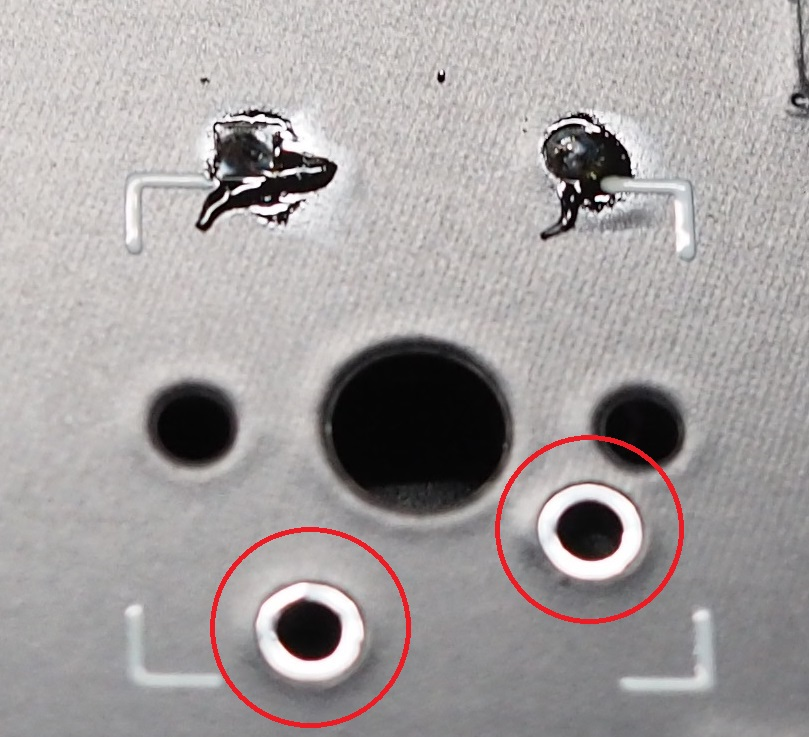
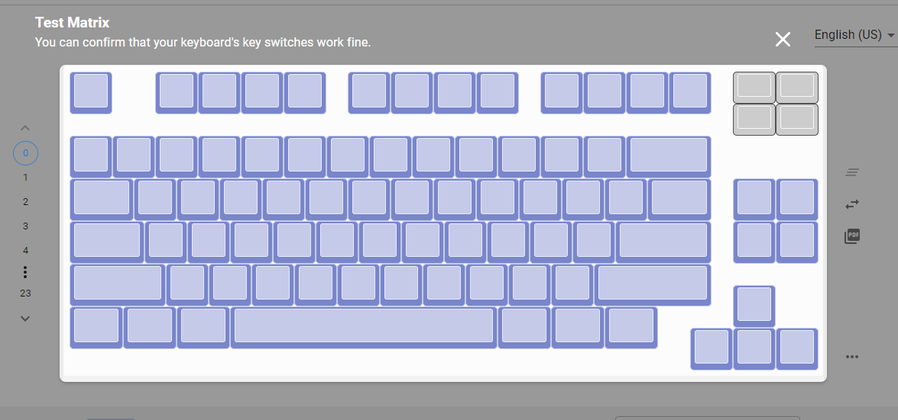

## 5. 導通チェック

下記ページ（Remap）でキーボードを認識させます。

https://remap-keys.app/configure

Remapで正常に認識できたらテストモードを開き、ピンセットでスイッチ用の穴に触れて導通をチェックします。 

 
 

**Point:ピンセットがない場合、切り取ったダイオードの足やアルミ箔を切ったものでも代用できます。** 

全て正常だと下図のように全てのキーが青くなります。
 

**Point:右上の4キー分はロータリーエンコーダの回転部分です。** 
**この4キー分は青く反応しなくても正常です。** 
**Point:ダイオードの番号とスイッチの番号はリンクしています。** 
**違う部分のキーが反応した場合はダイオードの向きを確認してください。** 
**Point:もし違う部分のキーが反応した場合はスイッチに対応するダイオードの向きを確認してください。** 
**ダイオードの番号とスイッチの番号はリンクしています。** 

