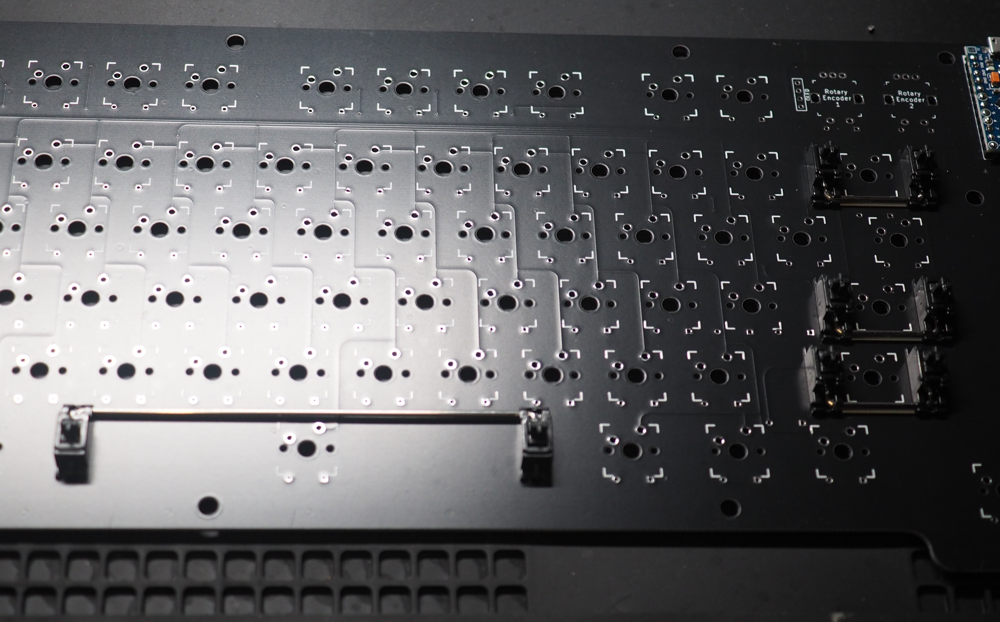
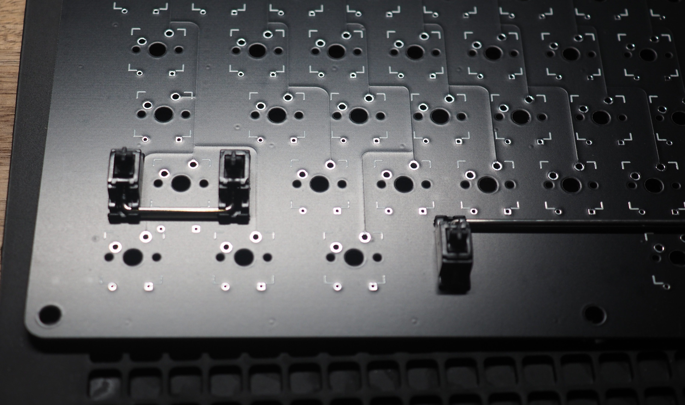
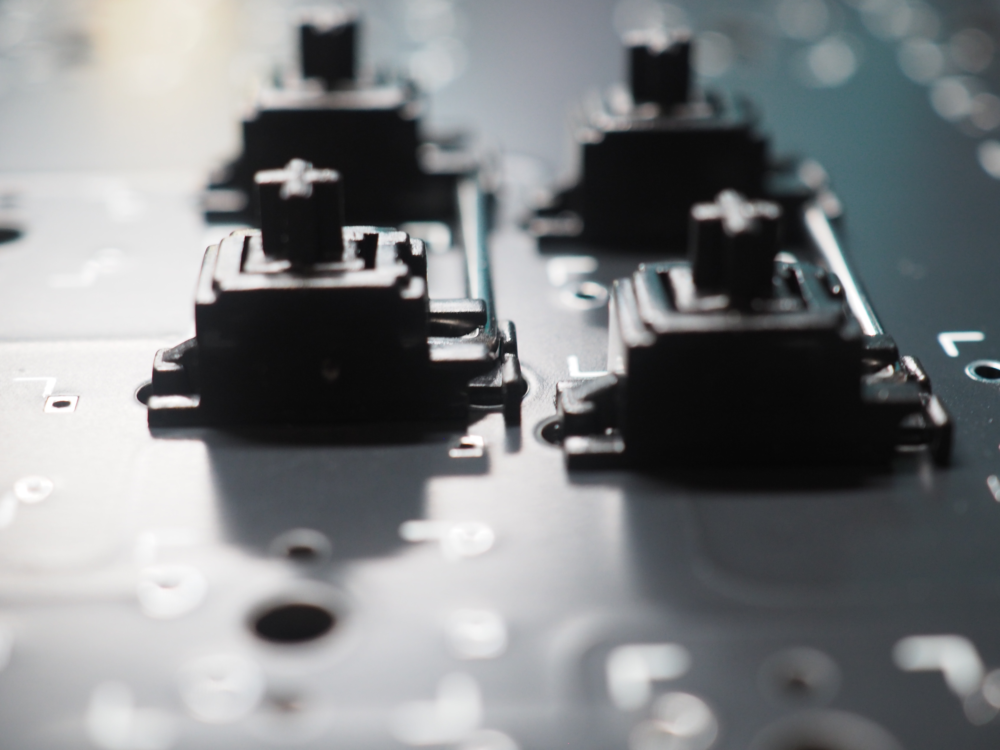
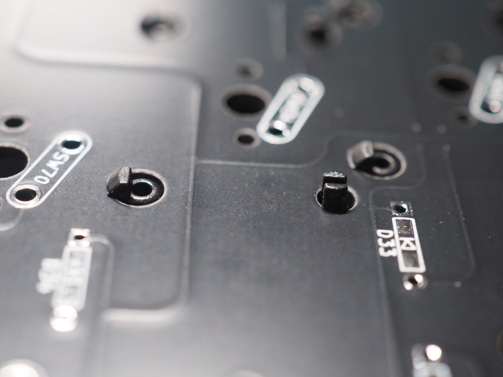

## 7. スタビライザーの取り付け

向きに注意してスタビライザーを取り付けます。 
 
 
 

**Point:スタビライザーはそのまま使用すると音が大きく満足度の低下につながるため、ぜひ潤滑剤用いて潤滑してください。** 
**潤滑剤は[こちら](https://shop.yushakobo.jp/collections/accessory/products/lubricants)。** 
**[こちら](https://salicylic-acid3.hatenablog.com/entry/stabilizer-lubrication)のサイトも参考になります。** 

**Point:取り付けにネジを使用しないスタビライザーであるスナップインスタビライザーを使用する場合、取り付けが非常に固い場合があります。** 
**その場合は無理に押し込まず、詰めの部分をペンチなどで軽く潰しておくと入れやすくなります。** 
 

