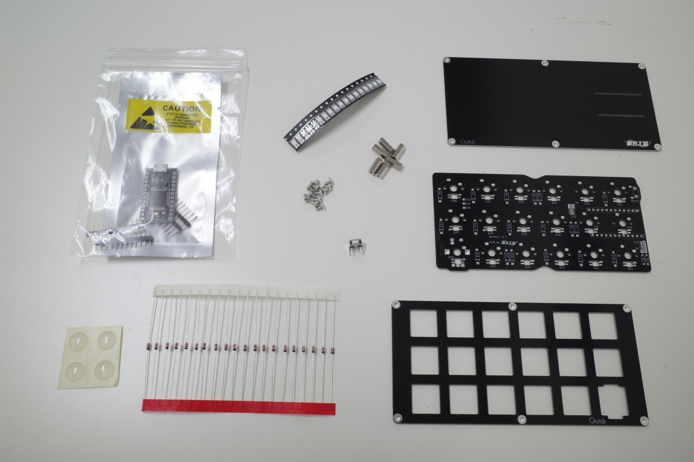

# Quick17 ビルドガイド

## 必要な部品

|名称|数量|備考|
|---|---|---|
|基板|1|
|トッププレート*|1|
|ボトムプレート*|1|
|M2 10mm スペーサー*|6|
|M2 4mm ネジ*|12|
|ダイオード|18|スルーホールのみ対応|
|ProMicro|1|
|コンスルー|2|12pin,高さ2.5mmのものを使用|
|SK6812MINI-E|18|
|リセットスイッチ|1|

アスタリスク(*)の付いた部品はスチールケースセットには付属しません(替わりにスチールケースが付属します)。

### オプション部品

|名称|数量|備考|
|---|---|---|
|ロータリーエンコーダ|1|スイッチ付きのものにも対応|
|ノブ|1|選択したロータリーエンコーダに対応するもの|

## 必要な道具

|名称|備考|
|---|---|
|はんだごて|LEDの取り付けを行う場合、温度調節機能付きのもの|
|はんだ線|0.6mm~0.8mm径程度のもの|
|*ドライバー|*スチールケースセットの組み立てには不要です|
|六角レンチ|ロータリーエンコーダー用ノブを取り付ける際に必要になる場合があります|

### 回路図は[こちら](Quick17.pdf)

## 組み立ての前に

**実際の組み立てを始める前に、このビルドガイドを最後までお読みください。**

組み立てには先端の熱くなるはんだごてを使用します。作業を中断し席を離れる際などは電源を切るなどし、やけどや怪我には十分ご注意ください

## 組み立ての手順

1. LEDのはんだ付け
1. ダイオードのはんだ付け
1. ProMicroとコンスルーのはんだ付け
1. リセットスイッチのはんだ付け
1. (オプション)ロータリーエンコーダーの取り付け
1. キースイッチの取り付け
1. キースイッチ/ロータリーエンコーダーのはんだ付け
1. ファームウェアの書き込みと動作確認
1. キーキャップの取り付け

