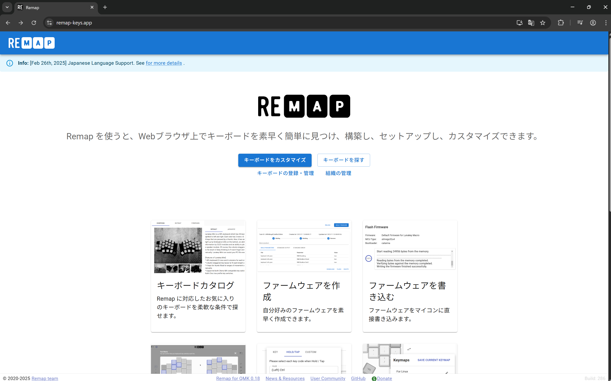
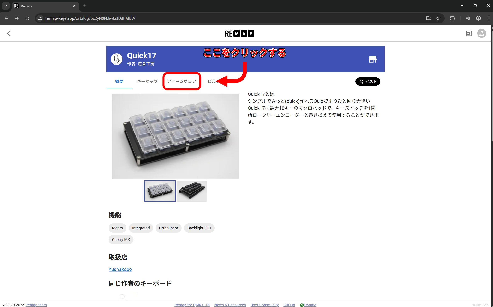
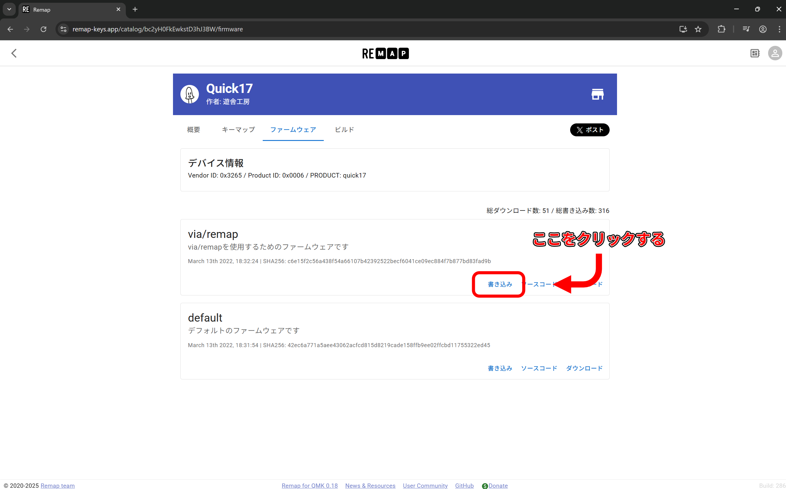
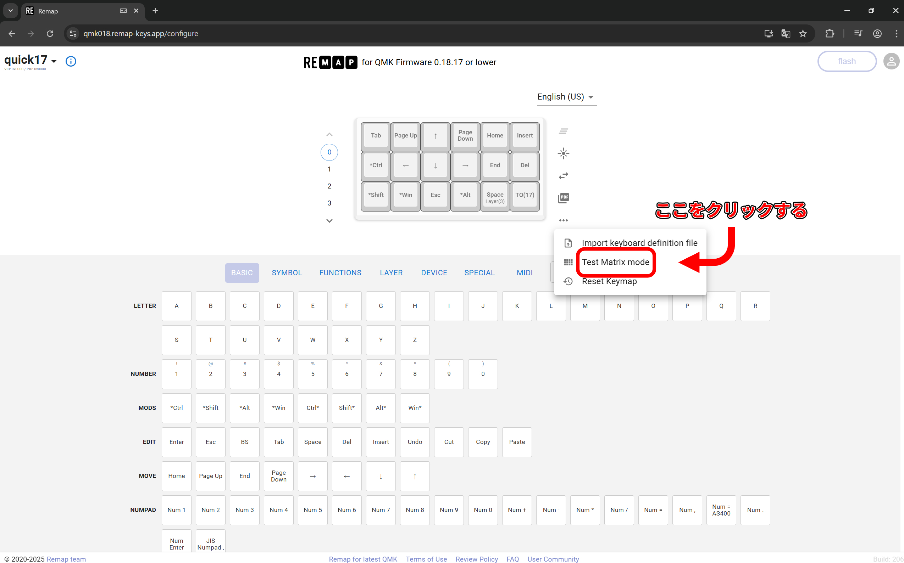
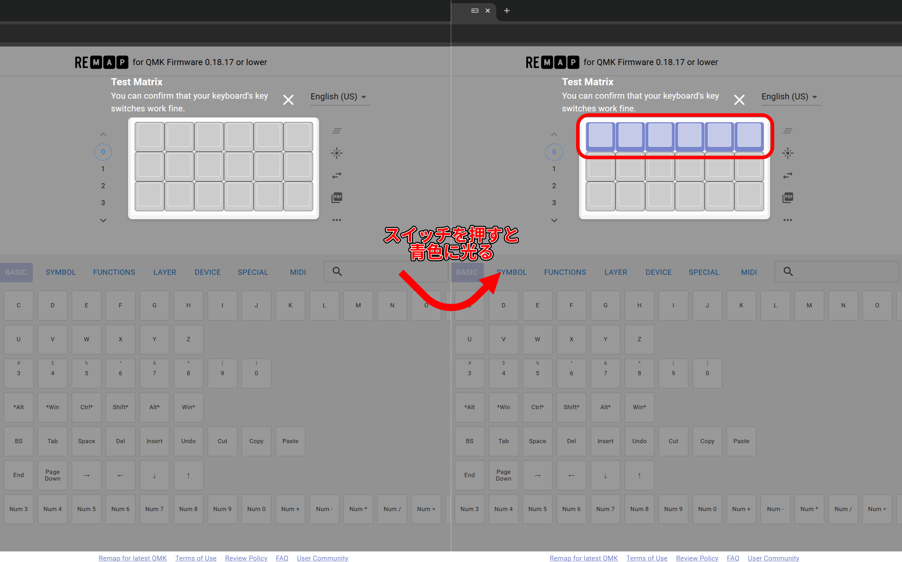

# Quick17 ビルドガイド

## 必要な部品

|名称|数量|備考|
|---|---|---|
|基板|1|
|トッププレート*|1|
|ボトムプレート*|1|
|M2 10mm スペーサー*|6|
|M2 4mm ネジ*|12|
|ダイオード|18|スルーホールのみ対応|
|ProMicro|1|
|コンスルー|2|12pin,高さ2.5mmのものを使用|
|SK6812MINI-E|18|
|リセットスイッチ|1|

アスタリスク(*)の付いた部品はスチールケースセットには付属しません(替わりにスチールケースが付属します)。

### オプション部品

|名称|数量|備考|
|---|---|---|
|ロータリーエンコーダ|1|スイッチ付きのものにも対応|
|ノブ|1|選択したロータリーエンコーダに対応するもの|

## 必要な道具

|名称|備考|
|---|---|
|はんだごて|LEDの取り付けを行う場合、温度調節機能付きのもの|
|はんだ線|0.6mm~0.8mm径程度のもの|
|*ドライバー|*スチールケースセットの組み立てには不要です|
|六角レンチ|ロータリーエンコーダー用ノブを取り付ける際に必要になる場合があります|

### 回路図は[こちら](Quick17.pdf)

## 組み立ての前に

**実際の組み立てを始める前に、このビルドガイドを最後までお読みください。**

組み立てには先端の熱くなるはんだごてを使用します。作業を中断し席を離れる際などは電源を切るなどし、やけどや怪我には十分ご注意ください

## 組み立ての手順

1. LEDのはんだ付け
1. ダイオードのはんだ付け
1. ProMicroとコンスルーのはんだ付け
1. リセットスイッチのはんだ付け
1. (オプション)ロータリーエンコーダーの取り付け
1. キースイッチの取り付け
1. キースイッチ/ロータリーエンコーダーのはんだ付け
1. ファームウェアの書き込みと動作確認
1. キーキャップの取り付け

## 1. LEDのはんだ付け

基板の`L`字の印とLEDのピン部分の切り欠きが合うように乗せます。

***このとき、2列目基板右側2つのLED(D19,D20)については向きが異なりますので、十分注意して取り付けを行います。***

温度調節機能付きはんだごての設定温度を270℃程度にし、LEDをはんだ付けしていきます。

## 2. ダイオードのはんだ付け

基板上`[Dxx  |]`の印に部分にダイオードを取り付けます。白い線、または四角い穴にダイオード表面の黒い帯を合わせて差し込み、はんだ付けします。

ダイオードは次のように取り付けます。

長く余ったダイオードの脚は適当な長さに切りそろえます。

## 3. ProMicroとコンスルーのはんだ付け

コンスルーの向きを揃えて基板に差し込み、ProMicroとはんだ付けします。

このとき、2の手順まででダイオードを取り付けた基板とは***はんだ付けしません***。

## 4. リセットスイッチのはんだ付け

基板右端、`Reset`とある部分にリセットスイッチを取り付けはんだ付けします。

## 5. (オプション)ロータリーエンコーダーの取り付け

基板を裏返し、ロータリーエンコーダーを取り付けます。スチールケースセットの場合、以降取り付けるためにはキースイッチのはんだを取り除く必要がありますので、ここでの取り付けを強くお勧めします。

## 6. キースイッチ取り付け

プレート、またはスチールケースにスイッチをはめ込みます。キースイッチには向きがありますのでご注意くさい。

## 7. キースイッチ/ロータリーエンコーダーのはんだ付け

キースイッチ/ロータリーエンコーダーの各ピンをはんだ付けします

## 8. ファームウェアの書き込みと動作確認

Quick17のファームウェアの書き込みには[Remap](https://remap-keys.app)というサイトを利用します。  
Remapはキーマップの変更やファームウェアの書き込みが可能なウェブサービスです。
Windows/MacOS/LinuxのChromeでのみ利用可能です。

最初にRemap上の[Quick17のカタログページ](https://remap-keys.app/catalog/bc2yH0FkEwkstD3hJ3BW)を開きます。上のタブから「ファームウェア」を選択します。

その後、「via/remap」内の書き込みを選び、ファームウェアを書き込みます。

書き込みは以下の手順で行います。

1. ポップアップ画面が開かれるので、もう一度「書き込み」を選ぶ。
1. 「remap-key.appがシリアルポートへの接続を要求しています」というポップアップが更に開かれるので、この画面のままリセットスイッチを2回押す。
1. リセットされるので、5秒以内に「Pro Micro ~~~（ここの内容は場合によって異なります）」という名前を選択し、「接続」を押す。
1. ファームウェアが書き込まれる。

入力のテストには[Remap](https://remap-keys.app/configure)からキーボードを読み込ませ、「・・・」メニュー内に隠れている「テストマトリクスモード」を選択します。  

この状態ではスイッチの動作確認が行えます。スイッチが正常に押された場合、画面上のキーが青く光ります。

問題なく動作した場合はトッププレート/ボトムプレートにスペーサーをネジ止めします。

## 9. キーキャップの取り付け

最後にキーキャップを取り付けて完成です。

