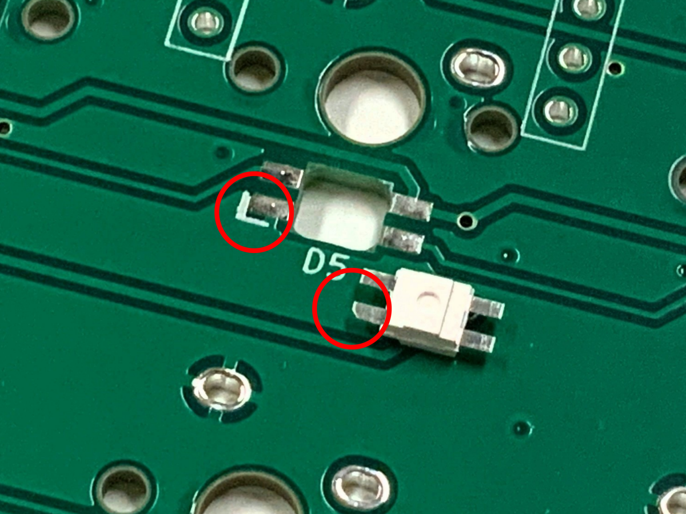
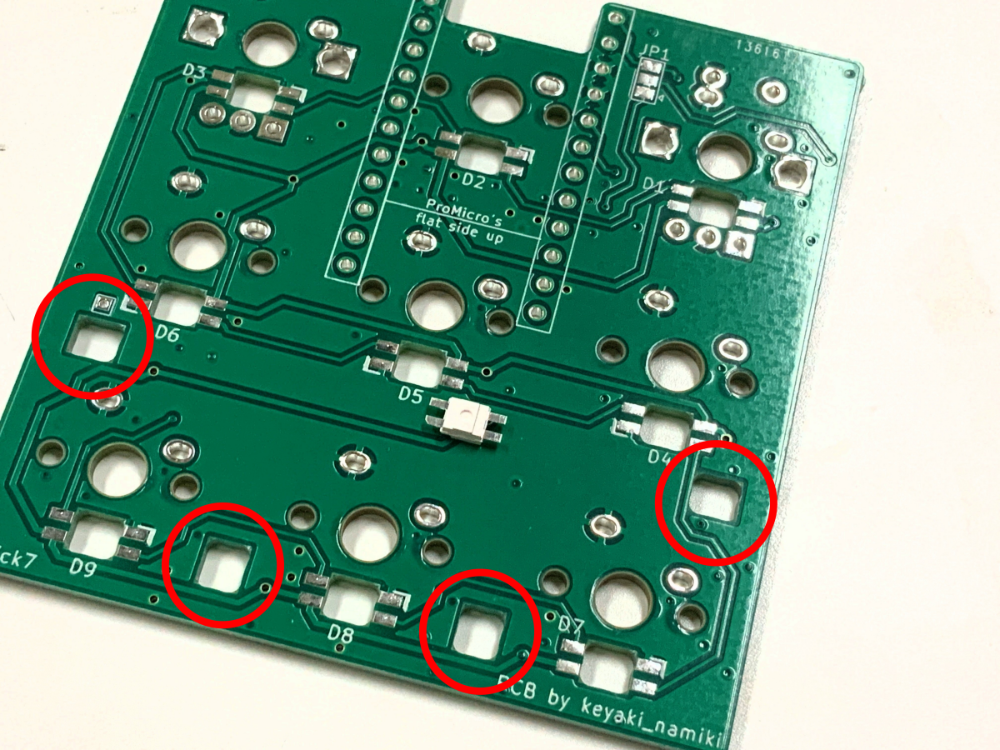
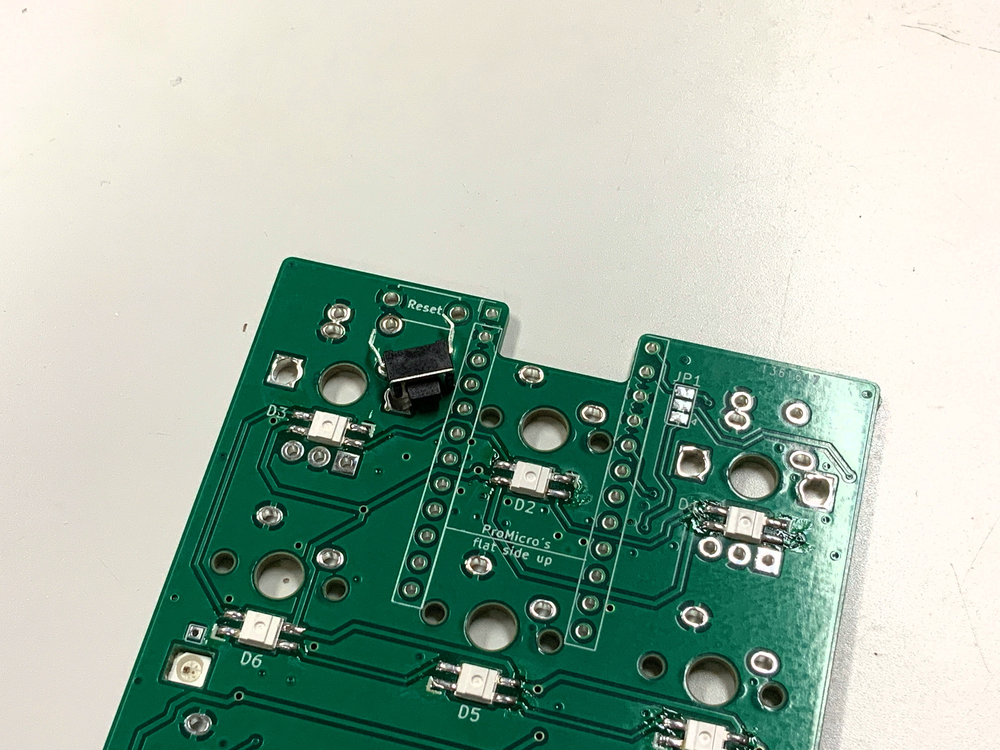
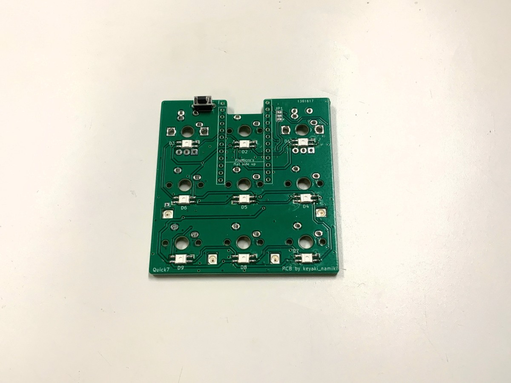
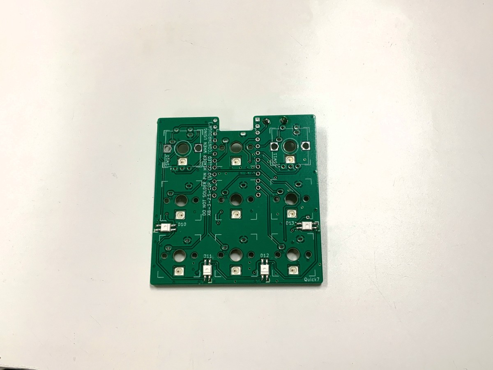
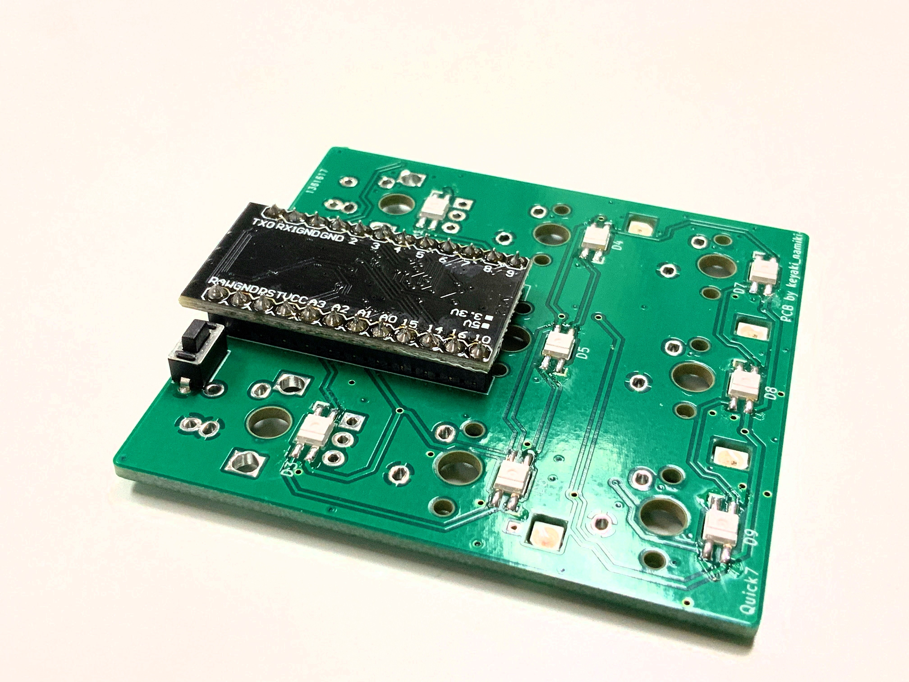
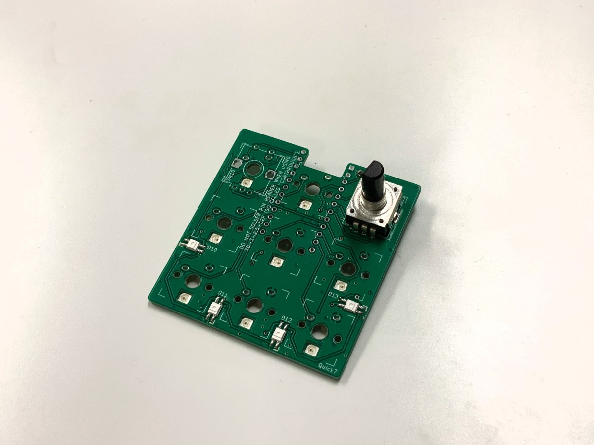
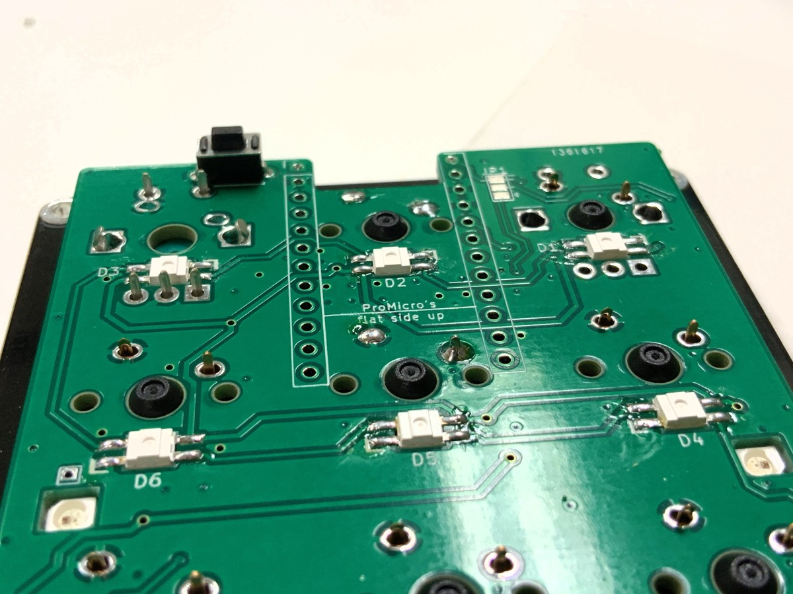
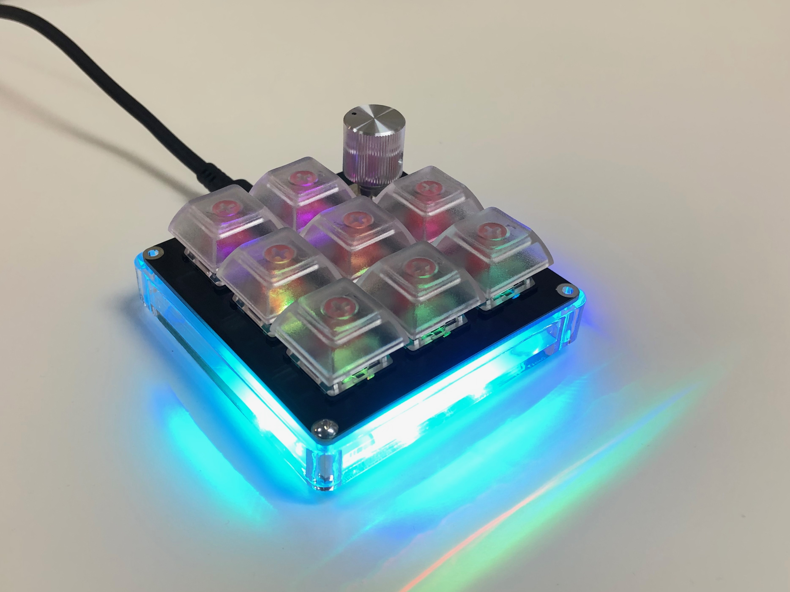

# Quick7 ビルドガイド

English Build guide is [here](Buildguide-en.md)

## 必要な部品

|部品名|数量|備考|
|---|---|---|
|基板|1枚|
|トッププレート|1枚|
|ボトムプレート|1枚|
|Pro Micro 又は 互換品|1個|Sparkfun製Qwiic Pro Microには対応していません|
|コンスルー|2本|[MAC8](https://www.mac8sdk.co.jp/catalog/)製 XB-3-2.5-12P|
|タクトスイッチ|1個|リセットスイッチ用|
|M2スペーサー 10mm|4本|ミドルプレートを使う場合、平径3mmのもの|
|M2ネジ 4mm|8本|
|Cherry MX互換キースイッチ|9個|ロータリーエンコーダーを使う場合、7個又は8個|
|Cherry MX互換キーキャップ|9個|ロータリーエンコーダーを使う場合、7個又は8個|
|ゴム足|4個|
 

### オプション部品

|部品名|数量|備考|
|---|---|---|
|アクリルミドルプレート|1個|厚さ10mmのもの|
|LED(YS-SK6812MINI-E)|13個|バックライト、アンダーグロー用|
|ロータリーエンコーダー|1~2個|Alps EC12E互換のもの、プッシュスイッチ対応|
|ロータリーエンコーダー用ノブ|1~2個|使用するロータリーエンコーダーの軸に対応したもの|
 

## 必要な道具

|名称|備考|
|---|---|
|はんだごて|LEDを使用する場合は調温機能のついたもの|
|はんだ線|0.6mm~0.8mmのもの|
|ニッパー|
|ドライバー|PH1のもの|
 

### 回路図は[こちら](Quick7.pdf)

## 組み立ての前に
作業の前に必ずこのビルドガイドの最後まで目を通してください。
***以降の作業では非常に熱いはんだごてを扱います。作業の途中に席を離れる際は電源を切るなど、やけどや怪我には十分注意してください。***

## 組み立ての手順
大まかな流れは以下のとおりです。それぞれ順を追ってみていきましょう。

1. LEDのはんだ付け
1. リセットスイッチのはんだ付け
1. コンスルーのはんだ付け
1. キースイッチの取り付け
1. ロータリーエンコーダーの取り付け
1. キースイッチ、ロータリーエンコーダーのはんだ付け
1. Pro Microの取り付け
1. ファームウェアの書き込み、動作確認
1. スペーサーの取り付け
1. キーキャップとノブ、ゴム足の取り付け

## 1. LEDのはんだ付け
4本出ている脚のうち切り欠きのある部分を」印のある位置に合わせておき、はんだ付けします。
***それぞれの行で向きが変わることに気をつけてください。***

**使用するLEDは熱に弱いため、はんだごての温度は270℃以下に設定することをお勧めします。**
LED以外の部品については一定の耐熱があるので320℃程度で使用できます。

UnderGlow LEDを使用する場合は、この穴を使いウラ面からはんだ付けします。

## 2. リセットスイッチのはんだ付け
基板上Resetとある位置にタクトスイッチを取り付け、はんだ付けします。

ここまでのはんだ付けが終わった状態(ウラ面)

(オモテ面)

## 3. コンスルーのはんだ付け
左右とも同じほうから穴が見えるように置き、Pro Micro 又は Elite-Cとコンスルーをはんだ付けします。***写真緑の基板とコンスルーははんだ付けしません。***

はんだ付けしたPro Microは一度取り外します。

## 4. キースイッチの取り付け
トッププレートの向きと裏表に気をつけながら、すべて同じ向きになるようにキースイッチをはめ込みます。

## 5. ロータリーエンコーダーの取り付け(オプション)
基板おもて側、白丸のある面からロータリーエンコーダーを取り付けます。

## 6. キースイッチ、ロータリーエンコーダーのはんだ付け
キースイッチをはんだ付けする前に、Pro Microと干渉する部分の脚をニッパーで切り落とします。

脚をカットしたら、はんだ付けします。

(使用する場合)あわせてロータリーエンコーダーもはんだ付けします。

## 7. Pro Microの取り付け
一度取り外したPro Microを再び基板に取り付けます。

## 8. ファームウェア書き込み、動作確認
Quick7はファームウェアとしてQMK Firmwareを使用しています。[公式のDocs](https://docs.qmk.fm/#/ja/)の通りに環境を用意し、書き込みます。

## 9. スペーサーの取り付け
四隅の穴にスペーサーを取り付けます。

ミドルプレートを使う場合、ここであわせて取り付けます。

## 10. キーキャップ、ノブの取り付け
最後にキーキャップとノブ、ゴム足を取り付けて完成です。

