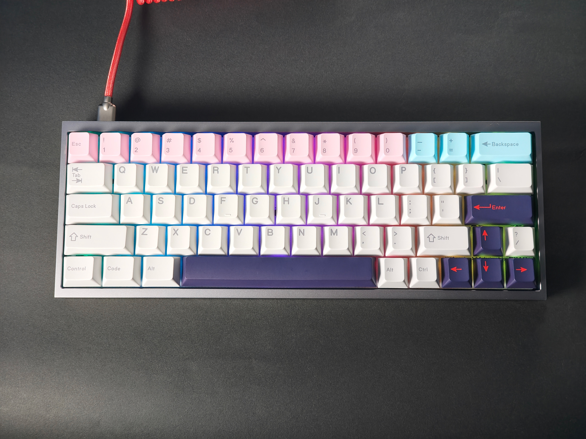

# YK60 ビルドガイド

この度は[YK60](https://shop.yushakobo.jp/products/YK60)のお買い上げありがとうございます。

実際の組み立てを始める前に、このビルドガイドを最後までお読みください。

キーボードの組み立ては本手順に沿って行ってください。
本手順に疑問等がある場合は遊舎工房の[サポートページ](https://yushakobo.zendesk.com/hc/ja)を参照の上、お気軽にお問い合わせください。

## 目次
- [YK60 ビルドガイド](#yk60-ビルドガイド)
- [目次](#目次)
- [注意事項](#注意事項)
- [必要な道具](#必要な道具)
- [1. キットに同梱されている部品をチェックする](#1-キットに同梱されている部品をチェックする)
- [2. 別途準備するパーツをチェックする](#2-別途準備するパーツをチェックする)
- [tips:スイッチとキーキャップについて](#tipsスイッチとキーキャップについて)
- [3. 基板の表・裏を確認する](#3-基板の表裏を確認する)
- [4. スタビライザーを取り付ける](#4-スタビライザーを取り付ける)
- [5. スイッチを取り付ける](#5-スイッチを取り付ける)
- [6. ケースに取り付ける](#6-ケースに取り付ける)
- [7. キーキャップを取り付ける](#7-キーキャップを取り付ける)
- [8. 完成！](#8-完成)
- [EX1. LEDを取り付ける（オプション）](#ex1-ledを取り付けるオプション)
- [必要な部品](#必要な部品)
- [必要な道具](#必要な道具-1)
- [EX1-1. LEDの向きを理解する](#ex1-1-ledの向きを理解する)
- [EX1-2. 基板のLED取り付け箇所を理解する](#ex1-2-基板のled取り付け箇所を理解する)
- [EX1-3. 取り付け箇所に予備はんだをする](#ex1-3-取り付け箇所に予備はんだをする)
- [EX1-4. LEDのピンをはんだ付けする](#ex1-4--ledのピンをはんだ付けする)
- [EX1-5. 完成！](#ex1-5-完成)
- [EX2. フォームを取り付ける（オプション）](#ex2-フォームを取り付けるオプション)
- [EX2-1. プレートフォーム](#ex2-1-プレートフォーム)
- [EX2-2. スイッチフォーム](#ex2-2-スイッチフォーム)
- [EX2-3. ボトムフォーム](#ex2-3-ボトムフォーム)

## 注意事項
本キットは半田付け不要のキットとなっておりますが、オプションによっては半田付けが必要になる場合があります。

半田ごてなどの火傷の危険性がある道具を使用する場合は、十分に注意して作業を行ってください。

## 必要な道具
|名称|使用用途|
|---|---|
|プラスドライバー|キーボードの固定時に使用|

