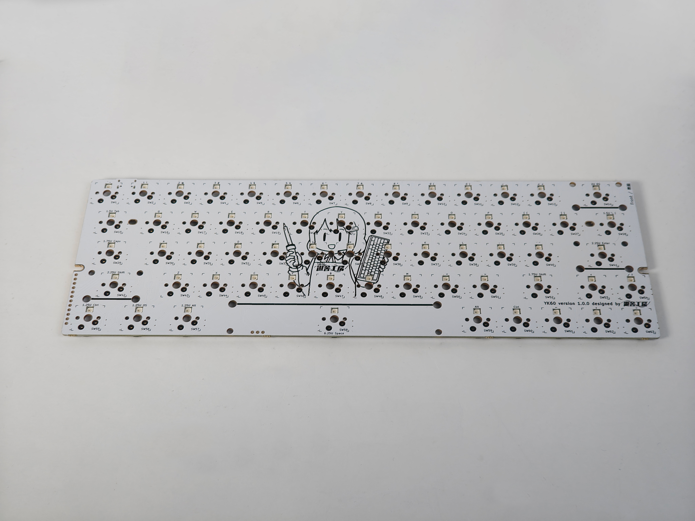
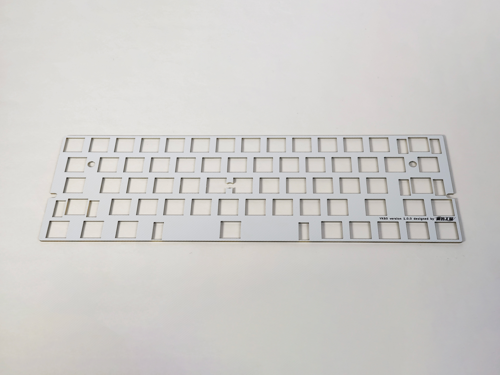

## 1. キットに同梱されている部品をチェックする
まずはキットに同梱されている部品が足りているかチェックしてください。
同梱物に不足がある場合は、大変お手数ですが遊舎工房の[お問い合わせフォーム](https://yushakobo.zendesk.com/hc/ja/requests/new)のカテゴリ 「購入した商品の不足・初期不良等」 より注文番号を記載の上、お問い合わせください。

|名称|数量|画像|備考|
|---|---|---|---|
|実装済み基板|x1||ファームウェア書き込み済み|
|スイッチプレート|x1|||

