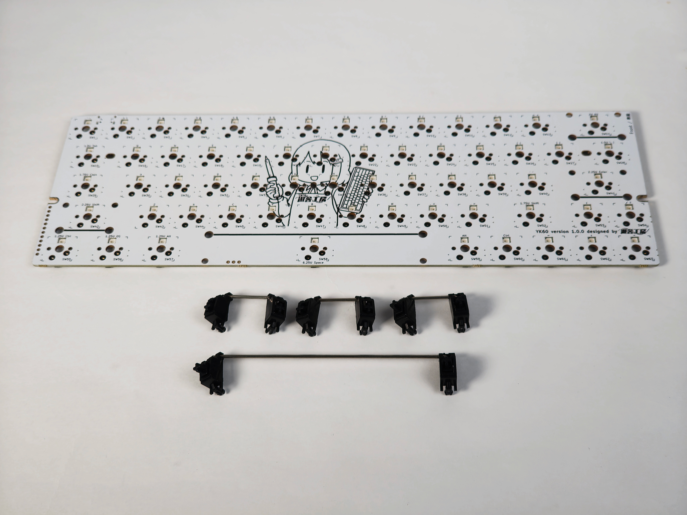
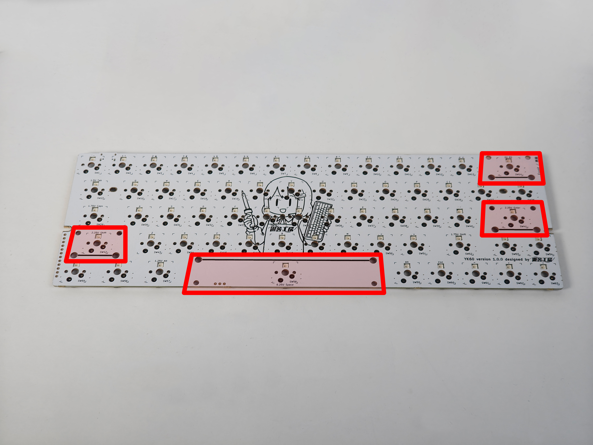
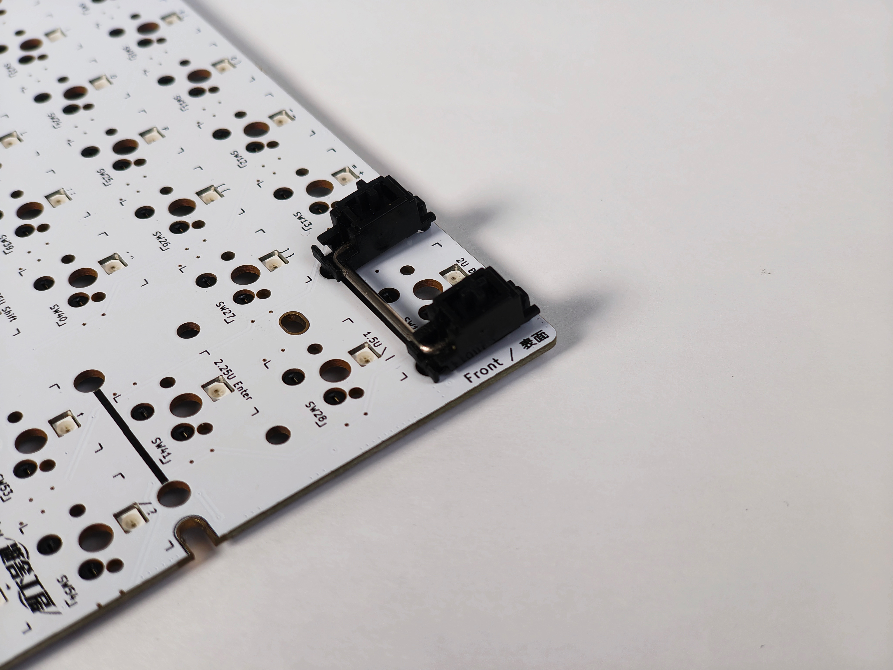
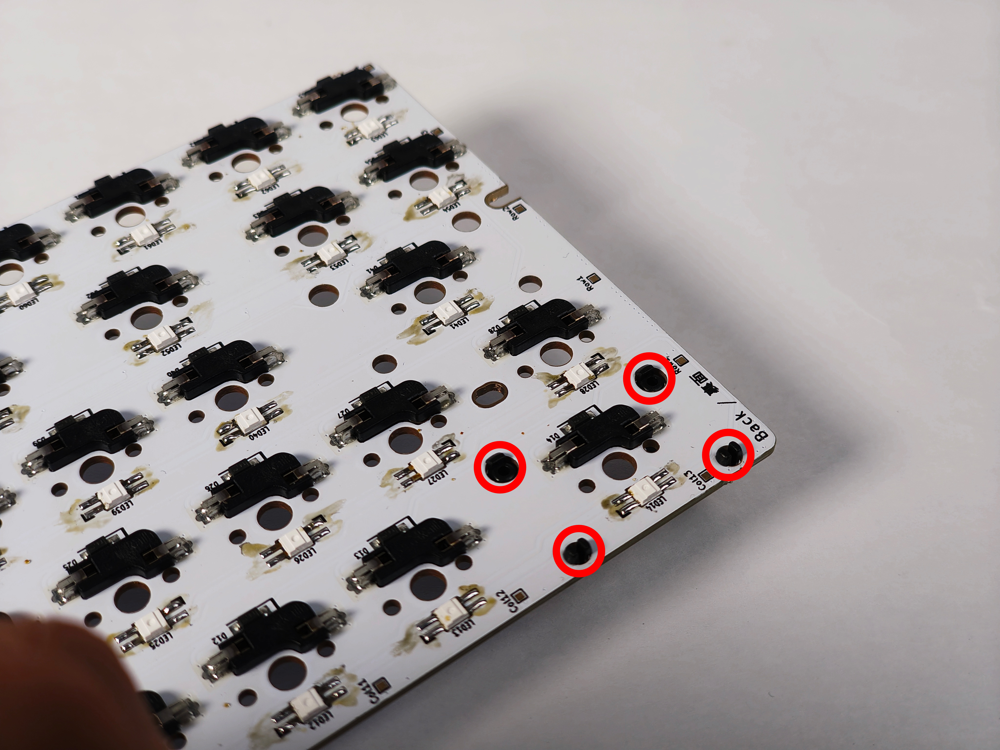
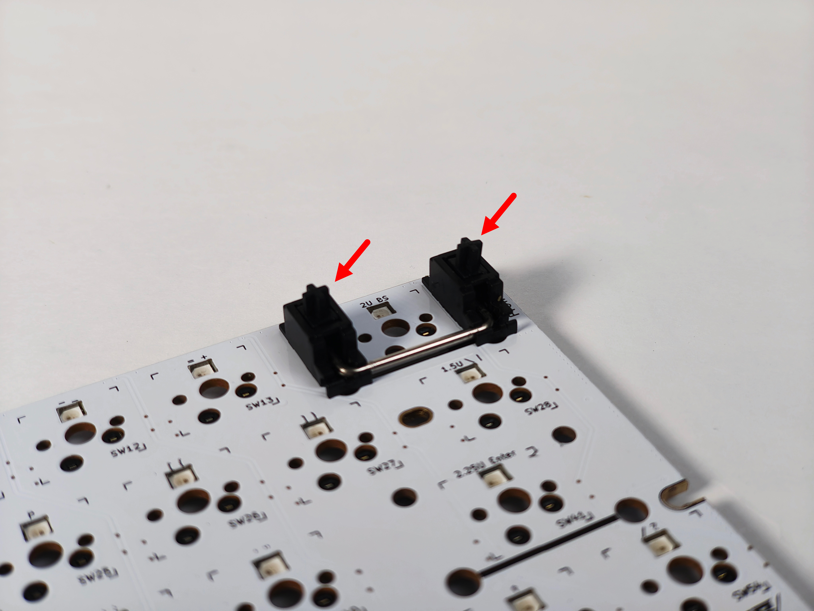
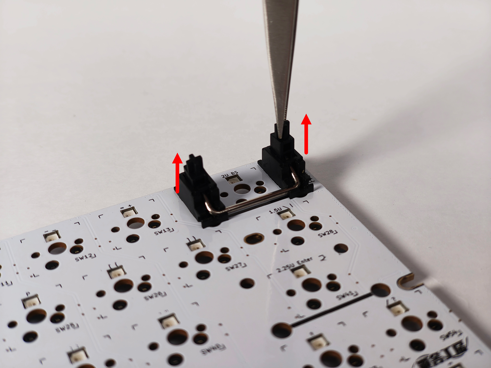
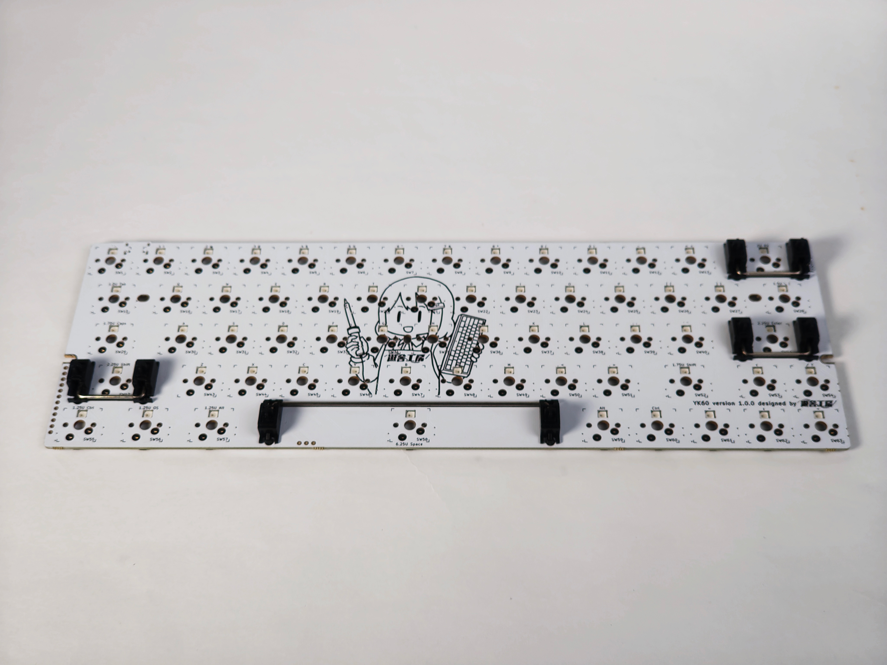

## 4. スタビライザーを取り付ける
YK60の実装基板に、スタビライザーを取り付けます。
使用するパーツは実装基板・スタビライザーです。

スタビライザーとは大きいキーキャップ(バックスペース、スペース、エンターなど)を安定させるために使われるパーツです。
詳細はこちらをご参照ください。
[遊舎工房の読み物 『自作キーボードの「スタビライザー」』](https://shop.yushakobo.jp/pages/diykeyb_stabilizer?utm_source=github&utm_medium=link&utm_campaign=buildguide)

スタビライザーは表面に取り付け、裏面で固定します。
画像内の赤枠部分に取り付けを行います。

スタビライザーを取り付ける際は、スタビライザーの金属ワイヤーを基板表面の黒い線（ガイド上）に合わせて取り付けを行います。

その後、裏返して4箇所を固定します。

固定の際はスタビライザーごとに取り付け方法が異なります。
[遊舎工房の読み物 『自作キーボードの「スタビライザー」』](https://shop.yushakobo.jp/pages/diykeyb_stabilizer?utm_source=github&utm_medium=link&utm_campaign=buildguide)を見て、スタビライザーのタイプを確認してください。

取り付けが完了したら、正しくスタビライザーが取り付けられているか確認を行います。
スタビライザーのステム（中心部分）を掴み、上に持ち上げます。

2箇所が連動して持ち上がれば、正しく取り付けができています。

すべて取り付けが完了したら、次の工程に進みます。

