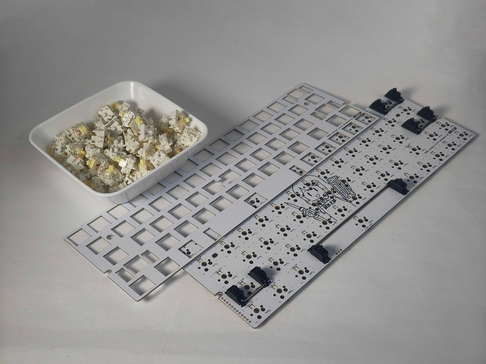
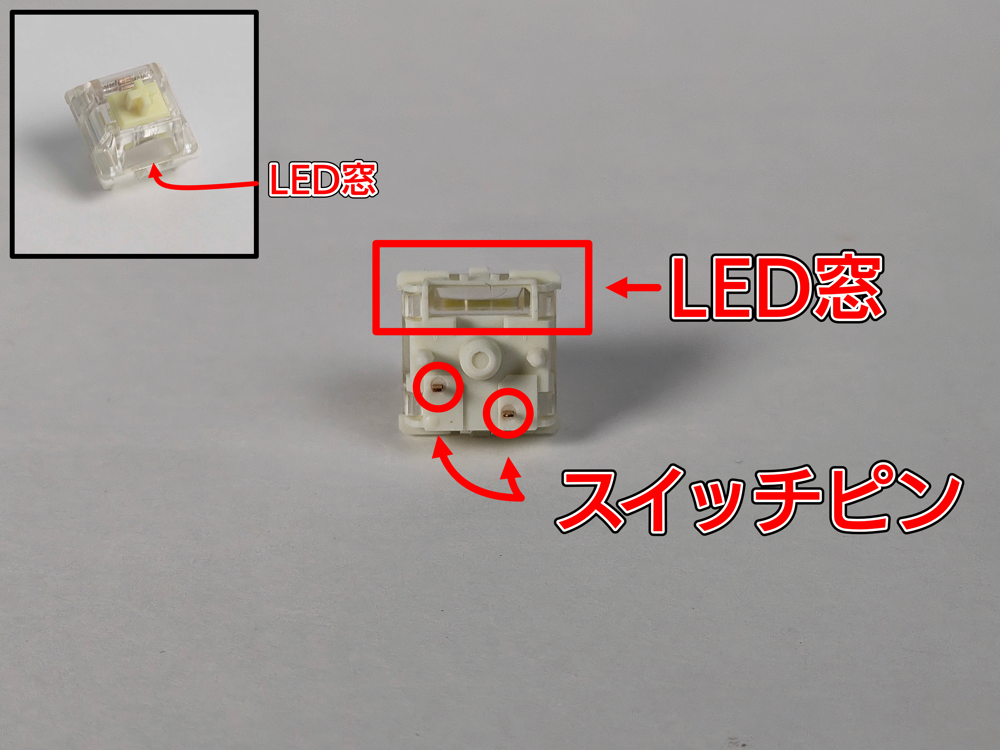
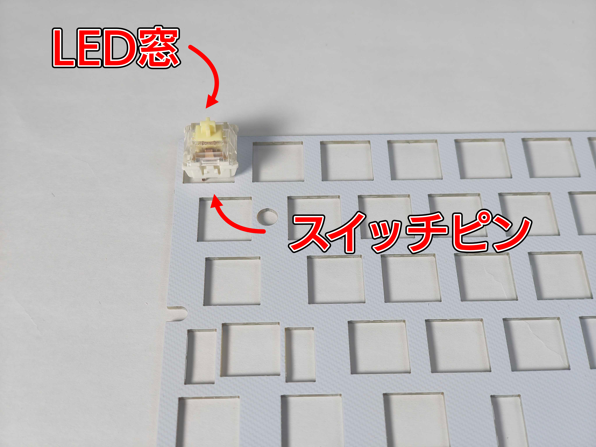
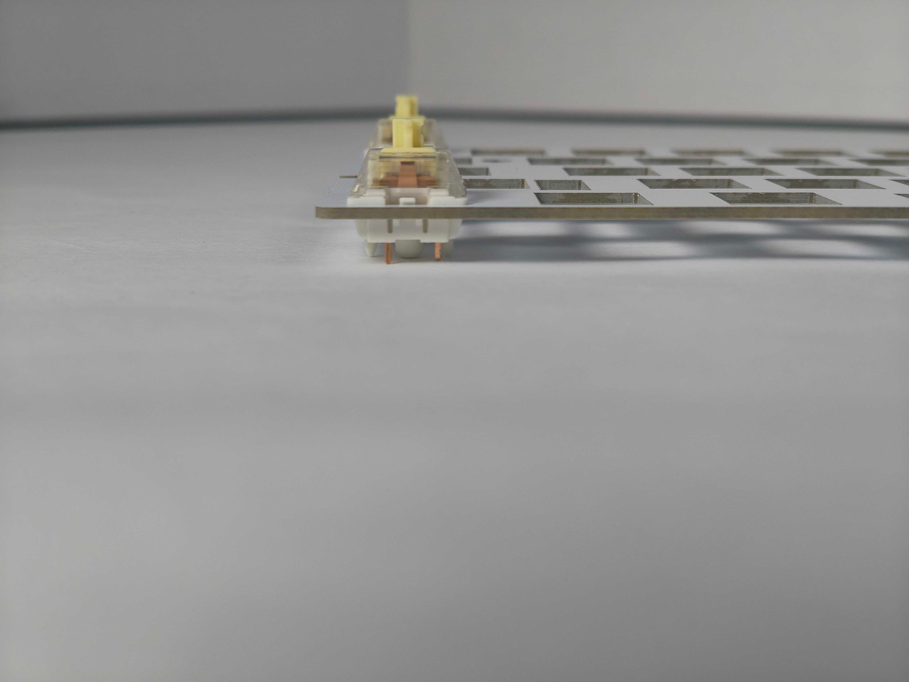
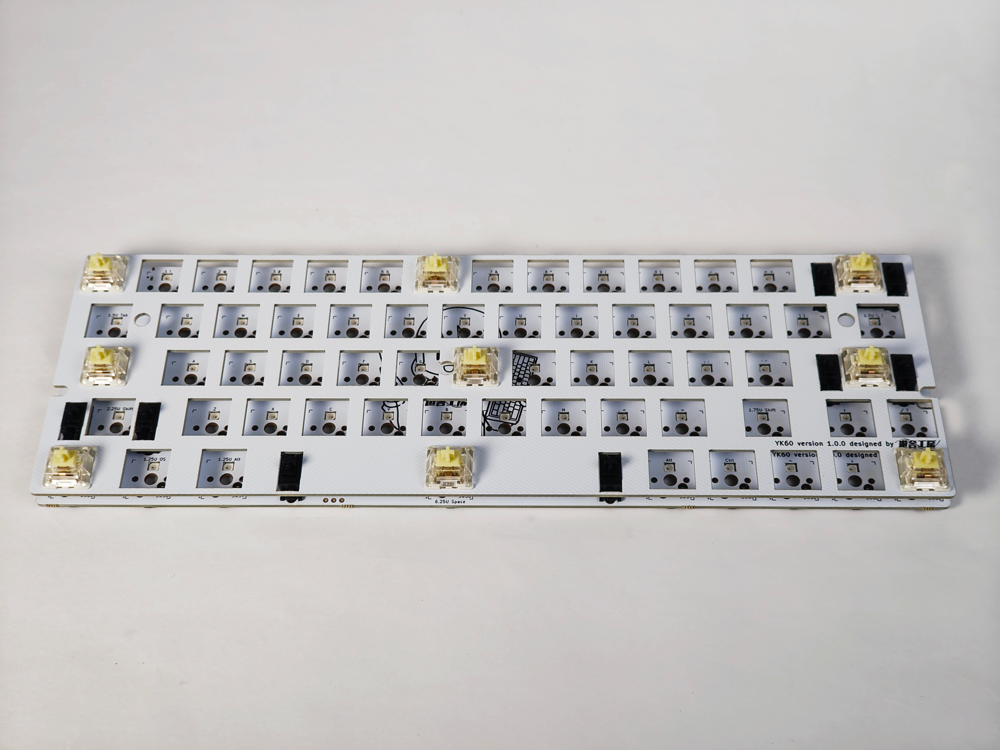
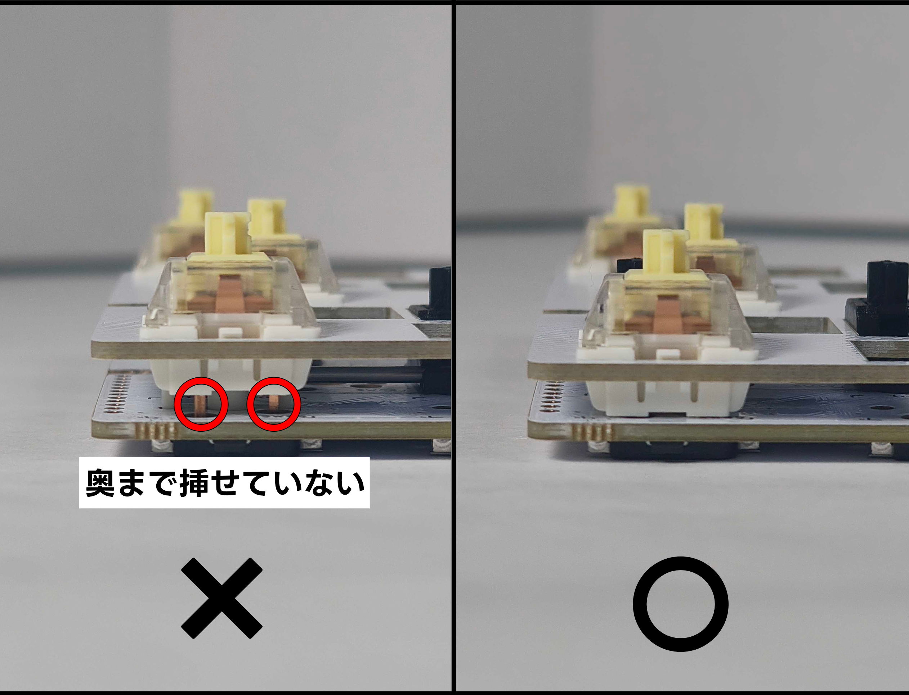
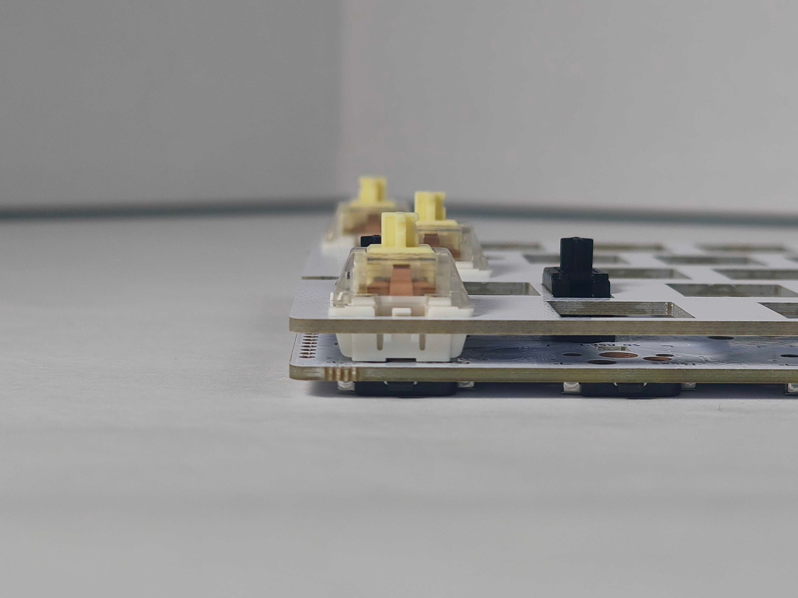
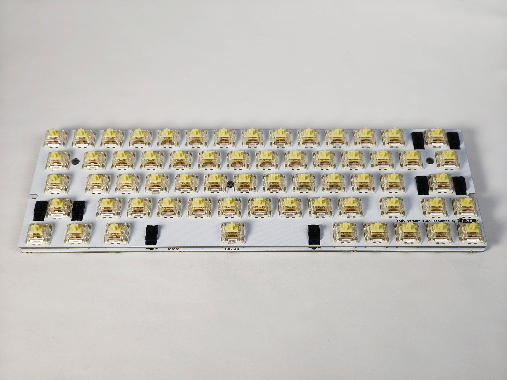

## 5. スイッチを取り付ける
YK60のプレートにスイッチを取り付け、実装基板と合体させます。
使用するパーツはスイッチ・プレート実装基板です。

スイッチをプレートに固定する際、上下がありますので最初に確認します。
LED窓がある方が上、スイッチピンがある方を下とします。

スイッチの取り付け向きは、プレートに対して上がLED窓のある方、下がスイッチピンのある方になるよう取付けます。

スイッチはプレートに密着するよう固定してください。

スイッチをプレートに固定し、実装基板と固定します。
最初に力が分散する箇所（写真では9箇所）に取り付けていきます。

基板に固定する際は、スイッチと実装基板の隙間がなくなるよう、奥まで挿し込みます。

順番にスイッチを取付けていきます。

すべてのスイッチを固定できたら、次の工程に進みます。

