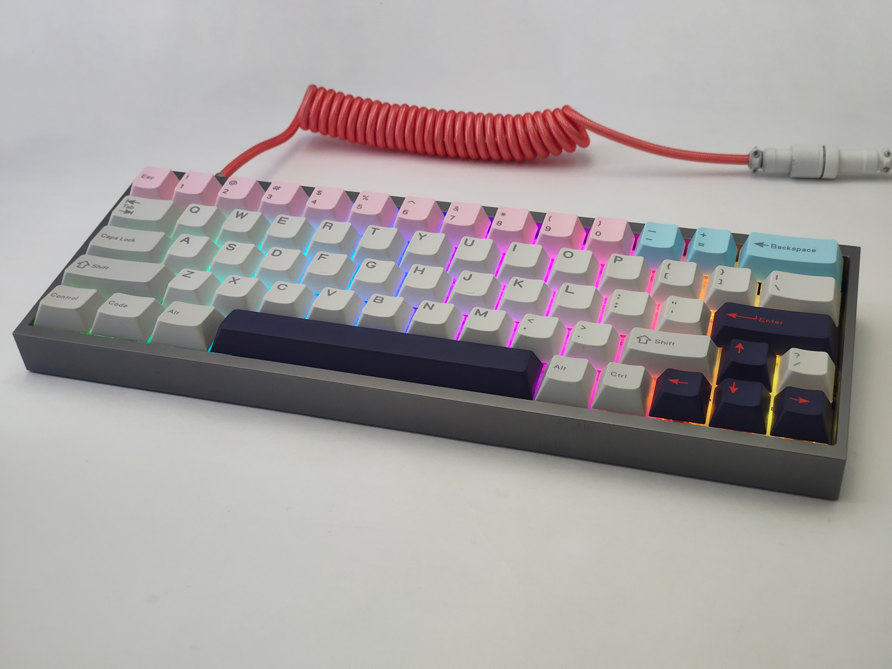
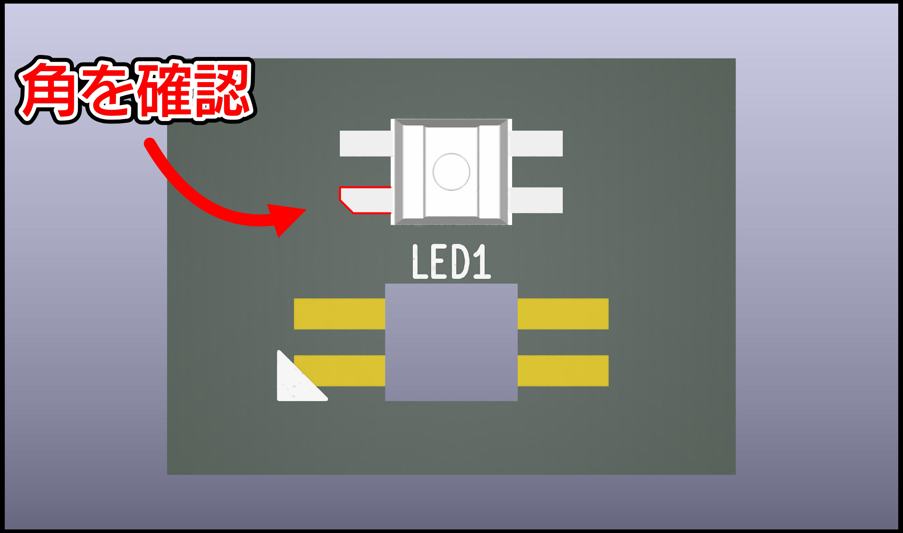
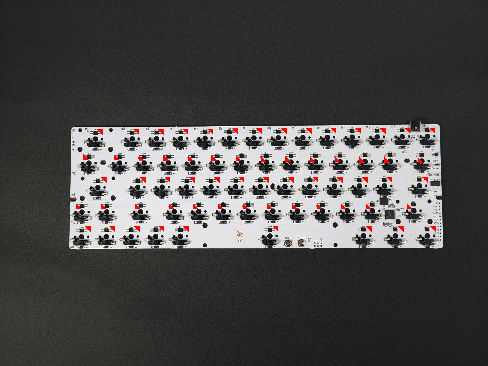
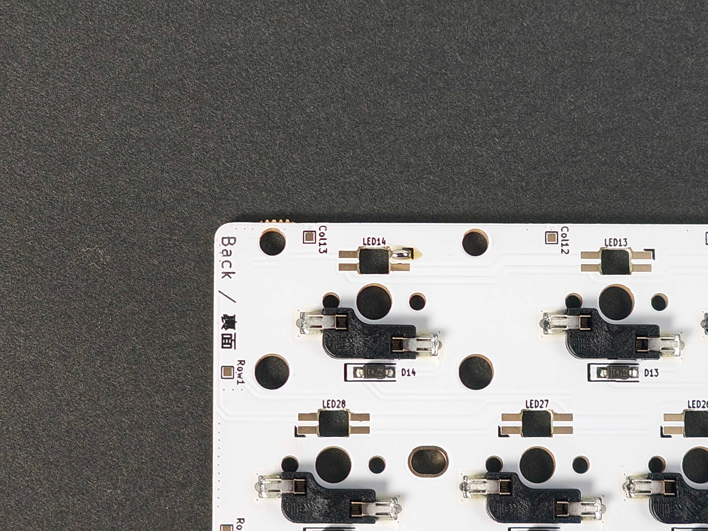
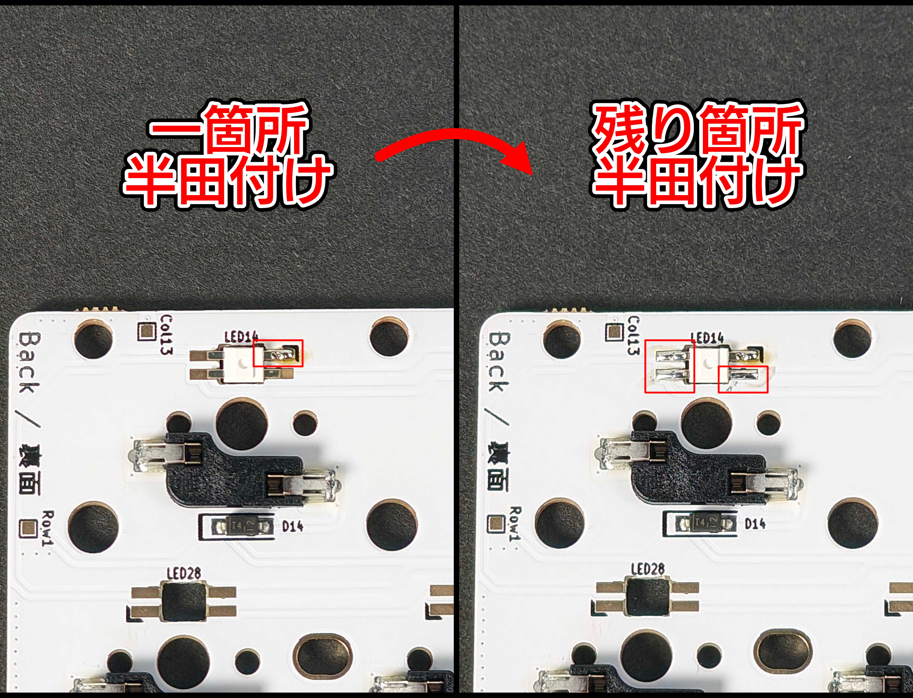
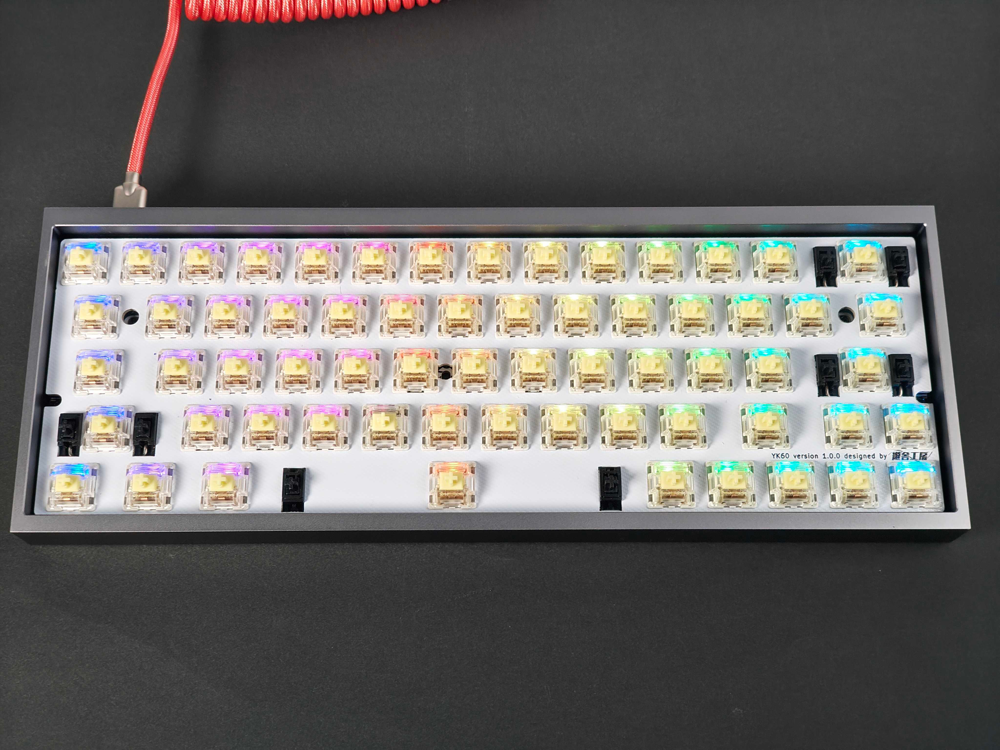
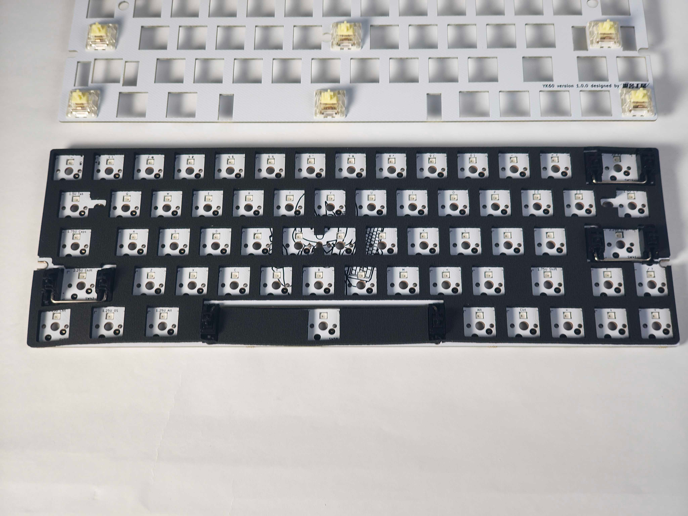
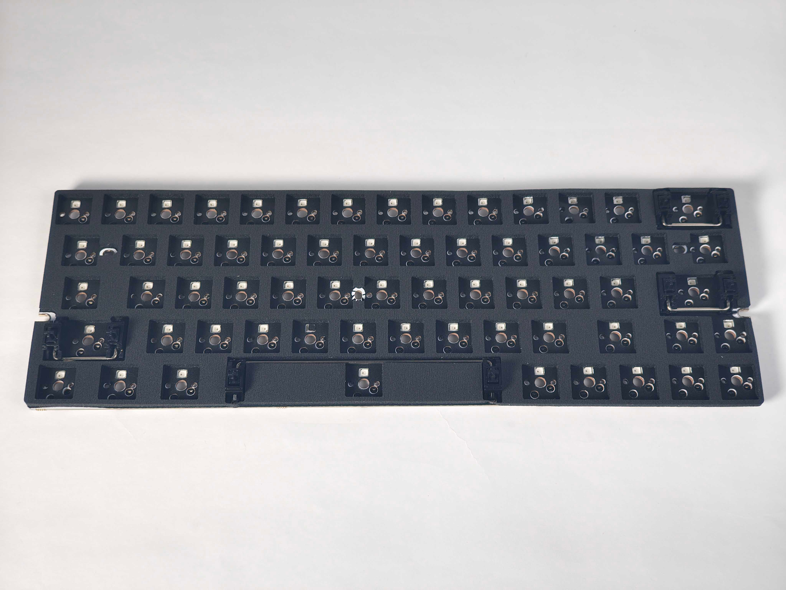
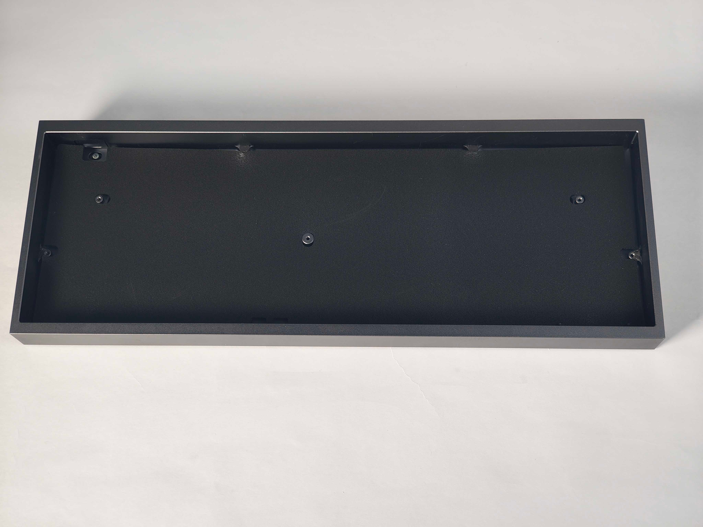

## 8. 完成！
お疲れ様でした。
これでYK60は完成です！

## EX1. LEDを取り付ける（オプション）
YK60はLEDを半田付けすることで、フルキーバックライト化（すべてのキーが光る状態）することが可能です。

### 必要な部品
|名称|数量|備考|
|---|---|---|
|SK6812MINI-E（10個入り）|x7|ご購入は[こちら](https://shop.yushakobo.jp/products/sk6812mini-e-10)|

### 必要な道具
|名称|使用用途|
|---|---|
|ハンダごて|できるだけ温度調節機能付きのもの 温度は320度程度を推奨|
|ハンダ線|0.6mm~0.8mm径程度のもの。|
|ピンセット|LEDを掴むような細かい作業に使用|

**こちらに[工具セット](https://shop.yushakobo.jp/products/a9900to)の用意もありますので、よろしければ部品と一緒にどうぞ。**

### EX1-1. LEDの向きを理解する
LEDには向きがあり、取り付け方向を間違えた場合、キーボードとして動作しなくなる可能性があります。

今回使用するLEDは、はんだ付けするピンが4つあるうち、1つが斜めに切り取られています。
この切り取られたピンを「斜めのピン」と以降の文章で表現します。

また、LEDの取り付け向き（表面・裏面）については、この文章中では写真の通りの向きで取り付けるようにしてください。

### EX1-2. 基板のLED取り付け箇所を理解する
YK60の基板には、LEDを取り付けるためのガイドとなる印字がされています。
写真の赤い三角部分に実際は黒い線がありますので、実物をご確認ください。

この黒い線の部分に斜めのピンを配置するようにして、穴に嵌め込むことで、LEDを光らせます。

### EX1-3. 取り付け箇所に予備はんだをする
LEDの取り付けを簡単にするため、事前に基板に予備はんだをします。
予備はんだはピンのうちどこにしても構いませんが、今回は右上で行いました。

### EX1-4. LEDのピンをはんだ付けする
斜めのピンを黒い印字に合わせて配置し、はんだ付けを行います。
最初に予備はんだ部分を溶かしてLEDを固定し、その後残りの3箇所をはんだ付けします。

### EX1-5. 完成！
LEDの光り方は、[Remap](https://remap-keys.app)上でRGB Mode+やRGB Mode-を適用してモードを変更できます。
お好みの発光方法を探してみてください！

## EX2. フォームを取り付ける（オプション）
YK60にはフォームが3種類あります。
これらは[『キーボードフォームカットサービス』](https://shop.yushakobo.jp/products/keyboard_foam)よりご購入いただけます。

- YK60 プレート - 3mm
プレートとPCBの間に挟むフォームです。
- YK60 スイッチ - 0.2mm
PCBの上部に乗せ、その上からスイッチを差し込むフォームです。
打鍵音を大きく変化させますが、静音性を高める効果はあまりありません。
- YK60 ボトム - 2mm
PCBとボトムのケースやアクリルの間に挟むフォームです。

これらの取り付け方法はフォームごとに異なります。

### EX2-1. プレートフォーム
実装基板とプレートの間に挟み込むようにしてスイッチの取り付け（工程5番）のタイミング取り付けます。

### EX2-2. スイッチフォーム
実装基板とスイッチの間に挟み込むようにして取りつけます。
スタビライザーがついていると固定できないため、スタビライザーの取りつけ（工程4番）のタイミングで取りつけます。

なお、プレートフォームとスイッチフォームはどちらも付けることができます。

### EX2-3. ボトムフォーム
実装基板とケースの間に挟み込むようにして取りつけます（工程6番）。
ケースによってはケース内に柱のようなものがあり少々干渉しますが、そのまま押しつぶすようにするかハサミでカットして取りつけてください。

