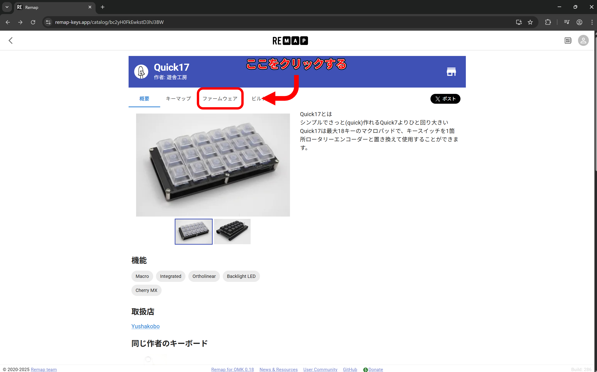
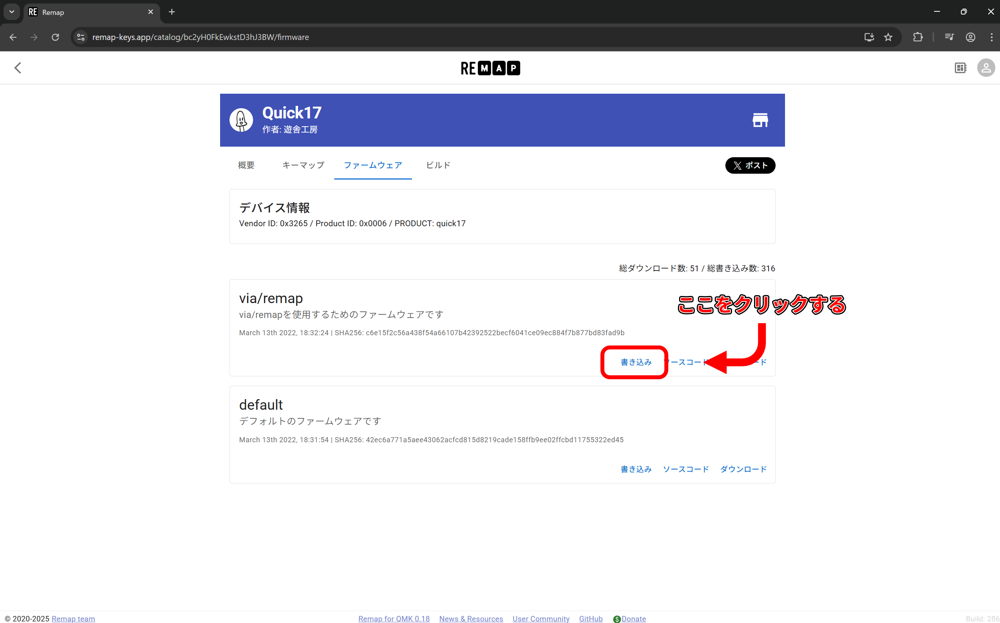
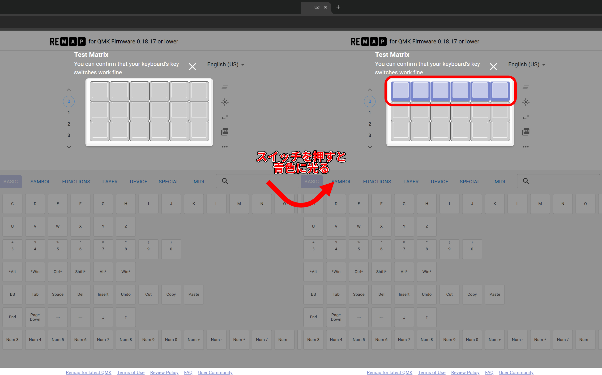
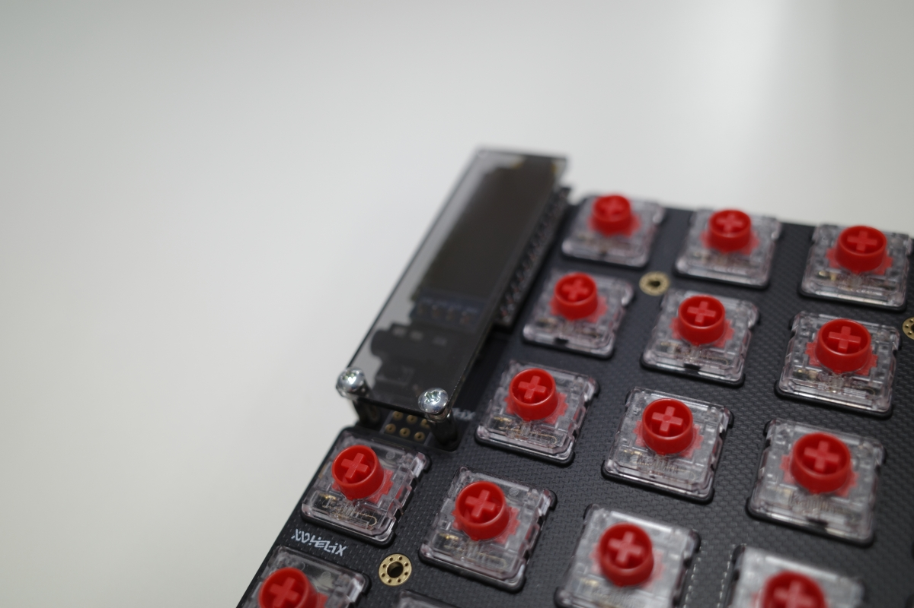

## 7. ファームウェアの書き込みと動作確認

※本項目で使用されている画像についてはデザインや書き込むファームウェアが異なる場合がありますが、適宜読み替えて作業をしてください。

Helix Rev3のファームウェアの書き込みには[Remap](https://remap-keys.app)というサイトを利用します。
Remapはキーマップの変更やファームウェアの書き込みが可能なウェブサービスです。
Windows/MacOS/LinuxのChromeでのみ利用可能です。

最初にRemap上の[Quick17のカタログページ](https://remap-keys.app/catalog/6IDu01pxYSDqMQRblcoX/firmware)を開きます。上のタブから「ファームウェア」を選択します。

その後、「via/remap」内の書き込みを選び、ファームウェアを書き込みます。

書き込みは以下の手順で行います。

1. ポップアップ画面が開かれるので、もう一度「書き込み」を選ぶ。
1. 「remap-key.appがシリアルポートへの接続を要求しています」というポップアップが更に開かれるので、この画面のままリセットスイッチを2回押す。
1. リセットされるので、5秒以内に「Pro Micro ~~~（ここの内容は場合によって異なります）」という名前を選択し、「接続」を押す。
1. ファームウェアが書き込まれる。

入力のテストには[Remap](https://remap-keys.app/configure)からキーボードを読み込ませ、「・・・」メニュー内に隠れている「テストマトリクスモード」を選択します。

この状態ではスイッチの動作確認が行えます。スイッチが正常に押された場合、画面上のキーが青く光ります。

動作に問題がなければ、ProMicro保護プレートをネジ止めし、次の工程へ進みましょう。

『故障かな？』と思ったら[こちら](TroubleShooting.md)

