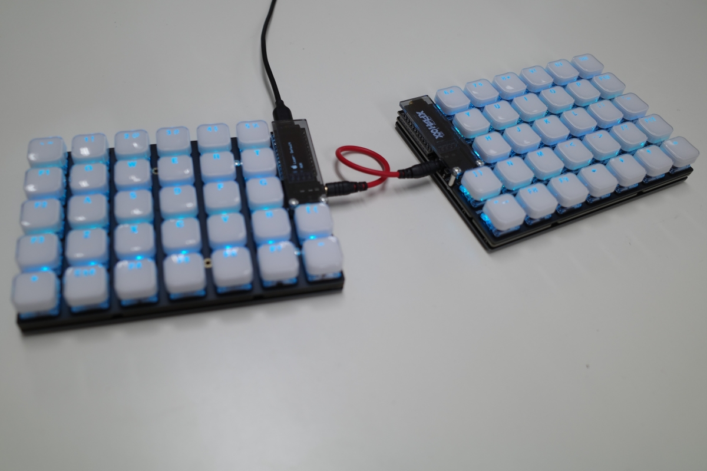
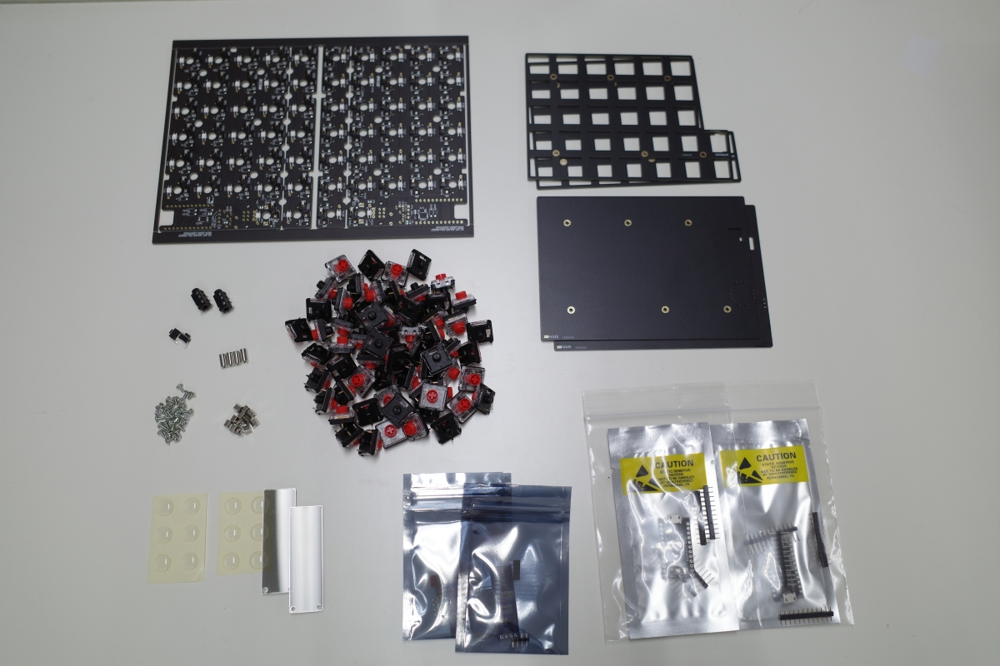
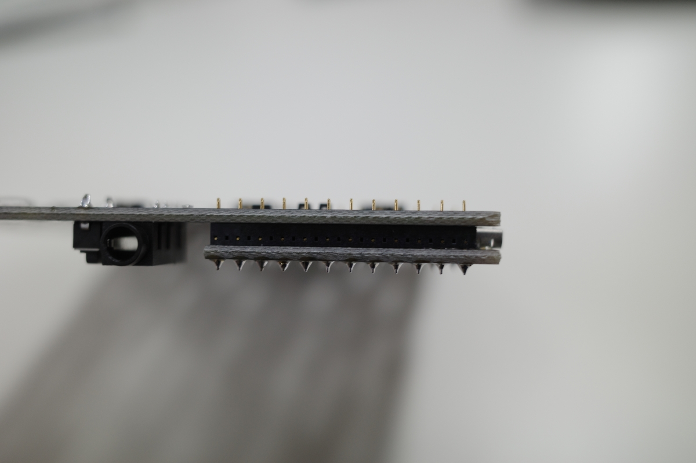
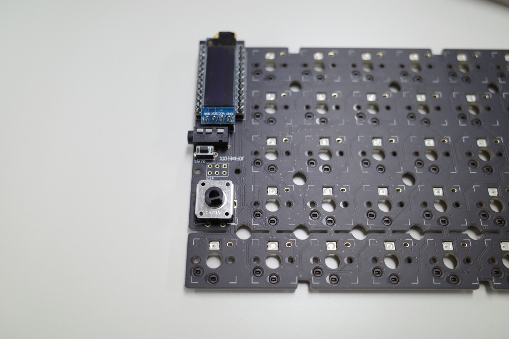
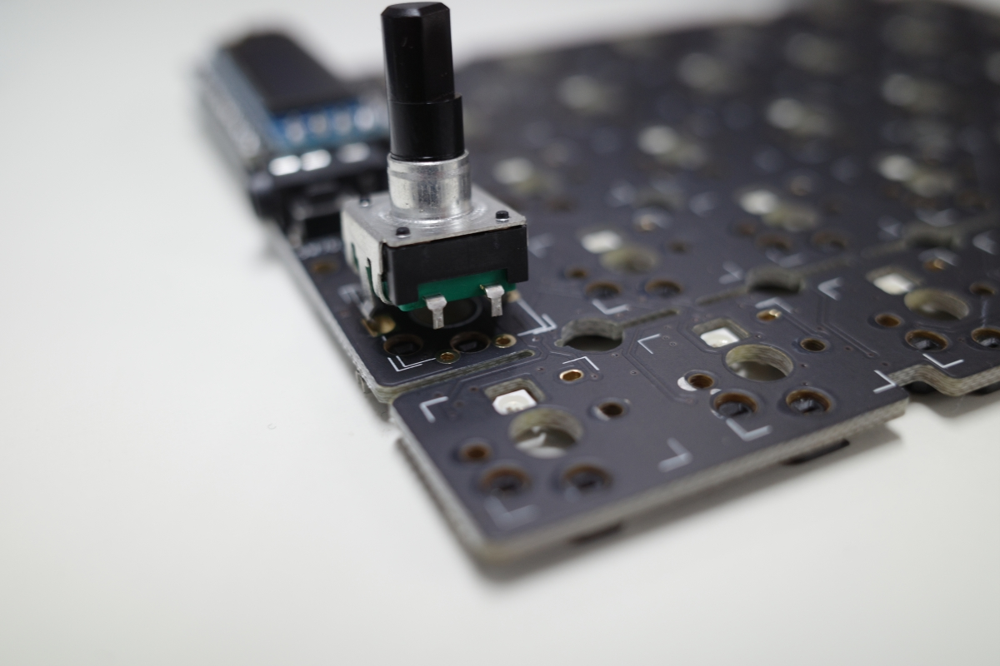
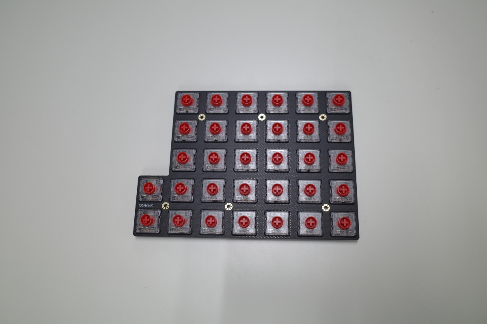
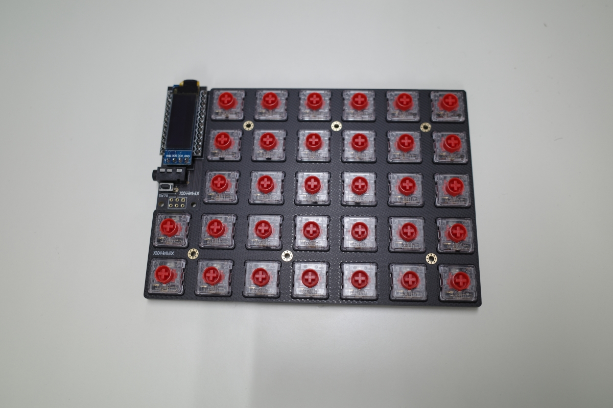

# Helix rev3 LP 組み立てガイド

## 必要な部品

表と写真を見比べて、必要な部品が揃っているかどうかご確認ください。

|部品名|数量|備考|
|---|---|---|
|基板|1|
|トッププレート|2|
|ボトムプレート|2|
|ProMicro保護プレート|2|
|ProMicro|2|
|コンスルー|4|
|タクトスイッチ|2|
|TRRSジャック|2|
|OLED/ピンヘッダー/ピンソケット|各2|
|M2ネジ|32|
|M2スペーサー 4mm|12|
|M2スペーサー 8mm|4|
|Kailh Choc/Choc v2スイッチ|最大64|
|選択したキースイッチに対応するキーキャップ|キースイッチと同数|Choc v2を使用する場合はトッププレートに干渉しないものをお選びください|
|ゴム足|12|
 

### オプション部品

|部品名|数量|備考|
|---|---|---|
|ロータリーエンコーダ|最大2つ|
|ロータリーエンコーダ用ノブ|最大2つ|

## 必要な道具

|名称|備考|
|---|---|
|はんだごて|
|はんだ線|0.6mm~0.8mmのもの|
|ドライバー|
|ペンチ/ラジオペンチ|基板を折り取るときに使用します|
|やすり|折り取った基板の断面を整えるときに使用します|

## 組み立ての前に

**実際の組み立てを始める前に、この組み立てガイドを最後までお読みください。**

この組立作業において、先端の熱いはんだごてを使用します。席を離れる際には電源を切るなど、怪我ややけどには十分ご注意ください。

## 組み立ての手順

大まかな流れは以下のとおりです。

1. 左右基板の分離
1. TRRSジャックとリセットスイッチのはんだ付け
1. コンスルーのはんだづけ
1. OLEDのはんだづけ
1. (オプション)ロータリーエンコーダの取り付け/はんだ付け
1. キースイッチの差し込み
1. ファームウェアの書き込みと動作確認
1. ボトムプレートの固定

## 1. 左右基板の分離

ペンチやラジオペンチなどを使い、フチの部分を折り取ります。
このとき、繊維状の突起物が発生しますのでやすりなどで取り除きます。

## 2. TRRSジャックとリセットスイッチのはんだ付け

TRRSジャックとリセットスイッチをそれぞれ差し込み、はんだ付けします。

## 3. コンスルーのはんだ付け

コンスルーを基板に差し込み、ProMicroとコンスルーをはんだ付けします。このとき、**キーボード本体の基板とコンスルーとははんだ付けしません。** はんだ付けした状態でも使用上の問題はありませんが、***ProMicroの交換が極めて難しくなります。*** ProMicroに不具合が生じた際に交換できるよう、キーボード本体とははんだ付けせず、コンスルーの保持力によって固定することをお勧めします。

## 4. OLEDのはんだ付け

キーボード本体の基板とピンソケットを、OLEDモジュールとピンヘッダーをそれぞれはんだ付けします。

OLEDモジュールはProMicro上部にかぶせるようにのせ、はんだ付けします。

## 5. (オプション)ロータリーエンコーダの取り付け/はんだ付け

ロータリーエンコーダを使用する場合は、ここで取り付けし、はんだ付けします。

スイッチ付きのものを使用する場合は、スイッチ部のピンを適当な長さに切りそろえます。

## 6. キースイッチの差し込み

トッププレートに選択したキースイッチを差し込みます。スイッチには向きがありますのでご注意ください。

すべてのキースイッチを差し込み終わりましたら、トッププレートとキーボード本体の基板を組み合わせます。

## 7. ファームウェアの書き込みと動作確認

※本項目で使用されている画像についてはデザインや書き込むファームウェアが異なる場合がありますが、適宜読み替えて作業をしてください。

Helix Rev3のファームウェアの書き込みには[Remap](https://remap-keys.app)というサイトを利用します。  
Remapはキーマップの変更やファームウェアの書き込みが可能なウェブサービスです。
Windows/MacOS/LinuxのChromeでのみ利用可能です。

最初にRemap上の[Quick17のカタログページ](https://remap-keys.app/catalog/6IDu01pxYSDqMQRblcoX/firmware)を開きます。上のタブから「ファームウェア」を選択します。

その後、「via/remap」内の書き込みを選び、ファームウェアを書き込みます。

書き込みは以下の手順で行います。

1. ポップアップ画面が開かれるので、もう一度「書き込み」を選ぶ。
1. 「remap-key.appがシリアルポートへの接続を要求しています」というポップアップが更に開かれるので、この画面のままリセットスイッチを2回押す。
1. リセットされるので、5秒以内に「Pro Micro ~~~（ここの内容は場合によって異なります）」という名前を選択し、「接続」を押す。
1. ファームウェアが書き込まれる。

入力のテストには[Remap](https://remap-keys.app/configure)からキーボードを読み込ませ、「・・・」メニュー内に隠れている「テストマトリクスモード」を選択します。  

この状態ではスイッチの動作確認が行えます。スイッチが正常に押された場合、画面上のキーが青く光ります。

動作に問題がなければ、ProMicro保護プレートをネジ止めし、次の工程へ進みましょう。

『故障かな？』と思ったら[こちら](TroubleShooting.md)

## 8. ボトムプレートの固定

スペーサーをねじで取り付け、ボトムプレートを固定します。

最後にゴム足を取り付けて、キーボードは完成です。 

お好みのキーキャップを取り付けてご使用ください！

