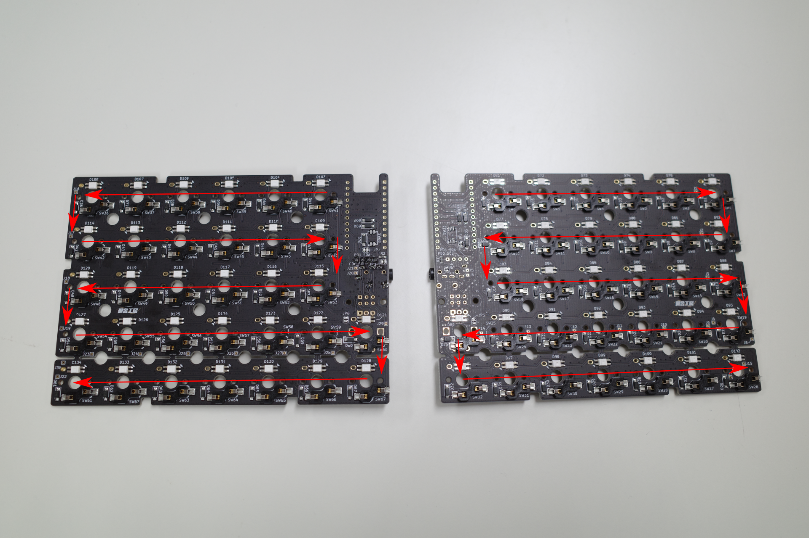

# 故障かな？とおもったら

## LEDが点灯しない/ある一点を境にほかと違う光り方をしている

LEDは左右それぞれ次の順番で数珠つなぎになっています。

|Right|Left|
|---|---|
|(下へ)D108<-**D103** D114->D109(下へ) (下へ)D120<-D115 D127->D121(下へ) (終点)D134<-D128|**D71**->D76(下へ) (下へ)D82<-D77 D83->D88(下へ) (下へ)D89<-D95 D96->D102(終点)|

一部LEDが点灯しない、またはほかと違う光り方をしている場合、前後のLEDのピンをはんだごて(270度ほど)で温めると改善することがあります。

はんだごてで温めて改善しない場合は[お問い合わせフォーム](https://yushakobo.zendesk.com/hc/ja/requests/new)よりご相談ください。

