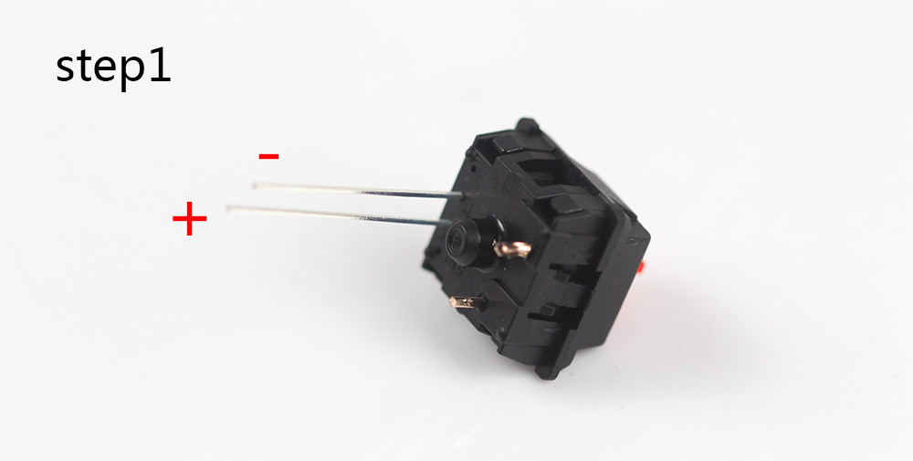
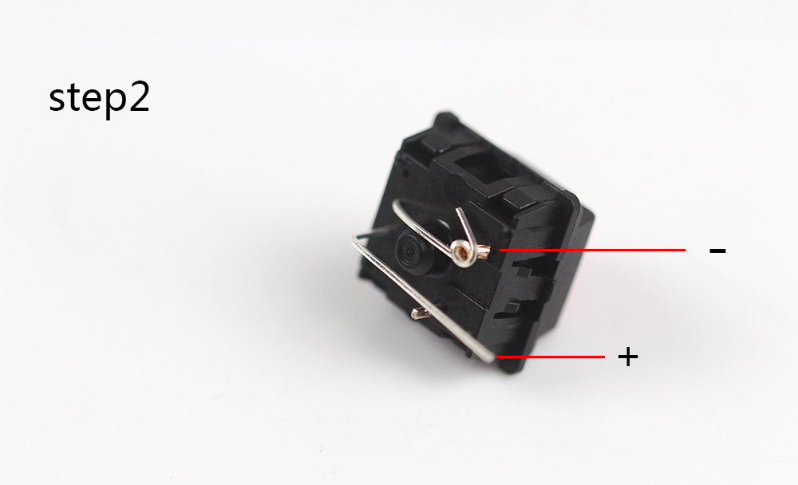
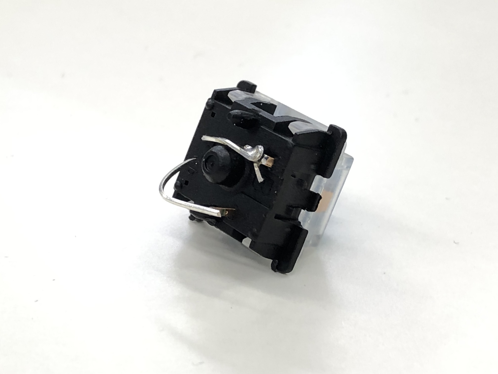
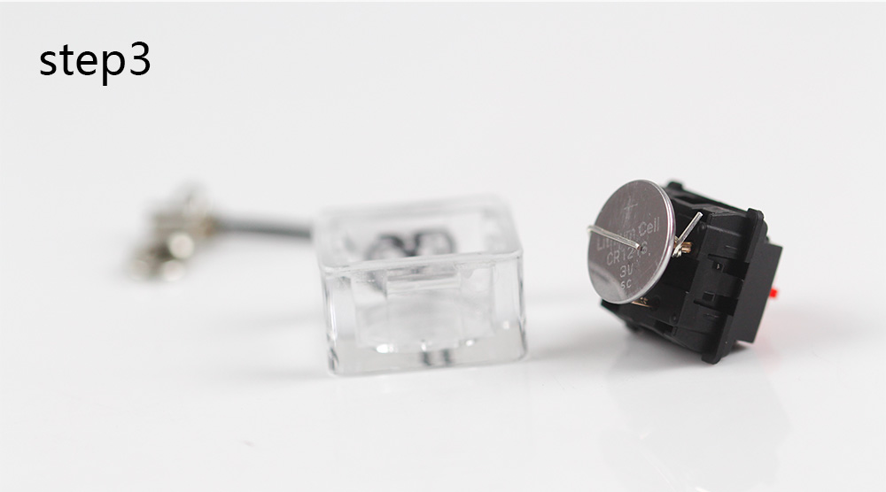
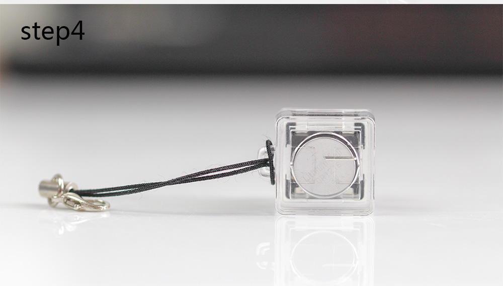
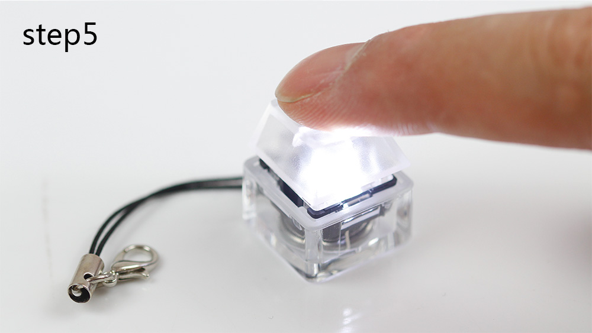

# Cherry MXキーチェーン のくみたてかた

## step1
LEDを極性に気をつけてさしこみます(LEDの脚の長いほうが+、短いほうが-です)

## step2 
-側の脚を折り曲げてはんだ付けします。はんだ付けしたスイッチの脚は根元で切り取ります

「はんだ付けした画像」

## Step3 
+側の脚をボタン電池の厚みに合わせて折り曲げます

## step4 
ボタン電池の+が外から見えるようにケースに収めます

## step5 
光るキースイッチキーホルダーの完成です!
